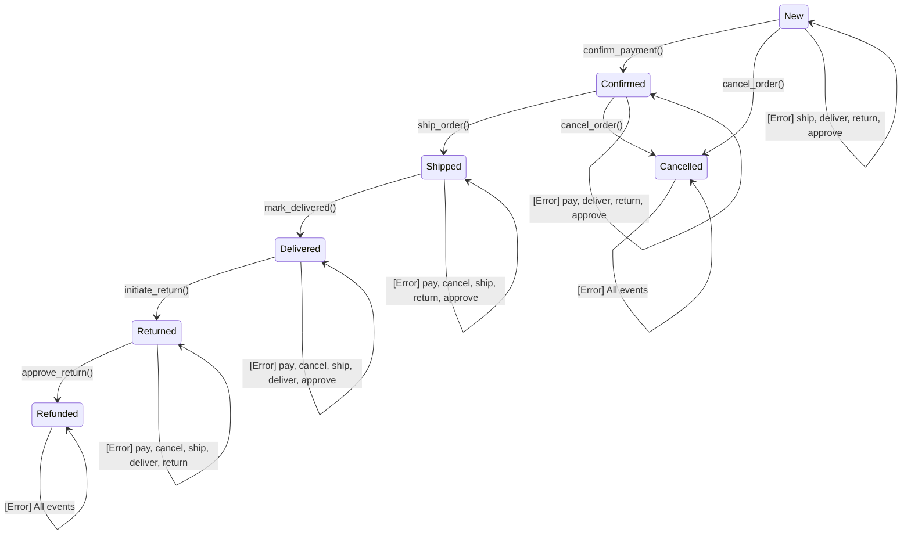

# Exercise 5: State Transition Testing

**Module**: 4 - Black Box Testing  
**Difficulty**: Intermediate  
**Time**: 60 minutes

---

## 🎯 Objectives

Practice identifying states, transitions, and events to test stateful systems.

By completing this exercise, you will:

- Identify states and transitions in a system
- Create state transition diagrams
- Build state transition tables
- Test valid and invalid transitions
- Calculate state and transition coverage
- Find defects in state machine implementations

---

## Instructions

For each scenario:

1. **Identify all states** the system can be in
2. **Identify events** that trigger transitions
3. **Map transitions** between states
4. **Create state diagram** (ASCII art or drawing)
5. **Create state transition table**
6. **Identify invalid transitions** (should be rejected)
7. **Implement state machine**
8. **Create tests** for all valid and invalid transitions
9. **Calculate coverage**

### State Transition Table Template

| Current State | Event   | Next State | Action/Output    |
| ------------- | ------- | ---------- | ---------------- |
| State A       | Event 1 | State B    | Action performed |
| State B       | Event 2 | State C    | Another action   |
| State B       | Event 3 | State A    | Return action    |

---

## Scenario 1: Order Processing System

### Requirements

An e-commerce order processing system with the following lifecycle:

**States**:

1. **New** - Order just created
2. **Confirmed** - Payment received and verified
3. **Shipped** - Package sent to customer
4. **Delivered** - Customer received package
5. **Returned** - Customer returned the order
6. **Refunded** - Money returned to customer
7. **Cancelled** - Order cancelled before shipping

**Events** (triggers):

- `confirm_payment()` - Payment processed successfully
- `cancel_order()` - Customer cancels order
- `ship_order()` - Warehouse ships package
- `mark_delivered()` - Delivery confirmed
- `initiate_return()` - Customer starts return process
- `approve_return()` - Return approved and received
- `issue_refund()` - Refund processed

**Business Rules**:

- Cannot cancel after shipping
- Cannot return without delivery
- Cannot ship without payment confirmation
- Return window: 30 days after delivery
- Refund only after return approval

### Part A: Create State Diagram

Create a state diagram showing all states and transitions:



**Your task**: Complete the diagram with ALL transitions, including error paths.

### Part B: Create State Transition Table

Complete this table:

| Test ID | Current State | Event             | Expected Next State     | Action/Validation                         | Valid? |
| ------- | ------------- | ----------------- | ----------------------- | ----------------------------------------- | ------ |
| ST_01   | New           | confirm_payment() | Confirmed               | Verify payment, send confirmation email   | Yes    |
| ST_02   | New           | cancel_order()    | Cancelled               | Release inventory, notify customer        | Yes    |
| ST_03   | New           | ship_order()      | New (no change)         | Error: Cannot ship unconfirmed order      | No     |
| ST_04   | New           | mark_delivered()  | New (no change)         | Error: Invalid state transition           | No     |
| ST_05   | New           | initiate_return() | New (no change)         | Error: Invalid state transition           | No     |
| ST_06   | New           | approve_return()  | New (no change)         | Error: Invalid state transition           | No     |
| ST_07   | Confirmed     | confirm_payment() | Confirmed (no change)   | Error: Already paid / Invalid state       | No     |
| ST_08   | Confirmed     | cancel_order()    | Cancelled               | Initiate refund, release inventory        | Yes    |
| ST_09   | Confirmed     | ship_order()      | Shipped                 | Generate tracking number, notify customer | Yes    |
| ST_10   | Confirmed     | mark_delivered()  | Confirmed (no change)   | Error: Invalid state transition           | No     |
| ST_11   | Confirmed     | initiate_return() | Confirmed (no change)   | Error: Invalid state transition           | No     |
| ST_12   | Confirmed     | approve_return()  | Confirmed (no change)   | Error: Invalid state transition           | No     |
| ST_13   | Shipped       | confirm_payment() | Shipped (no change)     | Error: Invalid state transition           | No     |
| ST_14   | Shipped       | cancel_order()    | Shipped (no change)     | Error: Cannot cancel shipped order        | No     |
| ST_15   | Shipped       | ship_order()      | Shipped (no change)     | Error: Invalid state transition           | No     |
| ST_16   | Shipped       | mark_delivered()  | Delivered               | Update delivery date, request review      | Yes    |
| ST_17   | Shipped       | initiate_return() | Shipped (no change)     | Error: Invalid state transition           | No     |
| ST_18   | Shipped       | approve_return()  | Shipped (no change)     | Error: Invalid state transition           | No     |
| ST_19   | Delivered     | confirm_payment() | Delivered (no change)   | Error: Already paid                       | No     |
| ST_20   | Delivered     | cancel_order()    | Delivered (no change)   | Error: Cannot cancel after delivery       | No     |
| ST_21   | Delivered     | ship_order()      | Delivered (no change)   | Error: Invalid state transition           | No     |
| ST_22   | Delivered     | mark_delivered()  | Delivered (no change)   | Error: Invalid state transition           | No     |
| ST_23   | Delivered     | initiate_return() | Returned                | Generate RMA number, send return label    | Yes    |
| ST_24   | Delivered     | approve_return()  | Delivered (no change)   | Error: Invalid state transition           | No     |
| ST_25   | Returned      | confirm_payment() | Returned (no change)    | Error: Invalid state transition           | No     |
| ST_26   | Returned      | cancel_order()    | Returned (no change)    | Error: Invalid state transition           | No     |
| ST_27   | Returned      | ship_order()      | Returned (no change)    | Error: Invalid state transition           | No     |
| ST_28   | Returned      | mark_delivered()  | Returned (no change)    | Error: Invalid state transition           | No     |
| ST_29   | Returned      | initiate_return() | Returned (no change)    | Error: Invalid state transition           | No     |
| ST_30   | Returned      | approve_return()  | Refunded                | Process refund, update inventory          | Yes    |
| ST_31   | Refunded      | [Any Event]       | Refunded (no change)    | Error: Terminal state                     | No     |
| ST_32   | Cancelled     | [Any Event]       | Cancelled (no change)   | Error: Terminal state                     | No     |

**Your task**: Complete the table with ALL possible transitions (valid and invalid).

### Part C: Implementation

**Python**:

```python
from enum import Enum
from datetime import datetime, timedelta
from typing import Optional, Tuple

class OrderState(Enum):
    NEW = "New"
    CONFIRMED = "Confirmed"
    SHIPPED = "Shipped"
    DELIVERED = "Delivered"
    RETURNED = "Returned"
    REFUNDED = "Refunded"
    CANCELLED = "Cancelled"

class OrderStateMachine:
    def __init__(self, order_id):
        self.order_id = order_id
        self.state = OrderState.NEW
        self.payment_confirmed = False
        self.tracking_number = None
        self.delivered_date = None
        self.rma_number = None
        self.history = [(OrderState.NEW, datetime.now())]

    def _transition(self, new_state: OrderState, message: str) -> Tuple[bool, str]:
        """Helper to record state transition."""
        self.history.append((new_state, datetime.now()))
        old_state = self.state
        self.state = new_state
        return True, f"Transitioned from {old_state.value} to {new_state.value}: {message}"

    def _reject(self, message: str) -> Tuple[bool, str]:
        """Helper to reject invalid transition."""
        return False, f"Invalid transition from {self.state.value}: {message}"

    def confirm_payment(self) -> Tuple[bool, str]:
        """Event: Payment confirmed."""
        if self.state == OrderState.NEW:
            self.payment_confirmed = True
            return self._transition(OrderState.CONFIRMED, "Payment confirmed")
        else:
            return self._reject("Cannot confirm payment in current state")

    def cancel_order(self) -> Tuple[bool, str]:
        """Event: Cancel order."""
        if self.state == OrderState.NEW:
            return self._transition(OrderState.CANCELLED, "Order cancelled before payment")
        elif self.state == OrderState.CONFIRMED:
            return self._transition(OrderState.CANCELLED, "Order cancelled, refund initiated")
        elif self.state == OrderState.SHIPPED:
            return self._reject("Cannot cancel order after shipping")
        elif self.state == OrderState.DELIVERED:
            return self._reject("Cannot cancel order after delivery. Use return process.")
        else:
            return self._reject("Cannot cancel order in current state")

    def ship_order(self) -> Tuple[bool, str]:
        """Event: Ship order."""
        if self.state == OrderState.CONFIRMED:
            self.tracking_number = f"TRK{self.order_id}123"
            return self._transition(OrderState.SHIPPED, f"Order shipped, tracking: {self.tracking_number}")
        elif self.state == OrderState.NEW:
            return self._reject("Cannot ship order without payment confirmation")
        else:
            return self._reject("Cannot ship order in current state")

    def mark_delivered(self) -> Tuple[bool, str]:
        """Event: Mark as delivered."""
        if self.state == OrderState.SHIPPED:
            self.delivered_date = datetime.now()
            return self._transition(OrderState.DELIVERED, "Order delivered successfully")
        else:
            return self._reject("Cannot mark as delivered in current state")

    def initiate_return(self) -> Tuple[bool, str]:
        """Event: Customer initiates return."""
        if self.state == OrderState.DELIVERED:
            # Check 30-day return window
            if datetime.now() - self.delivered_date > timedelta(days=30):
                return self._reject("Return window (30 days) has expired")
            self.rma_number = f"RMA{self.order_id}456"
            return self._transition(OrderState.RETURNED, f"Return initiated, RMA: {self.rma_number}")
        else:
            return self._reject("Can only return delivered orders")

    def approve_return(self) -> Tuple[bool, str]:
        """Event: Return approved and received."""
        if self.state == OrderState.RETURNED:
            return self._transition(OrderState.REFUNDED, "Return approved, refund processed")
        else:
            return self._reject("No return to approve")

    def get_state(self) -> OrderState:
        """Get current state."""
        return self.state

    def get_history(self) -> list:
        """Get state transition history."""
        return self.history


# Test cases - Valid transitions
def test_valid_new_to_confirmed():
    """ST_01: New → Confirmed via confirm_payment()"""
    order = OrderStateMachine("ORD001")
    success, msg = order.confirm_payment()
    assert success == True
    assert order.get_state() == OrderState.CONFIRMED
    assert "Payment confirmed" in msg

def test_valid_new_to_cancelled():
    """ST_02: New → Cancelled via cancel_order()"""
    order = OrderStateMachine("ORD002")
    success, msg = order.cancel_order()
    assert success == True
    assert order.get_state() == OrderState.CANCELLED

def test_valid_confirmed_to_shipped():
    """ST_04: Confirmed → Shipped via ship_order()"""
    order = OrderStateMachine("ORD003")
    order.confirm_payment()
    success, msg = order.ship_order()
    assert success == True
    assert order.get_state() == OrderState.SHIPPED
    assert order.tracking_number is not None

def test_valid_shipped_to_delivered():
    """ST_07: Shipped → Delivered via mark_delivered()"""
    order = OrderStateMachine("ORD004")
    order.confirm_payment()
    order.ship_order()
    success, msg = order.mark_delivered()
    assert success == True
    assert order.get_state() == OrderState.DELIVERED

def test_valid_delivered_to_returned():
    """ST_08: Delivered → Returned via initiate_return()"""
    order = OrderStateMachine("ORD005")
    order.confirm_payment()
    order.ship_order()
    order.mark_delivered()
    success, msg = order.initiate_return()
    assert success == True
    assert order.get_state() == OrderState.RETURNED
    assert order.rma_number is not None

def test_valid_returned_to_refunded():
    """ST_10: Returned → Refunded via approve_return()"""
    order = OrderStateMachine("ORD006")
    order.confirm_payment()
    order.ship_order()
    order.mark_delivered()
    order.initiate_return()
    success, msg = order.approve_return()
    assert success == True
    assert order.get_state() == OrderState.REFUNDED

# Test cases - Invalid transitions
def test_invalid_new_to_shipped():
    """ST_03: New → Shipped (should fail - no payment)"""
    order = OrderStateMachine("ORD007")
    success, msg = order.ship_order()
    assert success == False
    assert order.get_state() == OrderState.NEW
    assert "Cannot ship" in msg

def test_invalid_shipped_to_cancelled():
    """ST_06: Shipped → Cancelled (should fail - already shipped)"""
    order = OrderStateMachine("ORD008")
    order.confirm_payment()
    order.ship_order()
    success, msg = order.cancel_order()
    assert success == False
    assert order.get_state() == OrderState.SHIPPED
    assert "Cannot cancel" in msg

def test_invalid_new_to_delivered():
    """ST_11: New → Delivered (should fail - invalid transition)"""
    order = OrderStateMachine("ORD009")
    success, msg = order.mark_delivered()
    assert success == False
    assert order.get_state() == OrderState.NEW

def test_invalid_delivered_confirm_payment():
    """ST_09: Delivered → confirm_payment (should fail - already paid)"""
    order = OrderStateMachine("ORD010")
    order.confirm_payment()
    order.ship_order()
    order.mark_delivered()
    success, msg = order.confirm_payment()
    assert success == False
    assert order.get_state() == OrderState.DELIVERED

# Test state history
def test_state_history_tracking():
    """Verify state history is tracked correctly"""
    order = OrderStateMachine("ORD011")
    order.confirm_payment()
    order.ship_order()
    order.mark_delivered()

    history = order.get_history()
    assert len(history) == 4  # NEW, CONFIRMED, SHIPPED, DELIVERED
    assert history[0][0] == OrderState.NEW
    assert history[1][0] == OrderState.CONFIRMED
    assert history[2][0] == OrderState.SHIPPED
    assert history[3][0] == OrderState.DELIVERED

# TODO: Add tests for ALL transitions in state table
```

### Part D: Calculate Coverage

Calculate:

1. **State Coverage**: (States visited / Total states) × 100%
2. **Transition Coverage**: (Transitions tested / Total valid transitions) × 100%
3. **Invalid Transition Coverage**: (Invalid transitions tested / Total invalid transitions) × 100%

---

