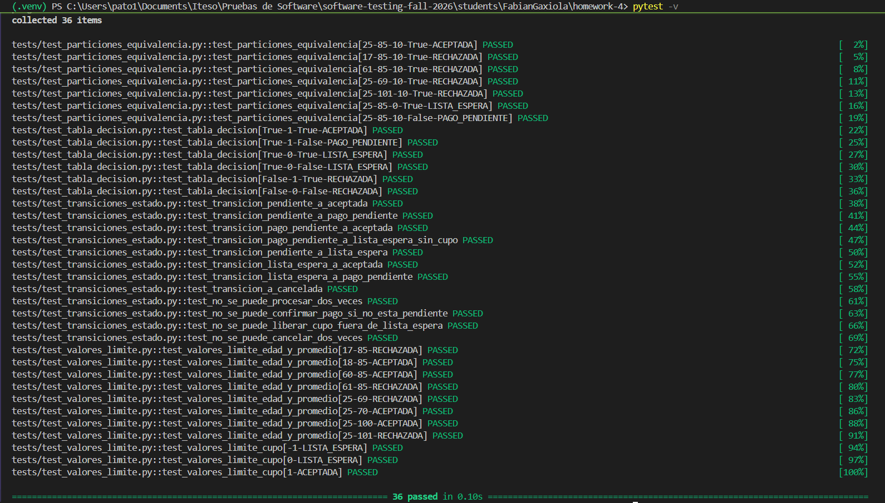
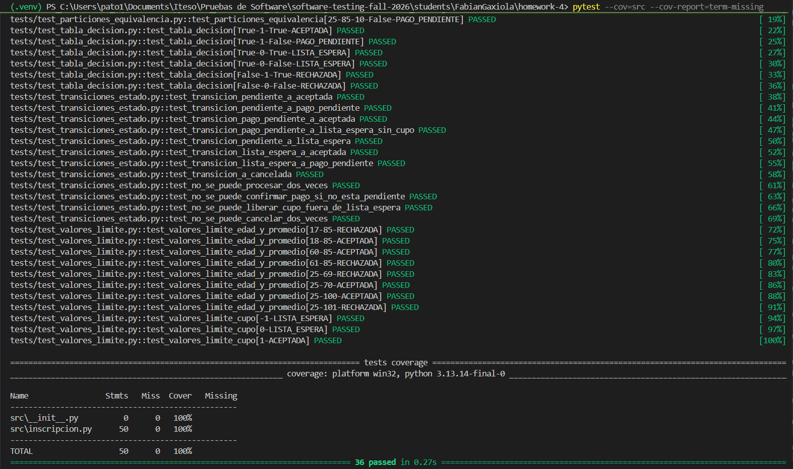
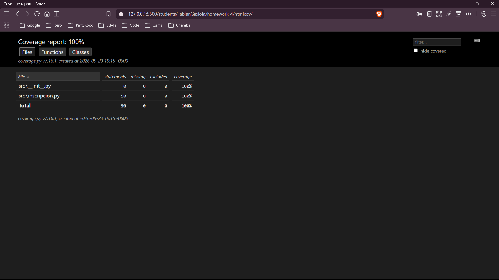

# Reporte de ejecución de pruebas

## Información general

| Elemento                 | Valor                           |
| ------------------------ | ------------------------------- |
| Proyecto                 | Sistema de inscripción a cursos |
| Lenguaje                 | Python                          |
| Framework                | pytest                          |
| Herramienta de cobertura | pytest-cov                      |
| Fecha de ejecución       | 23-09-2026                      |
| Responsable              | Fabián Gaxiola                  |

## Comando utilizado

```bash
pytest --cov=src --cov-report=term-missing --cov-report=html
```

## Resultado de ejecución

| Métrica                    |                         Resultado |
| -------------------------- | --------------------------------: |
| Casos de prueba ejecutados |                                35 |
| Casos exitosos             |                  [Resultado real] |
| Casos fallidos             |                  [Resultado real] |
| Porcentaje de éxito        |                  [Resultado real] |
| Cobertura de líneas        |                  [Resultado real] |
| Cobertura de ramas         | [Resultado real, si se configuró] |

## Resultado esperado

Todos los casos deben finalizar exitosamente.

## Evidencias

### Ejecución de pruebas



### Cobertura en terminal



### Cobertura HTML



## Conclusión

La ejecución validó las reglas de negocio relacionadas con edad, promedio, cupo disponible, pago y cambios de estado de una solicitud de inscripción. Las pruebas automatizadas fueron implementadas con pytest y cubren las técnicas de particiones de equivalencia, valores límite, tablas de decisión y transiciones de estado.
