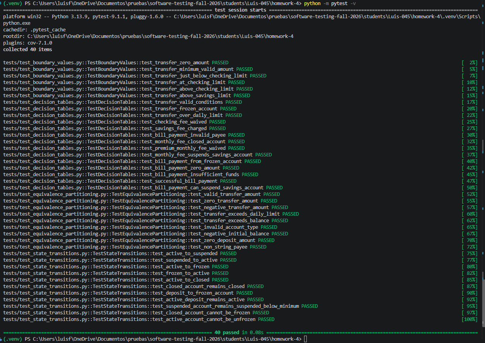
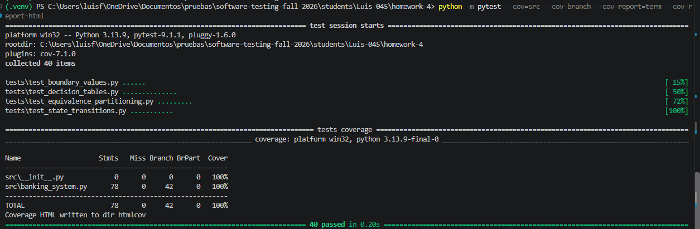

# SecureBank Test Execution Report

## 1. Test Execution Summary

The SecureBank black box test suite was executed successfully using pytest. The final test suite contains 40 automated test cases covering the four black box testing techniques required for this assignment.

| Metric | Result |
|---|---:|
| Total Tests | 40 |
| Passed | 40 |
| Failed | 0 |
| Success Rate | 100% |
| Code Coverage | 100% |

All implemented test cases passed successfully.

---

## 2. Test Environment

The tests were executed using the following environment:

- Operating System: Windows
- Python: 3.13.9
- pytest: 9.1.1
- pytest-cov: 7.1.0
- Test Framework: pytest
- Coverage Tool: pytest-cov

The test suite was executed from the `homework-4` project directory using a Python virtual environment.

---

## 3. Test Results by Technique

### Equivalence Partitioning

A total of 9 Equivalence Partitioning tests were implemented.

The tests validate representative valid and invalid input classes including:

- Valid transfer amounts
- Zero transfer amounts
- Negative transfer amounts
- Transfers exceeding daily limits
- Transfers exceeding available balance
- Invalid account types
- Negative initial balances
- Invalid deposit amounts
- Invalid payee types

**Result:** 9 passed, 0 failed.

### Boundary Value Analysis

A total of 6 Boundary Value Analysis tests were implemented.

The tests focus primarily on transfer boundaries such as:

- Zero transfer amount
- Minimum valid transfer amount
- Value immediately below the Checking daily limit
- Exact Checking daily limit
- Value immediately above the Checking daily limit
- Value above the Savings daily limit

**Result:** 6 passed, 0 failed.

### Decision Table Testing

A total of 14 Decision Table tests were implemented.

These tests verify combinations of conditions related to:

- Transfer authorization
- Daily transfer limits
- Frozen account restrictions
- Monthly fee processing
- Fee waiver conditions
- Premium account fees
- Bill payment validation
- Invalid payees
- Insufficient funds
- Invalid payment amounts

**Result:** 14 passed, 0 failed.

### State Transition Testing

A total of 11 State Transition tests were implemented.

These tests validate transitions between the following account states:

- Active
- Suspended
- Frozen
- Closed

Examples include:

- Active to Suspended
- Suspended to Active
- Active to Frozen
- Frozen to Active
- Active to Closed
- Closed account remaining Closed
- Frozen account rejecting deposits
- Invalid unfreeze operations
- Closed account rejecting state changes

**Result:** 11 passed, 0 failed.

---

## 4. Code Coverage

Coverage was measured using pytest-cov with branch coverage enabled.

The final execution achieved:

| File | Coverage |
|---|---:|
| `src/__init__.py` | 100% |
| `src/banking_system.py` | 100% |
| **Total** | **100%** |

The final test suite covers all statements and branches reported by the coverage tool.

The following command was used:

```bash
python -m pytest --cov=src --cov-branch --cov-report=term-missing
```

---

## 5. Execution Evidence

### Test Results

The following screenshot shows the successful execution of the complete automated test suite.



The final execution completed with:

**40 passed, 0 failed.**

### Coverage Report

The following screenshot shows the final coverage results.



The final code coverage achieved was:

**100%.**

---

## 6. Issues Found During Testing

During the initial test execution, some branches of the banking system were not exercised by the first set of test cases.

Initial coverage showed that behaviors such as invalid account creation, frozen account deposits, invalid state transitions, monthly fee edge cases, and several bill payment conditions were not fully covered.

Additional black box test cases were created to exercise these scenarios. After adding the additional tests, all 40 tests passed and the final coverage increased to 100%.

No unresolved test failures remain.

---

## 7. Final Result

The SecureBank system successfully passed all automated black box tests.

The final test suite demonstrates the application of:

- Equivalence Partitioning
- Boundary Value Analysis
- Decision Table Testing
- State Transition Testing

The execution resulted in 40 successful tests and 100% code coverage.