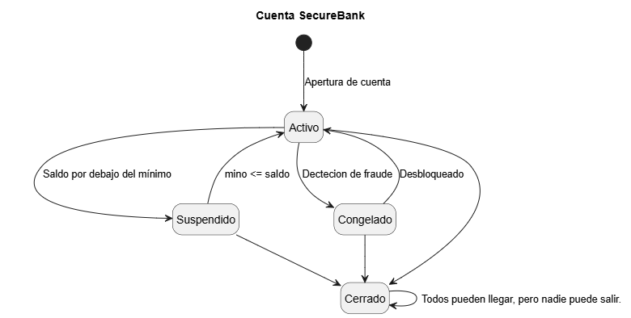

# Black Box Testing Analysis Report

## Executive Summary

Es difícil armar prueba. Después de diseñar 24 pruebas puedo decir que es muy fácil imaginar cómo probar el código, pero materializarlo en algo formal es mucho más complicado de lo que pensé. Entre EP, BVA, tablas de decisión y transición de estados, logre el 98% de código tuviera cobertura, pero siendo más difícil de lo que creí para llegar a este resultado.

## Technique Effectiveness

### Equivalence Partitioning

Me pareció interesante lo riguroso que puede ser plantear pruebas. Las tablas de decisión se me hacen más fáciles de aplicar porque me recuerdan a las tablas de validez de la lógica formal. También se me facilita hacer las tablas de partición y de límites, al tomar los tres puntos, que pueden ser elementos como los de la tabla de transiciones. Esta última, a diferencia de la primera que mencioné, choca con la manera en que lo hacía en lenguajes formales, por eso me cuesta más. Además, descubrí que siempre olvido hacer una prueba intermedia.

### Boundary Value Analysis

En esta ocasión, más que tener límites valiosos por la complejidad del proyecto, creo que la práctica me ayudó a estructurar mejor esta parte. En sí, todo lo que se refiere a los límites es valioso, al ser donde se concentra la mayoría de los errores. Aun así, los límites que más tuve que revisar fueron los del dinero: además de ser donde más problemas tuve para entender la lógica, son los más fundamentales para este tipo de proyecto, ya que definen si el programa termina funcionando como se espera o no.

### Decision Tables

La verdad, este tema fue el que más me costó plasmar. En mi cabeza sabía cómo funcionaba, pero me costó plasmarlo en el texto, ya que las normas que se usan aquí son diferentes a las que suelo usar con este propósito. Sin embargo, una vez que lo entendí, su lógica y sus resultados se me hicieron muy intuitivos, y creo que, entendiéndola, es una gran herramienta. Eso sí, para llegar a ello tuve que modelarla antes en papel.

### State Transition Testing

Creo que las pruebas estáticas me ayudaron más que nada en esta práctica a encontrar errores muy simples como que puse mal los nombre de los estados o como escribir true y false con mayúscula en JS, elementos mal conectados y faltas de ortografía. La verdad, en esta práctica las pruebas de caja negra no fueron las protagonistas, como en la pasada dedicada a ellas, pero me ayudaron a evitar problemas tontos, por los cuales el reporte se vería feo o no se podría correr el proyecto.

## Coverage Comparison

## Real-World Application

Creo que en el ámbito profesional son una gran ayuda para saber que lo que estamos haciendo se realizó de la manera correcta. Por eso se plantean las pruebas antes del código: para que lo que realicemos a partir de él pueda evaluarse correctamente, sin que los errores se expandan a producción. Esto es vital sobre todo en casos como el de un banco, porque, sin contar la regla del x10 para resolver errores en producción, estos le harían perder una cantidad muy relevante de dinero si no se revisan bien, y su reputación caería hasta el piso. Por lo tanto, es muy importante solucionarlos lo antes posible, y a las empresas les conviene mucho invertir en pruebas.

## Recommendations

Por mi parte, en el futuro me quedaría con el análisis de valores límite y con las tablas de decisión, ya que con ellas se puede plantear cualquier tipo de situación. Dejaría la primera para las condiciones individuales, y las tablas de decisión para las que tienen dos o más condiciones e incluso para las transiciones. Son con las que me sentí más cómodo y las que siento más fáciles de entender de manera visual y práctica.

## Lessons Learned

Lo más importante es aprender a manejar todo tipo de pruebas, ya sea para el examen, que nos comentó que vendrá principalmente de este apartado, o para la vida profesional. Es importante saber manejar un poco de todo, además de poder evaluar nuestro propio trabajo o dejarles las pautas a los demás de manera correcta. Entonces, aprender a usarlas y juzgar cuándo es mejor usar cada una es muy importante.
