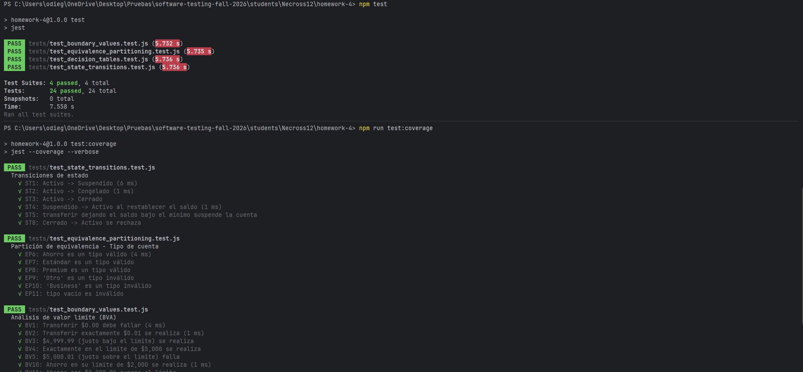
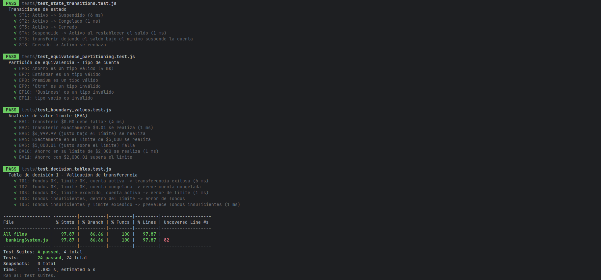

## Test Execution Summary

- **Date**: 2026-08-20
- **Test Framework**: Jest
- **Total Tests**: 24
- **Passed**: 24
- **Failed**: 0
- **Skipped**: 0
- **Duration**: 1.885 s, estimated 6 s

## Coverage Summary

- **Line Coverage**: 97.87%
- **Branch Coverage**: 86.66%
- **Function Coverage**: 100%

## Results by Technique

### Equivalence Partitioning (6 tests)

- ✅ EP6: Ahorro es un tipo válido
- ✅ EP7: Estándar es un tipo válido
- ✅ EP8: Premium es un tipo válido
- ✅ EP9: Otro es un tipo inválido
- ✅ EP10: Business es un tipo inválido
- ✅ EP11: tipo vacío es inválido

**Defects Found**: Ninguno en el código.

### Boundary Value Analysis (7 tests)

- ✅ BV1: Transferir $0.00 debe fallar
- ✅ BV2: Transferir exactamente $0.01 se realiza
- ✅ BV3: $4,999.99 (justo bajo el límite) se realiza
- ✅ BV4: Exactamente en el límite de $5,000 se realiza
- ✅ BV5: $5,000.01 (justo sobre el límite) falla
- ✅ BV10: Ahorro en su límite de $2,000 se realiza
- ✅ BV11: Ahorro con $2,000.01 supera el límite

**Defects Found**: Ninguno.

### Decision Tables (5 tests)
- ✅ TD1 (Regla 1): fondos OK, límite OK, cuenta activa -> transferencia exitosa
- ✅ TD2 (Regla 2): cuenta congelada -> error cuenta congelada
- ✅ TD3 (Regla 3): límite excedido -> error de límite
- ✅ TD4 (Regla 5): fondos insuficientes -> error de fondos
- ✅ TD5 (Regla 7): fondos insuficientes y límite excedido -> prevalece fondos insuficientes

**Defects Found**: La tabla marca varios errores por regla; el código devuelve solo el primero (fondos > límite).

### State Transitions (6 tests)
- ✅ ST1: Activo -> Suspendido
- ✅ ST2: Activo -> Congelado
- ✅ ST3: Activo -> Cerrado
- ✅ ST4: Suspendido -> Activo al restablecer el saldo
- ✅ ST5: transferir dejando el saldo bajo el mínimo suspende la cuenta
- ✅ ST8: Cerrado -> Activo se rechaza

**Defects Found**: La versión inicial usaba "Active" en el constructor y "Activo" en `next()`, por lo que el rechazo de cuentas cerradas nunca se activaba.

## Screenshots

## Coverage Analysis

¿Qué rutas de código están cubiertas?
Todo el código se somete a pruebas por medio de las funciones y hubop el 97% de sentencias.

¿Cuáles no están cubiertos y por qué?
Se cubrió el porcentaje de cobertura solicitado en la planeación (tanto en la parte 1 como en la parte 2). Faltan elementos por cubrir de estas secciones; sin embargo, al ser opcionales, no se tomaron en cuenta.
Faltan una sentencia y varias ramas al ser el 87%.

¿En qué se diferencia la cobertura según la técnica?
* Partición equivalente: Solo busca separar los elementos en clases.
* Análisis de valores límite: Prueba los casos donde es más probable que se encuentren errores.
* Tabla de decisiones: Ayuda a probar elementos complejos agrupando reglas según la acción que se considere necesaria.
* Tabla de transición de estados: Verifica los elementos que pueden cambiar de estado para asegurarse de que no se alcancen zonas incorrectas.

| Técnica                   | Sentencias | Ramas   |
|---------------------------|------------|---------|
| Partición de equivalencia | 34.04 %    | 23.33 % |
| Valores límite            | 65.95 %    | 40 %    |
| Tablas de decisión        | 78.72 %    | 50 %    |
| Transición de estados     | 74.46 %    | 46.66 % |

Las tablas de decisión cubren más código porque recorren varias validaciones de transfer y la partición solo toca validarTipoCuenta.
