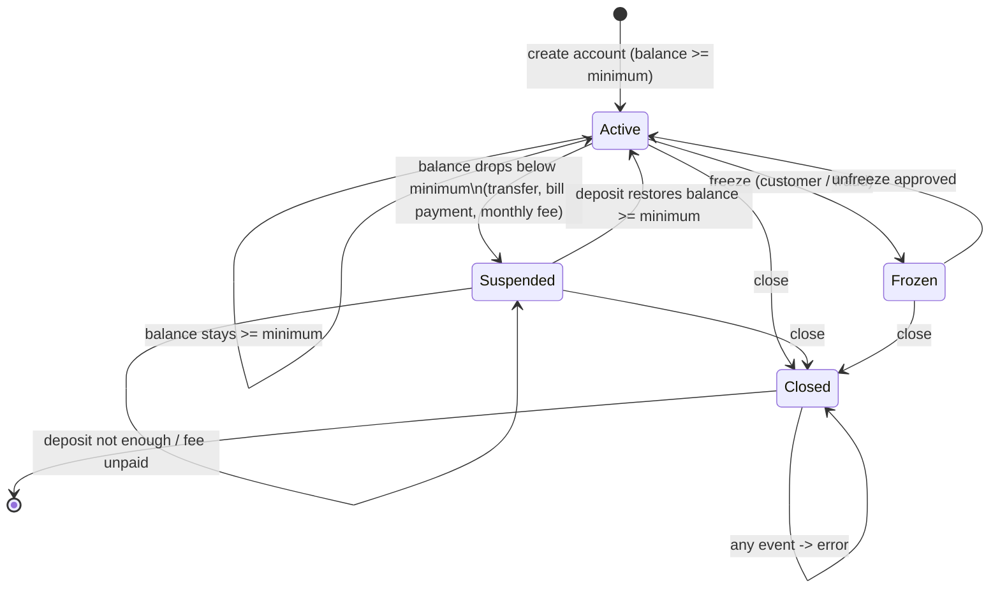

# Test Design Document - SecureBank Online Banking

**Student**: Rogelio Sosa (Rro0O)
**Module**: 4 - Black Box Testing
**Techniques**: Equivalence Partitioning (EP), Boundary Value Analysis (BVA), Decision Tables (DT), State Transition Testing (ST)

The design is derived from the assignment statement (tests assert the specified behaviour, not implementation details), and the IDs below
(`EP12`, `BV27`, `DT2-R6`, `ST17`, ...) are the same IDs that appear in the docstrings / test names of `tests/`.

## 0. Specification interpretation

The statement leaves a few points open. Every one of them was decided **before** writing tests and is documented here so the
tests have an unambiguous oracle.

| # | Ambiguity in the statement | Decision |
|---|----------------------------|----------|
| A1 | Can a **Suspended** account transact? | Yes. "Suspended: warnings shown" and the transfer rule only blocks Frozen / Closed. |
| A2 | Can a transfer leave the balance below the minimum? | Yes, the transfer succeeds and the account becomes Suspended (Active -> Suspended: "balance drops below minimum"; example ST1). |
| A3 | "Balance restored above minimum" | Balance `>= minimum` reactivates. The minimum itself is a valid balance. |
| A4 | Fee waiver "balance > $1,000" | Strictly greater. Exactly $1,000 still pays the fee. Same for $5,000 (Checking). |
| A5 | Is the daily limit per transfer or cumulative? | Cumulative per calendar day, reset when the day changes. Rejected transfers do not count. |
| A6 | Several rules violated at once | Frozen/Closed short-circuits (nothing else matters). For operable accounts, all violated rules are reported (`errors` list). |
| A7 | Freeze from Suspended? | Not allowed: the statement only lists Active -> Frozen. |
| A8 | Fees for Frozen / Closed accounts | Not processed (no transactions allowed). Suspended accounts still pay. |
| A9 | Amount precision | Amounts must be whole cents (max 2 decimals): $0.001 is invalid. |
| A10 | Creating an account below the minimum | Rejected. (Suspended accounts appear only when the balance *drops*.) |
| A11 | Deposits | Not listed as a feature, but needed for Suspended -> Active. Deposits are blocked for Frozen / Closed. |

Account parameters used throughout:

| Type | Minimum balance | Monthly fee | Waived if balance > | Daily limit |
|------|-----------------|-------------|---------------------|-------------|
| Savings | $100 | $5 | $1,000 | $2,000 |
| Checking | $0 | $10 | $5,000 | $5,000 |
| Premium | $10,000 | $0 | (always) | $50,000 |

---

## 1. Equivalence Partitioning

Eight inputs, 37 partitions (V = valid, I = invalid).

### Input 1: Transfer amount (Checking, $10,000 balance, $5,000 limit)

| Partition ID | Description | Type | Representative Value | Expected Result |
|--------------|-------------|------|----------------------|-----------------|
| EP1 | Valid amount within limits | V | $500 | Transfer succeeds, balance $9,500 |
| EP2 | Zero amount | I | $0 | Error: Amount must be positive |
| EP3 | Negative amount | I | -$100 | Error: Amount must be positive |
| EP4 | Amount exceeds daily limit | I | $100,000 | Error: Exceeds daily limit |
| EP5 | Amount exceeds balance | I | Balance + $1 | Error: Insufficient funds |
| EP6 | Not a number (text, null, boolean, NaN, infinity) | I | `"abc"`, `None`, `True`, `NaN`, `inf` | Error: Amount must be a number |
| EP7 | More than two decimals | I | $10.005 | Error: at most 2 decimal places |

### Input 2: Account type

| Partition ID | Description | Type | Representative Value | Expected Result |
|--------------|-------------|------|----------------------|-----------------|
| EP8 | Savings | V | Savings | Daily limit $2,000 |
| EP9 | Checking | V | Checking | Daily limit $5,000 |
| EP10 | Premium | V | Premium | Daily limit $50,000 |
| EP11 | Unknown type | I | "Gold" | Error: Invalid account type |

### Input 3: Account balance (opening balance at account creation)

| Partition ID | Description | Type | Representative Value | Expected Result |
|--------------|-------------|------|----------------------|-----------------|
| EP12 | Negative | I | -$1 | Error: cannot be negative |
| EP13 | Between $0 and the type minimum | I | Savings $50 | Error: below the Savings minimum |
| EP14 | At or above the type minimum | V | Savings $500 | Account created, state Active |
| EP15 | Not a number | I | "lots" | Error: must be a number |

### Input 4: Account state (when transferring)

| Partition ID | Description | Type | Representative Value | Expected Result |
|--------------|-------------|------|----------------------|-----------------|
| EP16 | Active | V | Active | Transfer succeeds, no warning |
| EP17 | Suspended | V | Savings at $90 | Transfer succeeds (warning state kept) |
| EP18 | Frozen | I | Frozen | Error: Account is frozen |
| EP19 | Closed | I | Closed | Error: Account is closed |

### Input 5: Payee information (bill payment)

| Partition ID | Description | Type | Representative Value | Expected Result |
|--------------|-------------|------|----------------------|-----------------|
| EP20 | Registered payee | V | "CFE Electricity" | Payment made |
| EP21 | Well-formed but unregistered payee | I | "Random Store" | Error: Invalid payee |
| EP22 | Empty / whitespace payee | I | `""`, `"   "` | Error: Payee is required |
| EP23 | Missing / not a string | I | `None` | Error: Payee is required |

### Input 6: Payment date (bill payment)

| Partition ID | Description | Type | Representative Value | Expected Result |
|--------------|-------------|------|----------------------|-----------------|
| EP24 | No date (immediate) | V | none | Debited now |
| EP25 | Future date | V | 2026-10-01 | Scheduled, no debit yet |
| EP26 | Past date | I | 2026-09-01 (today = 09-15) | Error: date in the past |
| EP27 | Malformed date | I | "15/09/2026" | Error: Invalid payment date |

### Input 7: Date range for transaction history

| Partition ID | Description | Type | Representative Value | Expected Result |
|--------------|-------------|------|----------------------|-----------------|
| EP28 | Range containing transactions | V | Sep 5 - Sep 15 | Only matching transactions |
| EP29 | Valid range without transactions | V | Aug 1 - Aug 31 | Empty list |
| EP30 | Only start date | V | start = Sep 10 | Everything from Sep 10 |
| EP31 | Only end date | V | end = Sep 10 | Everything up to Sep 10 |
| EP32 | Start after end | I | Sep 20 - Sep 1 | Error: start must not be after end |
| EP33 | Malformed date | I | "yesterday", "2026-02-30" | Error: Invalid date |
| EP34 | No filter | V | none | Whole history |

### Input 8: Deposit amount / date input types (supporting)

| Partition ID | Description | Type | Representative Value | Expected Result |
|--------------|-------------|------|----------------------|-----------------|
| EP35 | Deposit that is not a positive 2-decimal number | I | 0, -5, "ten", 1.234 | Rejected, balance unchanged |
| EP36 | Valid deposit | V | $250.50 | Balance increases |
| EP37 | Date given as date / datetime / ISO string vs other type | V / I | `date`, `datetime`, "2026-09-01" / `12345` | Same day recognised / Error: Invalid date |

---

## 2. Boundary Value Analysis

Twelve boundaries. Test values follow the classic "just below / at / just above" pattern (minimum, min+, nominal, max-, max, max+).

### Boundary 1: Transfer amount - Checking, $5,000 limit (balance $10,000)

| Test ID | Boundary | Test Value | Expected Result |
|---------|----------|------------|-----------------|
| BV1 | Below minimum | $0.00 | Error: Amount must be positive |
| BV2 | Minimum valid | $0.01 | Transfer succeeds |
| BV3 | Just below limit | $4,999.99 | Transfer succeeds |
| BV4 | At limit | $5,000.00 | Transfer succeeds |
| BV5 | Just above limit | $5,000.01 | Error: Exceeds daily limit |
| BV6 | Far above limit | $10,000.00 | Error: Exceeds daily limit |

### Boundary 2: Transfer amount - Savings, $2,000 limit (balance $5,000)

| Test ID | Boundary | Test Value | Expected Result |
|---------|----------|------------|-----------------|
| BV7 | Minimum valid | $0.01 | Succeeds |
| BV8 | Just below limit | $1,999.99 | Succeeds |
| BV9 | At limit | $2,000.00 | Succeeds |
| BV10 | Just above limit | $2,000.01 | Error: Exceeds daily limit |
| BV11 | Far above limit | $4,000.00 | Error: Exceeds daily limit |

### Boundary 3: Transfer amount vs. balance (Checking, balance $1,000)

| Test ID | Boundary | Test Value | Expected Result |
|---------|----------|------------|-----------------|
| BV12 | Small amount | $1.00 | Succeeds, balance $999.00 |
| BV13 | One cent below balance | $999.99 | Succeeds, balance $0.01 |
| BV14 | Exactly the balance | $1,000.00 | Succeeds, balance $0.00 |
| BV15 | One cent above balance | $1,000.01 | Error: Insufficient funds |
| BV16 | Far above balance | $1,500.00 | Error: Insufficient funds |

### Boundary 4: Resulting balance vs. minimum (Savings $200 -> minimum $100; Premium $10,001 -> minimum $10,000)

| Test ID | Boundary | Test Value (transfer -> remaining) | Expected Result |
|---------|----------|------------------------------------|-----------------|
| BV17 | Just above minimum | $99.99 -> $100.01 | Stays Active |
| BV18 | At minimum | $100.00 -> $100.00 | Stays Active |
| BV19 | Just below minimum | $100.01 -> $99.99 | Suspended |
| BV20 | Almost empty | $199.99 -> $0.01 | Suspended |
| BV21 | Empty | $200.00 -> $0.00 | Suspended |
| BV22 | Premium at / below minimum | remaining $10,000.00 vs $9,999.99 | Active vs Suspended |

### Boundary 5: Cumulative daily limit (Checking, $5,000)

| Test ID | Boundary | Test Sequence | Expected Result |
|---------|----------|---------------|-----------------|
| BV23 | Two transfers summing exactly to the limit | $4,999.99 then $0.01 | Both succeed, total $5,000 |
| BV24 | One cent over the accumulated limit | $5,000 then $0.01 | Second fails: Exceeds daily limit |
| BV25 | Rejected transfer does not count | $5,000.01 (rejected) then $5,000 | Second succeeds |
| BV26 | Midnight rollover | $5,000 on day D, $5,000 on D+1 | Both succeed |
| BV27 | Same day, no rollover | $5,000 then $1 on D; $1 on D+1 | Fails on D, succeeds on D+1 |

### Boundary 6: Fee waiver threshold

| Test ID | Boundary | Test Value | Expected Result |
|---------|----------|------------|-----------------|
| BV28 | Savings just below $1,000 | $999.99 | Fee $5 |
| BV29 | Savings at $1,000 | $1,000.00 | Fee $5 (waiver needs `>`) |
| BV30 | Savings just above | $1,000.01 | Waived |
| BV31 | Savings well above | $1,001.00 | Waived |
| BV32 | Checking just below $5,000 | $4,999.99 | Fee $10 |
| BV33 | Checking at $5,000 | $5,000.00 | Fee $10 |
| BV34 | Checking just above | $5,000.01 | Waived |

### Boundary 7: Balance vs. the $10 Checking fee (can the fee be paid?)

| Test ID | Boundary | Test Value | Expected Result |
|---------|----------|------------|-----------------|
| BV35 | One cent below the fee | $9.99 | Not charged, Suspended, unpaid fee = $10 |
| BV36 | Exactly the fee | $10.00 | Charged, balance $0, stays Active (minimum $0) |
| BV37 | One cent above the fee | $10.01 | Charged, balance $0.01 |

### Boundary 8: Day of the month for fee processing

| Test ID | Boundary | Test Value | Expected Result |
|---------|----------|------------|-----------------|
| BV38 | Last day of previous month | 2026-09-30 | Not processed |
| BV39 | First of the month | 2026-10-01 | Processed |
| BV40 | Day after | 2026-10-02 | Not processed |
| BV41 | Last day of February | 2026-02-28 | Not processed |
| BV42 | First day after February | 2026-03-01 | Processed |

### Boundary 9: Opening balance vs. minimum

| Test ID | Boundary | Test Value | Expected Result |
|---------|----------|------------|-----------------|
| BV43 | Savings just below | $99.99 | Rejected |
| BV44 | Savings at minimum | $100.00 | Created |
| BV45 | Savings just above | $100.01 | Created |
| BV46 | Premium just below | $9,999.99 | Rejected |
| BV47 | Premium at minimum | $10,000.00 | Created |
| BV48 | Premium just above | $10,000.01 | Created |

### Boundary 10: Amount precision

| Test ID | Boundary | Test Value | Expected Result |
|---------|----------|------------|-----------------|
| BV49 | Below one cent | $0.001 | Rejected |
| BV50 | One cent | $0.01 | Accepted |
| BV51 | Fraction of a cent | $0.011 | Rejected |
| BV52 | Ten cents | $0.10 | Accepted |

### Boundary 11: History date range (range Sep 10 - Sep 20, deposits on Sep 9, 10, 20, 21)

| Test ID | Boundary | Test Value | Expected Result |
|---------|----------|------------|-----------------|
| BV53 | Day before start | Sep 9 | Excluded |
| BV54 | Start day | Sep 10 | Included |
| BV55 | End day | Sep 20 | Included |
| BV56 | Day after end / single-day range | Sep 21 / Sep 20-Sep 20 | Excluded / 1 result |

### Boundary 12: Bill payment date around "today" (Sep 15)

| Test ID | Boundary | Test Value | Expected Result |
|---------|----------|------------|-----------------|
| BV57 | Yesterday | 2026-09-14 | Rejected |
| BV58 | Today | 2026-09-15 | Paid immediately |
| BV59 | Tomorrow | 2026-09-16 | Scheduled |

---

## 3. Decision Tables

### Decision Table 1: Transfer validation

Conditions: funds sufficient (amount <= balance), within daily limit (accumulated + amount <= limit), account operable (Active or Suspended).
Per A6 a non-operable account short-circuits the other checks.

| Condition | R1 | R2 | R3 | R4 | R5 | R6 | R7 | R8 |
|-----------|----|----|----|----|----|----|----|----|
| Sufficient funds? | Y | Y | Y | Y | N | N | N | N |
| Within daily limit? | Y | Y | N | N | Y | Y | N | N |
| Account operable? | Y | N | Y | N | Y | N | Y | N |
| **Action** | | | | | | | | |
| Transfer succeeds | X | | | | | | | |
| Error: Account frozen / closed | | X | | X | | X | | X |
| Error: Exceeds daily limit | | | X | | | | X | |
| Error: Insufficient funds | | | | | X | | X | |

Additional rules (single-condition variations):

| Rule | Situation | Action |
|------|-----------|--------|
| R9 | Closed source account | Error: Account is closed |
| R10 | Destination own account is Closed | Error: Destination account cannot receive funds, nothing debited |
| R11 | Destination own account is valid | Source debited **and** destination credited |
| R12 | Destination is the source itself | Error: Cannot transfer to the same account |
| R13 | Destination own account is Suspended | Succeeds; destination reactivated if minimum reached |

### Decision Table 2: Monthly fee processing (executed on the 1st)

| Condition | R1 | R2 | R3 | R4 | R5 | R6 | R7 | R8 | R9 | R11 |
|-----------|----|----|----|----|----|----|----|----|----|-----|
| Account type | Sav | Sav | Sav | Chk | Chk | Chk | Prem | any | any | Sav |
| Is the 1st of the month? | Y | Y | Y | Y | Y | Y | Y | **N** | Y | Y |
| Account state Active/Suspended? | Y | Y | Y | Y | Y | Y | Y | Y | **N** | Y (Suspended) |
| Balance > waiver threshold? | Y | N | N | Y | N | N | - | - | - | N |
| Balance >= fee? | - | Y | Y | - | Y | **N** | - | - | - | Y |
| Balance - fee >= minimum? | - | Y | **N** | - | Y | - | - | - | - | N (already suspended) |
| **Action** | | | | | | | | | | |
| Fee waived | X | | | X | | | X | | | |
| Fee charged | | X | X | | X | | | | | X |
| Account becomes / stays Suspended | | | X | | | X | | | | X |
| Fee recorded as unpaid | | | | | | X | | | | |
| Nothing processed | | | | | | | | X | X | |

Concrete data: R1 Savings $1,500; R2 Savings $500; R3 Savings $102 (-> $97); R4 Checking $8,000; R5 Checking $2,000;
R6 Checking $5; R7 Premium $10,000 / $250,000; R8 date 2026-10-15; R9 Frozen or Closed Checking; R10 (extra) unparsable date -> "Invalid date";
R11 Suspended Savings $90 -> $85.

### Decision Table 3: Bill payment validation

| Condition | R1 | R2 | R3 | R4 | R5 | R6 | R7 | R8 | R9 | R10 |
|-----------|----|----|----|----|----|----|----|----|----|-----|
| Account operable? | Y | Y | Y | Y | Y | Y | **N** | Y | Y | Y |
| Payee valid? | Y | Y | **N** | Y | Y | Y | - | **N** | Y | Y |
| Amount is a positive number? | Y | Y | Y | **N** | Y | Y | - | **N** | Y | **N (text)** |
| Funds sufficient? | Y | Y | Y | - | **N** | Y | - | - | Y | - |
| Date | today | future | today | today | today | **past** | - | **past** | today | **malformed** |
| **Action** | | | | | | | | | | |
| Paid and debited | X | | | | | | | | X | |
| Scheduled (no debit) | | X | | | | | | | | |
| Error: Invalid payee | | | X | | | | | X | | |
| Error: Amount must be positive / a number | | | | X | | | | X | | X |
| Error: Insufficient funds | | | | | X | | | | | |
| Error: Payment date (past / invalid) | | | | | | X | | X | | X |
| Error: Account frozen | | | | | | | X | | | |
| Warning: account suspended (balance < minimum) | | | | | | | | | X | |

### Decision Table 4: Account creation / information update

| Condition | R1 | R2 | R3 | R4 | R5 |
|-----------|----|----|----|----|----|
| Account type valid? | Y | N | Y | Y | Y |
| Opening balance >= type minimum? | Y | - | N | Y | Y |
| Owner name provided? | Y | - | - | N | Y |
| Update data valid (name not blank, e-mail contains @)? | - | - | - | - | Y / N |
| **Action** | | | | | |
| Account created Active | X | | | | |
| Error: Invalid account type | | X | | | |
| Error: Below minimum | | | X | | |
| Error: Owner name required | | | | X | |
| Information updated / validation errors listed | | | | | X |

---

## 4. State Transition Testing

### State Transition Diagram



ASCII version (same content):

```
                 balance < minimum
      +-----------------------------------+
      |                                   v
  [Active] <---- deposit restores ---- [Suspended]
   |  ^  \                                 |
   |  |   \--- close ------+               | close
 freeze unfreeze           v               v
   v  |                 [Closed] <--- close ---- [Frozen]
  [Frozen] --------------^   (absorbing: any event -> error)
```

### State Transition Table

| Current State | Event | Next State | Action / Output |
|---------------|-------|------------|-----------------|
| Active | Balance drops below minimum (transfer / bill payment / fee) | Suspended | Warning "account suspended" |
| Active | Movement keeps balance >= minimum | Active | Normal operation |
| Active | Freeze request (customer / fraud) | Frozen | Block all transactions |
| Active | Close request | Closed | Final statement generated |
| Active | Unfreeze | Active | Error: cannot unfreeze (invalid) |
| Suspended | Deposit restores balance >= minimum | Active | Restrictions removed |
| Suspended | Deposit leaves balance < minimum | Suspended | Deposit recorded |
| Suspended | Close request | Closed | Final statement generated |
| Suspended | Freeze request | Suspended | Error: not allowed (A7) |
| Frozen | Unfreeze approved | Active | Full access restored |
| Frozen | Close request | Closed | Final statement generated |
| Frozen | Transfer / deposit / bill payment | Frozen | Error: Account is frozen |
| Frozen | Freeze again | Frozen | Error: invalid |
| Closed | Any event (transfer, deposit, pay, freeze, unfreeze, close, reopen, update, fee) | Closed | Error: Account is closed |

### State Transition Test Cases (25)

| Test ID | Start State | Event | Expected End State | Validation |
|---------|-------------|-------|--------------------|------------|
| ST1 | Active (Savings $150) | Transfer $60 | Suspended | Warning shown, balance $90 |
| ST2 | Suspended ($90) | Deposit $500 | Active | Balance $590, full access |
| ST3 | Suspended ($90) | Deposit $5 | Suspended | Balance $95 |
| ST4 | Suspended ($90) | Deposit $10 (reaches minimum) | Active | Minimum itself is enough |
| ST5 | Active | Freeze (fraud) | Frozen | State = Frozen |
| ST6 | Frozen | Unfreeze | Active | Transfer works again |
| ST7 | Active | Close | Closed | Final statement returned |
| ST8 | Suspended | Close | Closed | Final statement returned |
| ST9 | Frozen | Close | Closed | Final statement returned |
| ST10 | Active (Savings $150) | Bill payment $100 | Suspended | Balance $50 |
| ST11 | Active (Checking $5) | Monthly fee processing | Suspended | Fee unpaid |
| ST12 | Active (Savings $500) | Transfer $100 | Active | Self-loop |
| ST13 | Frozen | View balance | Frozen | Balance readable |
| ST14 | Frozen | Transfer | Frozen | Error |
| ST15 | Frozen | Deposit | Frozen | Error, balance unchanged |
| ST16 | Active | Unfreeze | Active | Invalid event rejected |
| ST17 | Suspended | Freeze | Suspended | Invalid event rejected |
| ST18 | Frozen | Freeze | Frozen | Invalid event rejected |
| ST19 | Closed | Each of 9 events | Closed | Error every time, balance unchanged |
| ST20 | Active | Reopen | Active | Error: not closed |
| ST21 | Active -> ... -> Closed | Full lifecycle path | Closed | Visited: Active, Suspended, Active, Frozen, Active, Closed |
| ST22 | Active | Transfer, deposit, bill payment, fee | Active | History lists 4 typed entries |
| ST23 | Active | Export CSV with date filter (+ quoting of commas/quotes) | Active | Header + filtered rows |
| ST24 | Closed | View balance / history | Closed | Still readable |
| ST25 | Frozen | Update e-mail | Frozen | Allowed (not a monetary transaction) |

Coverage of the model: all 4 states, all 9 valid transitions (including the three self-loops), and each invalid event
class from every state (0-switch coverage plus the invalid-transition "sneak path" checks).

---

## 5. Traceability

| Technique | Design items | Test file (Python) | Test file (JavaScript) |
|-----------|--------------|--------------------|------------------------|
| EP | EP1 - EP37 | `tests/test_equivalence_partitioning.py` | `tests/equivalencePartitioning.test.js` |
| BVA | BV1 - BV59 | `tests/test_boundary_values.py` | `tests/boundaryValues.test.js` |
| Decision tables | DT1 (R1-R13), DT2 (R1-R11), DT3 (R1-R10), DT4 (R1-R6) | `tests/test_decision_tables.py` | `tests/decisionTables.test.js` |
| State transitions | ST1 - ST25 | `tests/test_state_transitions.py` | `tests/stateTransitions.test.js` |
