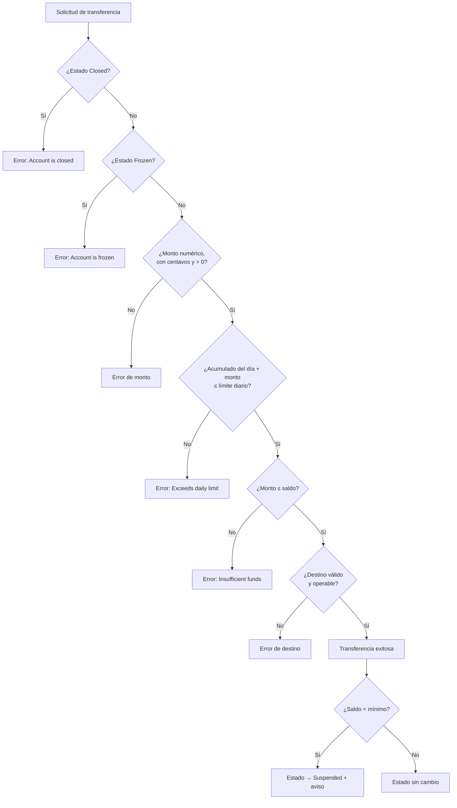
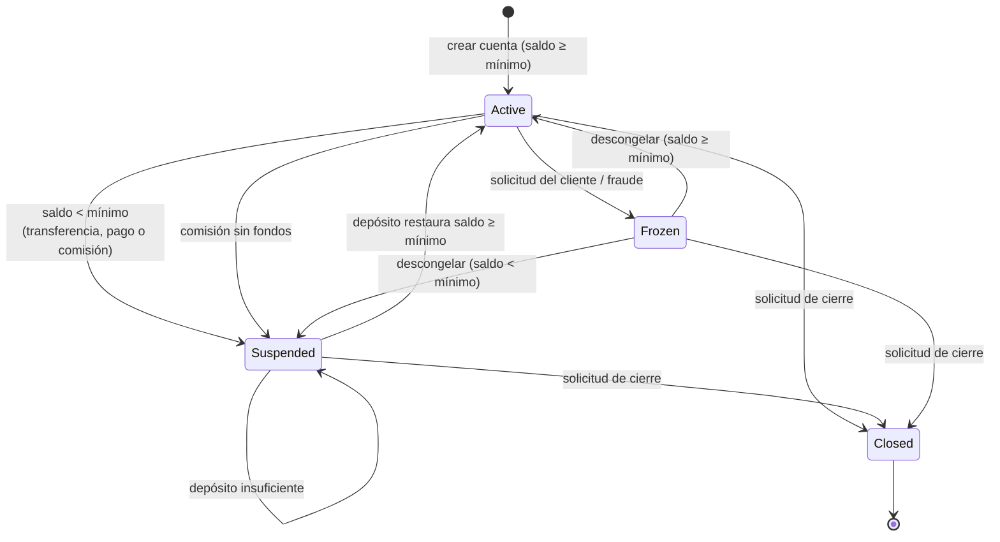

# Test Design Document — SecureBank Online Banking

**Homework 4**: Black Box Testing Suite
**Autor**: Angel Isaac Barbarín
**Técnicas**: Particiones de Equivalencia (EP), Análisis de Valores Límite (BVA), Tablas de Decisión (DT) y Transición de Estados (ST)

Cada caso de este documento tiene un identificador (`EP1`, `BV12`, `DT2-R6`, `ST8`) que aparece en el docstring de la prueba automatizada que lo implementa, tanto en `tests/*.py` como en `tests/*.test.js`.

---

## 0. Supuestos de diseño

La especificación deja varias reglas abiertas. Estas son las interpretaciones adoptadas; cada una está cubierta por al menos una prueba:

| # | Regla ambigua | Interpretación adoptada | Prueba que la fija |
| --- | --- | --- | --- |
| A1 | "Cannot transfer from Frozen or Closed" no menciona Suspended | Una cuenta **Suspended sí puede operar** (solo muestra advertencias) | DT1-R11 |
| A2 | Frontera del saldo mínimo | Estar **exactamente en el mínimo es válido**; se suspende con saldo `< mínimo` y se reactiva con `>= mínimo` | BV17, BV20 |
| A3 | "Waived if balance > $1,000" | La exención exige saldo **estrictamente mayor** al umbral | BV32, BV33 |
| A4 | Una transferencia puede violar varias reglas a la vez | **Precedencia**: estado → validez del monto → límite diario → fondos → cuenta destino | DT1-R4, DT1-R6..R8 |
| A5 | "Active → Frozen" es la única entrada a Frozen | Congelar una cuenta Suspended **se rechaza** | ST13 |
| A6 | Descongelar una cuenta cuyo saldo bajó mientras estaba Frozen | Regresa a **Suspended**, no a Active | ST8 |
| A7 | Comisión sin fondos en una cuenta Frozen | **Frozen tiene precedencia**: no se cobra y la cuenta sigue Frozen | DT2-R10 |
| A8 | Montos con fracciones de centavo | Se **rechazan** (el sistema opera en centavos enteros) | EP7, BV46 |
| A9 | Pago programado a futuro | Se **agenda sin validar fondos**; los fondos se validan al ejecutarse | DT3-R3 |
| A10 | Pagos de servicios y límite diario | Los pagos de servicios **no consumen** el límite diario de transferencias | — (fuera de alcance) |



*Figura 1. Árbol de decisión de la validación de transferencias con el orden de precedencia A4.*

---

## 1. Equivalence Partitioning

Siete entradas analizadas, con clases válidas e inválidas para cada una.

### Input: Transfer Amount

| Partition ID | Description | Type | Representative Value | Expected Result |
| --- | --- | --- | --- | --- |
| EP1 | Monto válido dentro de límites | Valid | $500 (saldo $1,000) | Transferencia exitosa |
| EP2 | Monto cero | Invalid | $0 | Error: Amount must be positive |
| EP3 | Monto negativo | Invalid | -$100 | Error: Amount must be positive |
| EP4 | Monto mayor al límite diario | Invalid | $100,000 (Checking) | Error: Exceeds daily limit |
| EP5 | Monto mayor al saldo | Invalid | $1,500 (saldo $1,000) | Error: Insufficient funds |
| EP6 | Monto no numérico | Invalid | `"500"`, `None`, `True`, `NaN` | Error: Amount must be a number |
| EP7 | Monto con fracción de centavo | Invalid | $10.005 | Error: at most 2 decimal places |

### Input: Deposit Amount

| Partition ID | Description | Type | Representative Value | Expected Result |
| --- | --- | --- | --- | --- |
| EP31 | Depósito positivo | Valid | $250 | Saldo aumenta a $1,250 |
| EP32 | Depósito negativo | Invalid | -$250 | Error: Amount must be positive |
| EP33 | Depósito como texto | Invalid | `"250"` | Error: Amount must be a number |

### Input: Account Type

| Partition ID | Description | Type | Representative Value | Expected Result |
| --- | --- | --- | --- | --- |
| EP8 | Savings | Valid | `"Savings"` | Cuenta activa, límite $2,000 |
| EP9 | Checking | Valid | `"Checking"` | Cuenta activa, límite $5,000 |
| EP10 | Premium | Valid | `"Premium"` | Cuenta activa, límite $50,000 |
| EP11 | Tipo inexistente | Invalid | `"Business"` | ValueError: Invalid account type |
| EP12 | Tipo con mayúsculas incorrectas o vacío | Invalid | `"savings"`, `""` | ValueError: Invalid account type |
| EP34 | Cuenta sin reloj inyectado | Valid | `BankAccount("Checking", 100)` | Usa la hora del sistema y opera normal |

### Input: Account Balance (apertura)

| Partition ID | Description | Type | Representative Value | Expected Result |
| --- | --- | --- | --- | --- |
| EP13 | Saldo mayor o igual al mínimo | Valid | Savings con $5,000 | Cuenta activa |
| EP14 | Saldo positivo bajo el mínimo | Invalid | Premium con $5,000 | ValueError: below minimum |
| EP15 | Saldo negativo | Invalid | Savings con -$50 | ValueError: below minimum |

### Input: Payee Information (bill payment)

| Partition ID | Description | Type | Representative Value | Expected Result |
| --- | --- | --- | --- | --- |
| EP16 | Beneficiario registrado | Valid | `"UTIL-ELECTRIC"` | Pago realizado |
| EP20 | Registrado con espacios y minúsculas | Valid | `"  cc-visa  "` | Se normaliza y se paga |
| EP17 | Vacío o solo espacios | Invalid | `""`, `"   "` | Error: Payee is required |
| EP18 | Tipo de dato inválido | Invalid | `None`, `12345` | Error: Payee is required |
| EP19 | Beneficiario no registrado | Invalid | `"UTIL-GAS"` | Error: Unknown payee |
| EP29 | Monto del pago en cero | Invalid | $0 | Error: Amount must be positive |

### Input: Scheduled Payment Date

| Partition ID | Description | Type | Representative Value | Expected Result |
| --- | --- | --- | --- | --- |
| EP26 | Sin fecha (inmediato) | Valid | `None` | Pago inmediato |
| EP27 | Fecha futura | Valid | 2026-10-01 | Pago programado, saldo sin cambio |
| EP28 | Fecha pasada | Invalid | 2026-09-01 | Error: cannot be in the past |

### Input: Date Range (transaction history)

Historial de prueba: un depósito el 14, 15 y 16 de septiembre de 2026.

| Partition ID | Description | Type | Representative Value | Expected Result |
| --- | --- | --- | --- | --- |
| EP21 | Rango válido con movimientos | Valid | 15-sep a 16-sep | 2 movimientos (rango inclusivo) |
| EP24 | Rango abierto | Valid | sin fechas / solo inicio | Todo el historial / desde la fecha |
| EP23 | Rango válido sin movimientos | Valid | enero de 2027 | Lista vacía |
| EP30 | Exportación CSV de un rango válido | Valid | 14-sep a 14-sep | Encabezado + 1 fila |
| EP22 | Inicio posterior al fin | Invalid | 20-sep a 01-sep | ValueError: on or before |
| EP25 | Fecha como texto | Invalid | `"2026-09-01"` | TypeError: must be a date |

---

## 2. Boundary Value Analysis

Diez fronteras, cada una con 3 a 6 valores alrededor del límite.

### B1 — Transfer Amount (Checking, límite $5,000; saldo $20,000)

| Test ID | Boundary | Test Value | Expected Result |
| --- | --- | --- | --- |
| BV1 | Debajo del mínimo | $0.00 | Error: Amount must be positive |
| BV2 | Mínimo válido | $0.01 | Éxito (saldo exacto $999.99 partiendo de $1,000) |
| BV3 | Justo debajo del límite | $4,999.99 | Éxito |
| BV4 | En el límite | $5,000.00 | Éxito, acumulado diario = $5,000 |
| BV5 | Justo arriba del límite | $5,000.01 | Error: Exceeds daily limit |
| BV6 | Muy arriba del límite | $10,000.00 | Error: Exceeds daily limit |

### B2 — Transfer Amount (Savings, límite $2,000; saldo $10,000)

| Test ID | Boundary | Test Value | Expected Result |
| --- | --- | --- | --- |
| BV7 | Debajo del mínimo | $0.00 | Error |
| BV8 | Mínimo válido | $0.01 | Éxito |
| BV9 | Justo debajo del límite | $1,999.99 | Éxito |
| BV10 | En el límite | $2,000.00 | Éxito |
| BV11 | Justo arriba del límite | $2,000.01 | Error: Exceeds daily limit |

### B3 — Transfer Amount (Premium, límite $50,000; saldo $200,000)

| Test ID | Boundary | Test Value | Expected Result |
| --- | --- | --- | --- |
| BV12 | Justo debajo del límite | $49,999.99 | Éxito |
| BV13 | En el límite | $50,000.00 | Éxito |
| BV14 | Justo arriba del límite | $50,000.01 | Error: Exceeds daily limit |
| BV15 | Muy arriba del límite | $75,000.00 | Error: Exceeds daily limit |

### B4 — Account Balance vs Minimum (Savings, mínimo $100; saldo inicial $200)

| Test ID | Boundary | Test Value (transferencia → saldo) | Expected Result |
| --- | --- | --- | --- |
| BV16 | Justo arriba del mínimo | $99.99 → $100.01 | Sigue Active |
| BV17 | En el mínimo | $100.00 → $100.00 | Sigue Active |
| BV18 | Justo debajo del mínimo | $100.01 → $99.99 | Pasa a Suspended |
| BV19 | Muy debajo del mínimo | $150.00 → $50.00 | Pasa a Suspended |
| BV20 | Reactivación exacta | Suspended en $99.99 + depósito $0.01 | Regresa a Active con $100.00 |

### B5 — Transfer Amount vs Balance (Checking, saldo $1,000)

| Test ID | Boundary | Test Value | Expected Result |
| --- | --- | --- | --- |
| BV21 | Justo debajo del saldo | $999.99 | Éxito |
| BV22 | Igual al saldo | $1,000.00 | Éxito (saldo $0, mínimo de Checking) |
| BV23 | Justo arriba del saldo | $1,000.01 | Error: Insufficient funds |
| BV24 | Muy arriba del saldo | $1,500.00 | Error: Insufficient funds |

### B6 — Cumulative Daily Limit (Savings; ya se transfirieron $1,500 hoy)

| Test ID | Boundary | Test Value | Expected Result |
| --- | --- | --- | --- |
| BV25 | Acumulado justo debajo | 2.ª transferencia de $499.99 | Éxito |
| BV26 | Acumulado en el límite | 2.ª transferencia de $500.00 | Éxito |
| BV27 | Acumulado justo arriba | 2.ª transferencia de $500.01 | Error: Exceeds daily limit |
| BV28 | Acumulado muy arriba | 2.ª transferencia de $800.00 | Error: Exceeds daily limit |
| BV29 | Un segundo antes de medianoche | 23:59:59, $1 tras agotar el límite | Error: Exceeds daily limit |
| BV30 | Medianoche | 00:00:00 del día siguiente | Acumulado en $0; $2,000 procede |

### B7 — Fee Waiver Threshold (exención con saldo estrictamente mayor)

| Test ID | Boundary | Test Value | Expected Result |
| --- | --- | --- | --- |
| BV31 | Savings justo debajo | $999.99 | Se cobran $5 |
| BV32 | Savings en el umbral | $1,000.00 | Se cobran $5 |
| BV33 | Savings justo arriba | $1,000.01 | Exenta |
| BV34 | Checking en el umbral | $5,000.00 | Se cobran $10 |
| BV35 | Checking justo arriba | $5,000.01 | Exenta |

### B8 — Balance vs Monthly Fee (Checking, comisión $10, mínimo $0)

| Test ID | Boundary | Test Value | Expected Result |
| --- | --- | --- | --- |
| BV36 | Justo arriba de la comisión | $10.01 | Se cobra; sigue Active con $0.01 |
| BV37 | Igual a la comisión | $10.00 | Se cobra; sigue Active con $0.00 |
| BV38 | Justo debajo de la comisión | $9.99 | No se cobra; pasa a Suspended |

### B9 — Minimum Opening Balance

| Test ID | Boundary | Test Value | Expected Result |
| --- | --- | --- | --- |
| BV39 | Premium justo debajo | $9,999.99 | ValueError |
| BV40 | Premium en el mínimo | $10,000.00 | Cuenta creada |
| BV41 | Premium justo arriba | $10,000.01 | Cuenta creada |
| BV42 | Savings justo debajo | $99.99 | ValueError |
| BV43 | Savings en el mínimo | $100.00 | Cuenta creada |
| BV44 | Checking en el mínimo | $0.00 | Cuenta creada |

### B10 — Decimal Precision (resolución de un centavo)

| Test ID | Boundary | Test Value | Expected Result |
| --- | --- | --- | --- |
| BV45 | Resolución mínima | $0.01 | Éxito |
| BV46 | Por debajo de la resolución | $0.001 | Rechazado |
| BV47 | Casi un centavo | $0.009 | Rechazado |
| BV48 | Un decimal significativo | $1.10 | Éxito |

---

## 3. Decision Tables

### Decision Table 1: Transfer Validation

Tabla completa sobre las tres condiciones del enunciado (2³ = 8 reglas) más el estado Closed y el monto inválido. Cuando se cumplen varias condiciones de error, **solo se reporta la de mayor precedencia** (supuesto A4); por eso cada regla tiene exactamente una acción.

| Condition | R1 | R2 | R3 | R4 | R5 | R6 | R7 | R8 | R9 | R10 |
| --- | --- | --- | --- | --- | --- | --- | --- | --- | --- | --- |
| Account state | Active | Active | Active | Active | Frozen | Frozen | Frozen | Frozen | Closed | Active |
| Amount valid (> 0)? | Y | Y | Y | Y | - | - | - | - | - | N |
| Within daily limit? | Y | Y | N | N | Y | Y | N | N | - | - |
| Sufficient funds? | Y | N | Y | N | Y | N | Y | N | - | - |
| **Action** | | | | | | | | | | |
| Transfer succeeds | X | | | | | | | | | |
| Error: Insufficient funds | | X | | | | | | | | |
| Error: Exceeds daily limit | | | X | X | | | | | | |
| Error: Account is frozen | | | | | X | X | X | X | | |
| Error: Account is closed | | | | | | | | | X | |
| Error: Amount must be positive | | | | | | | | | | X |

Reglas adicionales sobre el estado Suspended y la cuenta destino:

| Condition | R11 | R12 | R13 | R14 |
| --- | --- | --- | --- | --- |
| Account state | Suspended | Active | Active | Active |
| Validations R1 pass? | Y | Y | Y | Y |
| Destination | — | Frozen | La misma cuenta | Active |
| **Action** | | | | |
| Transfer succeeds | X (sigue Suspended) | | | X (se acredita el destino) |
| Error: Destination account unavailable | | X | | |
| Error: Cannot transfer to the same account | | | X | |

**Simplificación**: R5–R8 se reducen a una sola regla `Frozen, -, -, -` y R3–R4 a `Active, Y, N, -`. La tabla queda en 10 reglas efectivas para 14 casos.

### Decision Table 2: Monthly Fee Processing

| Condition | R1 | R2 | R3 | R4 | R5 | R6 | R7 | R8 | R9 | R10 |
| --- | --- | --- | --- | --- | --- | --- | --- | --- | --- | --- |
| Account closed? | Y | N | N | N | N | N | N | N | N | N |
| Day 1 of month? | - | N | Y | Y | Y | Y | Y | Y | Y | Y |
| Account type | - | - | Premium | Savings | Savings | Savings | Checking | Checking | Checking | Checking |
| Balance > waiver threshold? | - | - | - | Y | N | N | Y | N | N | N |
| Balance ≥ fee? | - | - | - | - | Y | Y | - | Y | N | N |
| Balance after fee ≥ minimum? | - | - | - | - | Y | N | - | Y | - | - |
| Account state | - | - | - | - | Active | Active | Active | Active | Active | Frozen |
| **Action** | | | | | | | | | | |
| Error: Account is closed | X | | | | | | | | | |
| Error: only on the 1st | | X | | | | | | | | |
| No fee ($0, type without fee) | | | X | | | | | | | |
| Fee waived | | | | X | | | X | | | |
| Charge fee | | | | | $5 | $5 | | $10 | | |
| State → Suspended | | | | | | X | | | X | |
| Error: insufficient funds for fee | | | | | | | | | X | X |
| State stays Frozen | | | | | | | | | | X |

### Decision Table 3: Bill Payment Validation

Saldo inicial de $1,000; "hoy" = 14-sep-2026.

| Condition | R1 | R2 | R3 | R4 | R5 | R6 | R7 | R8 | R9 | R10 |
| --- | --- | --- | --- | --- | --- | --- | --- | --- | --- | --- |
| Account state | Active | Active | Active | Active | Active | Active | Frozen | Closed | Active | Active |
| Payee registered? | Y | Y | Y | Y | Y | N | - | - | Y | Y |
| Amount > 0? | Y | Y | Y | Y | N | - | - | - | Y | Y |
| Scheduled date | hoy/ninguna | ninguna | futura | pasada | - | - | - | - | = hoy | ninguna |
| Sufficient funds? | Y | N | N | - | - | - | - | - | Y | Y |
| Balance after ≥ minimum? | Y | - | - | - | - | - | - | - | Y | N |
| **Action** | | | | | | | | | | |
| Pay now | X | | | | | | | | X | X |
| Schedule payment | | | X | | | | | | | |
| State → Suspended | | | | | | | | | | X |
| Error: Insufficient funds | | X | | | | | | | | |
| Error: date in the past | | | | X | | | | | | |
| Error: Amount must be positive | | | | | X | | | | | |
| Error: Unknown payee | | | | | | X | | | | |
| Error: Account is frozen | | | | | | | X | | | |
| Error: Account is closed | | | | | | | | X | | |

### Decision Table 4: Account Creation

| Condition | R1 | R2 | R3 | R4 |
| --- | --- | --- | --- | --- |
| Valid account type? | Y | Y | N | Y |
| Initial balance numeric? | Y | Y | - | N |
| Initial balance ≥ minimum? | Y | N | - | - |
| **Action** | | | | |
| Create account (Active) | X | | | |
| Error: below minimum | | X | | |
| Error: Invalid account type | | | X | |
| Error: Amount must be a number | | | | X |

---

## 4. State Transition Testing

### State Transition Diagram



*Figura 2. Diagrama de estados de una cuenta SecureBank. Closed es terminal.*

Versión en texto del mismo diagrama:

```
[Active] ---(saldo < mínimo / comisión sin fondos)---> [Suspended]
   |  ^                                                    |
   |  +----------(depósito restaura el mínimo)-------------+
   |
   +---(congelar)---> [Frozen] ---(descongelar, saldo >= mín)---> [Active]
   |                     |------(descongelar, saldo < mín)----> [Suspended]
   |                     |
   +---(cerrar)------> [Closed] <---(cerrar)--- [Frozen], [Suspended]
```

### State Transition Table (transiciones válidas)

| Current State | Event | Next State | Action/Output |
| --- | --- | --- | --- |
| Active | Movimiento deja el saldo bajo el mínimo | Suspended | Aviso "balance below minimum" |
| Active | Comisión mensual sin fondos | Suspended | Aviso "insufficient funds for fee" |
| Active | Solicitud de congelamiento | Frozen | Bloquea movimientos; aviso con el motivo |
| Active | Solicitud de cierre | Closed | Estado de cuenta final |
| Suspended | Depósito que restaura saldo ≥ mínimo | Active | Aviso "reactivated" |
| Suspended | Depósito que no alcanza el mínimo | Suspended | Solo se acredita el depósito |
| Suspended | Solicitud de cierre | Closed | Estado de cuenta final |
| Frozen | Descongelar con saldo ≥ mínimo | Active | Acceso completo restaurado |
| Frozen | Descongelar con saldo < mínimo | Suspended | Acceso con advertencia |
| Frozen | Solicitud de cierre | Closed | Estado de cuenta final |

### Transiciones inválidas (matriz estado × evento)

`—` = el evento se rechaza y el estado no cambia.

| Estado \ Evento | transfer / pay_bill | deposit | freeze | unfreeze | close | consultar saldo |
| --- | --- | --- | --- | --- | --- | --- |
| Active | ✔ (puede → Suspended) | ✔ | → Frozen | — | → Closed | ✔ |
| Suspended | ✔ (sigue Suspended) | ✔ (puede → Active) | — | — | → Closed | ✔ |
| Frozen | — | — | — | → Active / Suspended | → Closed | ✔ |
| Closed | — | — | — | — | — | ✔ |

### State Transition Test Cases

| Test ID | Start State | Event | Expected End State | Validation |
| --- | --- | --- | --- | --- |
| ST1 | Active (Savings $500) | Transferir $450 | Suspended | Aviso "balance below minimum" |
| ST2 | Active | Congelar por fraude | Frozen | Aviso con el motivo |
| ST3 | Active ($750 + depósito $50) | Cerrar | Closed | Estado final: $800, 1 movimiento |
| ST4 | Suspended ($50) | Depositar $500 | Active | Saldo $550, aviso "reactivated" |
| ST5 | Suspended ($50) | Depositar $20 | Suspended | Sigue bajo el mínimo |
| ST6 | Suspended | Cerrar | Closed | — |
| ST7 | Frozen (saldo $500) | Descongelar | Active | — |
| ST8 | Frozen (Savings $102) | Comisión → $97; descongelar | Suspended | La comisión no cambia Frozen; al descongelar queda Suspended |
| ST9 | Frozen | Cerrar | Closed | — |
| ST10 | Active (Checking $3) | Comisión mensual | Suspended | No se cobra |
| ST11 | Frozen | transfer / deposit / pay_bill | Frozen | Error "Account is frozen", saldo intacto |
| ST12 | Closed | transfer, deposit, freeze, unfreeze, close | Closed | Cada evento rechazado; no se reabre |
| ST13 | Suspended | Congelar | Suspended | Error: solo Active → Frozen |
| ST14 | Active | Descongelar | Active | Error "Account is not frozen" |
| ST15 | Frozen → Closed | Consultar saldo | — | Saldo visible en ambos estados |
| ST16 | Active | Secuencia completa | Closed | Recorre Active → Suspended → Active → Frozen → Active → Closed |
| ST17 | Active (Savings $300) | Suspender, reactivar, volver a suspender | Suspended | La regla se reaplica en cada ciclo |
| ST18 | Suspended / Frozen | Descongelar una Suspended; congelar una Frozen | Sin cambio | Ambos eventos rechazados |

**Cobertura del modelo**: las 10 transiciones válidas de la tabla se ejercitan al menos una vez (cobertura 0-switch del 100%), las 11 celdas "—" de la matriz se prueban en ST11–ST14 y ST18, y ST16/ST17 cubren secuencias de pares de transiciones consecutivas (1-switch) sobre el ciclo principal.

---

## 5. Trazabilidad

| Técnica | Casos de diseño | Archivo Python | Archivo JavaScript | Pruebas ejecutadas |
| --- | --- | --- | --- | --- |
| Equivalence Partitioning | EP1–EP34 (7 entradas) | `tests/test_equivalence_partitioning.py` | `tests/equivalencePartitioning.test.js` | 40 |
| Boundary Value Analysis | BV1–BV48 (10 fronteras) | `tests/test_boundary_values.py` | `tests/boundaryValues.test.js` | 50 |
| Decision Tables | DT1–DT4 (38 reglas/casos) | `tests/test_decision_tables.py` | `tests/decisionTables.test.js` | 38 |
| State Transitions | ST1–ST18 | `tests/test_state_transitions.py` | `tests/stateTransitions.test.js` | 24 |
| **Total** | | | | **152 por lenguaje** |

Las pruebas ejecutadas superan a los casos de diseño porque las pruebas parametrizadas cuentan cada valor por separado (por ejemplo, EP6 prueba cuatro valores no numéricos).
