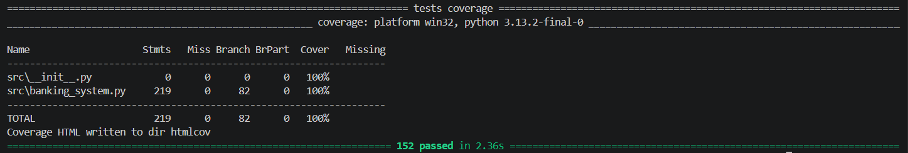
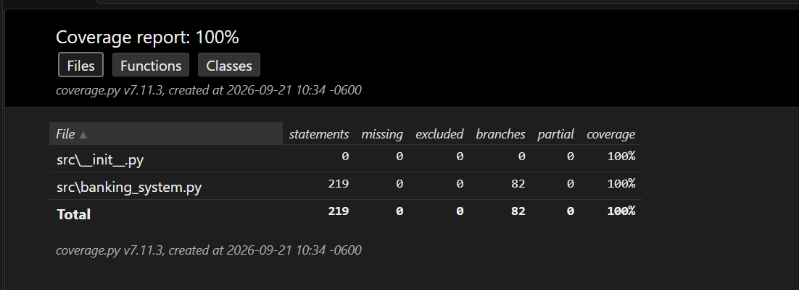
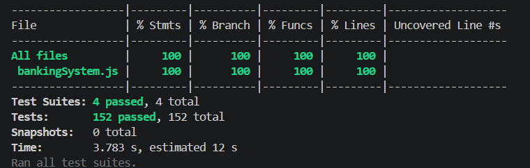

# Test Execution Report — SecureBank Online Banking

## Test Execution Summary

### Python (pytest)

- **Date**: 2026-09-21
- **Environment**: Windows 11, Python 3.13.2, pytest 8.4.2, pytest-cov 7.0.0
- **Test Framework**: pytest + pytest-cov
- **Command**: `pytest -v --cov=src --cov-branch --cov-report=term-missing --cov-report=html`
- **Total Tests**: 152
- **Passed**: 152
- **Failed**: 0
- **Skipped**: 0
- **Duration**: 2.52s

### JavaScript (Jest) — bonus de doble implementación

- **Test Framework**: Jest 29
- **Command**: `npm run test:coverage`
- **Total Tests**: 152
- **Passed**: 152
- **Failed**: 0
- **Skipped**: 0
- **Duration**: 15.24s

## Coverage Summary

| Métrica | Python (`src/banking_system.py`) | JavaScript (`src/bankingSystem.js`) |
| --- | --- | --- |
| Line / Statement Coverage | 100% (219/219 statements) | 100% |
| Branch Coverage | 100% (82/82 branches) | 100% |
| Function Coverage | 100% (todas las funciones y métodos) | 100% (27/27) |

La cobertura se mide solo sobre el código bajo prueba (`src/`), no sobre las pruebas.

---

## Results by Technique

### Equivalence Partitioning (40 tests)

- ✅ `test_ep1_transfer_valid_amount`
- ✅ `test_ep2_ep3_transfer_non_positive_amount` (2 casos)
- ✅ `test_ep4_transfer_exceeds_daily_limit`
- ✅ `test_ep5_transfer_exceeds_balance`
- ✅ `test_ep6_transfer_non_numeric_amount` (4 casos: texto, None, bool, NaN)
- ✅ `test_ep7_transfer_sub_cent_amount`
- ✅ `test_ep31_to_ep33_deposit_amount` (3 casos)
- ✅ `test_ep8_to_ep10_valid_account_types` (3 casos)
- ✅ `test_ep11_ep12_invalid_account_type` (3 casos)
- ✅ `test_ep34_default_system_clock`
- ✅ `test_ep13_balance_at_or_above_minimum`
- ✅ `test_ep14_ep15_initial_balance_below_minimum` (2 casos)
- ✅ `test_ep16_ep20_valid_payee` (2 casos)
- ✅ `test_ep17_ep18_missing_payee` (4 casos)
- ✅ `test_ep19_unknown_payee`
- ✅ `test_ep26_bill_immediate_payment`
- ✅ `test_ep27_bill_future_date_is_scheduled`
- ✅ `test_ep28_bill_past_date_rejected`
- ✅ `test_ep29_bill_invalid_amount`
- ✅ `test_ep21_valid_date_range` · `test_ep22_start_after_end` · `test_ep23_range_without_transactions` · `test_ep24_open_ended_range` · `test_ep25_invalid_date_type` · `test_ep30_export_csv`

**Defects Found**: Ninguna falla en el código. EP sí expuso dos huecos de la especificación: qué hacer con montos de más de dos decimales (supuesto A8) y si el tipo de cuenta distingue mayúsculas (se tratan como inválidas: EP12).

### Boundary Value Analysis (50 tests)

- ✅ `test_b1_transfer_amount_checking` (6 casos: BV1–BV6)
- ✅ `test_bv2_minimum_valid_amount_updates_balance`
- ✅ `test_bv4_transfer_at_limit_updates_daily_total`
- ✅ `test_b2_transfer_amount_savings` (5 casos: BV7–BV11)
- ✅ `test_b3_transfer_amount_premium` (4 casos: BV12–BV15)
- ✅ `test_b4_savings_minimum_balance` (4 casos: BV16–BV19)
- ✅ `test_bv20_deposit_restoring_exact_minimum_reactivates`
- ✅ `test_b5_transfer_against_balance` (4 casos: BV21–BV24)
- ✅ `test_b6_cumulative_daily_limit` (4 casos: BV25–BV28)
- ✅ `test_bv29_daily_limit_one_second_before_midnight`
- ✅ `test_bv30_daily_limit_resets_at_midnight`
- ✅ `test_b7_fee_waiver_threshold` (5 casos: BV31–BV35)
- ✅ `test_b8_balance_against_fee` (3 casos: BV36–BV38)
- ✅ `test_b9_minimum_opening_balance` (6 casos: BV39–BV44)
- ✅ `test_b10_decimal_precision` (4 casos: BV45–BV48)

**Defects Found**: Ninguna falla en el código. Durante el diseño apareció un riesgo real de punto flotante: `1000 - 0.01` en `float` puede no dar exactamente `999.99`. Se evitó desde la implementación manejando todo en centavos enteros; BV2 verifica el resultado exacto.

### Decision Tables (38 tests)

- ✅ `test_dt1_transfer_validation` (10 casos: DT1-R1..R10)
- ✅ `test_dt1_r11_suspended_account_can_transfer`
- ✅ `test_dt1_r12_destination_frozen`
- ✅ `test_dt1_r13_destination_same_account`
- ✅ `test_dt1_r14_destination_active_is_credited`
- ✅ `test_dt2_monthly_fee_charged_or_waived` (6 casos: DT2-R3..R8)
- ✅ `test_dt2_r1_closed_account_not_charged` · `test_dt2_r2_not_first_of_month` · `test_dt2_r9_insufficient_funds_suspends` · `test_dt2_r10_insufficient_funds_on_frozen_keeps_frozen`
- ✅ `test_dt3_bill_payment` (9 casos: DT3-R1..R9)
- ✅ `test_dt3_r10_payment_below_minimum_suspends`
- ✅ `test_dt4_account_creation` (4 casos: DT4-R1..R4)

**Defects Found**: Ninguna falla en el código. La tabla DT1 del enunciado marca **dos errores a la vez** en algunas reglas (por ejemplo, fondos insuficientes y límite excedido); un sistema real solo puede devolver uno. Se definió una precedencia explícita (supuesto A4) y las reglas R4 y R6–R8 la verifican.

### State Transitions (24 tests)

- ✅ `test_st1` a `test_st10`: las 10 transiciones válidas del modelo
- ✅ `test_st11_frozen_rejects_transactions` (3 casos)
- ✅ `test_st12_closed_is_final` (5 casos)
- ✅ `test_st13_suspended_cannot_be_frozen` · `test_st14_active_cannot_be_unfrozen` · `test_st18_redundant_state_events_rejected`
- ✅ `test_st15_balance_is_viewable_in_every_state`
- ✅ `test_st16_full_lifecycle_sequence` · `test_st17_repeated_suspension_cycle`

**Defects Found**: Ninguna falla en el código. El modelo reveló un estado que el enunciado no contempla: una cuenta Frozen cuyo saldo baja del mínimo (por la comisión mensual) no puede volver a Active al descongelarse. Se modeló la transición Frozen → Suspended (ST8).

---

## Verificación de la efectividad de la suite (mutación manual)

Para comprobar que las pruebas detectan errores reales y no "siempre pasan", se introdujeron 15 defectos en `src/banking_system.py`, uno a la vez, y se corrió la suite completa contra cada versión defectuosa.

| Mutante | Defecto introducido | Detectado por |
| --- | --- | --- |
| M1 | Límite diario con `>=` en vez de `>` | BVA |
| M2 | Fondos suficientes con `>=` en vez de `>` | BVA |
| M3 | Saldo mínimo con `<=` en vez de `<` | BVA |
| M4 | Exención de comisión con `>=` en vez de `>` | BVA |
| M5 | Acepta monto cero (`< 0` en vez de `<= 0`) | EP, BVA, DT |
| M6 | No valida fracciones de centavo | EP |
| M7 | Reactivación con `>` en vez de `>=` | BVA |
| M8 | Frozen permite transferir | DT, ST |
| M9 | El límite diario no se reinicia a medianoche | BVA |
| M10 | Descongelar siempre regresa a Active | ST |
| M11 | Comisión sin fondos no suspende la cuenta | BVA, DT, ST |
| M12 | Un pago programado para hoy se agenda en vez de pagarse | DT |
| M13 | Límite de Savings igual al de Checking | EP, BVA |
| M14 | Permite congelar una cuenta Suspended | ST |
| M15 | Filtro de fecha final exclusivo | EP |

**Resultado: 15 de 15 mutantes detectados (100%).** Cada técnica detectó al menos un defecto que ninguna otra detectó.

---

## Screenshots

| Archivo | Contenido |
| --- | --- |
| `screenshots/test-results.png` | Salida de `pytest -v` con las 152 pruebas en verde |
| `screenshots/coverage-report.png` | Reporte HTML de cobertura (`htmlcov/index.html`) |
| `screenshots/jest-results.png` | Salida de `npm run test:coverage` con la tabla de cobertura de Jest |

---

## Coverage Analysis

**Rutas cubiertas.** Todas las líneas y ramas de `src/` se ejecutan: validaciones de monto, límites diarios y su reinicio, las cuatro transiciones de estado con sus rechazos, la comisión mensual con exención y suspensión, pagos inmediatos y programados, y el historial con filtros y exportación CSV.

**Rutas no cubiertas.** Ninguna dentro de `src/`. Quedan fuera del alcance funcionalidades que el sistema no implementa: autenticación, persistencia, concurrencia (dos transferencias simultáneas contra el mismo límite diario) y la ejecución real de los pagos programados.

**Cobertura por técnica.** Las técnicas se traslapan en las validaciones básicas de transferencia, pero cada una aporta rutas propias:

| Técnica | Rutas que solo esta técnica ejercita |
| --- | --- |
| EP | Tipos de dato inválidos, normalización del beneficiario, filtros e historial CSV |
| BVA | Reinicio del límite a medianoche, umbrales de exención, reactivación exacta en el mínimo |
| DT | Precedencia entre errores simultáneos, cuenta destino, pago programado para hoy |
| ST | Descongelar hacia Suspended, rechazo de eventos en estados terminales, secuencias largas |

Cobertura de líneas al 100% no significa ausencia de defectos: el experimento de mutación mostró que la calidad de las aserciones importa tanto como la cobertura (ver el reporte de análisis).
