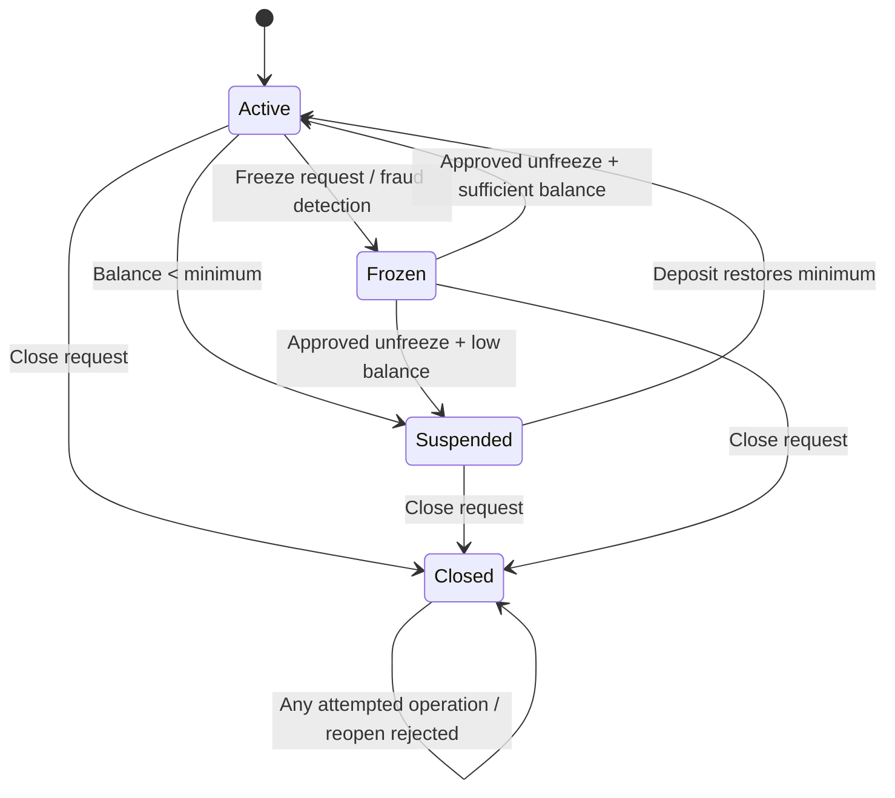

# Test Design Document — SecureBank Online Banking

## 1. Scope and assumptions

This document applies four black-box techniques to the SecureBank requirements:
Equivalence Partitioning (EP), Boundary Value Analysis (BVA), Decision Tables,
and State Transition Testing.

Assumptions used by the executable model:

- Savings: minimum balance $100, fee $5, fee waived only when balance is **greater than** $1,000, daily transfer limit $2,000.
- Checking: minimum balance $0, fee $10, fee waived only when balance is **greater than** $5,000, daily transfer limit $5,000.
- Premium: minimum balance $10,000, fee $0, daily transfer limit $50,000.
- Minimum transfer is $0.01.
- Frozen and Closed accounts cannot transact.
- A balance below the minimum places the account in Suspended state.
- Closed accounts cannot be reopened.

---

# 2. Equivalence Partitioning

## Input A — Transfer amount

| ID  | Partition                                | Type    |             Representative | Expected                       |
| --- | ---------------------------------------- | ------- | -------------------------: | ------------------------------ |
| EP1 | Positive, within balance and daily limit | Valid   |                       $500 | Transfer succeeds              |
| EP2 | Zero                                     | Invalid |                         $0 | Error: amount must be positive |
| EP3 | Negative                                 | Invalid |                      -$100 | Error: amount must be positive |
| EP4 | Above daily limit                        | Invalid |         $5,000.01 Checking | Error: exceeds daily limit     |
| EP5 | Above available balance but within limit | Invalid | $1,500 with $1,000 balance | Error: insufficient funds      |

## Input B — Account type

| ID   | Partition        | Type    | Representative | Expected                    |
| ---- | ---------------- | ------- | -------------- | --------------------------- |
| EP6A | Savings          | Valid   | `Savings`      | Account created             |
| EP6B | Checking         | Valid   | `Checking`     | Account created             |
| EP6C | Premium          | Valid   | `Premium`      | Account created             |
| EP7  | Unsupported type | Invalid | `Student`      | Error: invalid account type |

## Input C — Account balance

| ID      | Partition                   | Type               | Representative | Expected  |
| ------- | --------------------------- | ------------------ | -------------: | --------- |
| EP-BAL1 | Meets minimum               | Valid              |   Savings $500 | Active    |
| EP-BAL2 | Below minimum               | Invalid/restricted |    Savings $50 | Suspended |
| EP-BAL3 | Exactly minimum             | Valid              |   Savings $100 | Active    |
| EP-BAL4 | Large valid Premium balance | Valid              |        $50,000 | Active    |

## Input D — Bill payee

| ID      | Partition              | Type    | Representative   | Expected             |
| ------- | ---------------------- | ------- | ---------------- | -------------------- |
| EP8     | Known/registered payee | Valid   | Electricity      | Payment allowed      |
| EP9     | Unknown payee          | Invalid | Unknown Merchant | Error: invalid payee |
| EP-PAY3 | Empty payee            | Invalid | `""`             | Error: invalid payee |

## Input E — Transaction-history date range

| ID       | Partition           | Type    | Representative | Expected                  |
| -------- | ------------------- | ------- | -------------- | ------------------------- |
| EP-DATE1 | Start before end    | Valid   | Sep 1–Sep 30   | Results returned          |
| EP-DATE2 | Same start/end date | Valid   | Sep 15–Sep 15  | Same-day results          |
| EP10     | Start after end     | Invalid | Sep 10–Sep 1   | Error: invalid date range |

---

# 3. Boundary Value Analysis

## Boundary 1 — Minimum transfer amount

| ID      | Value | Position                 | Expected |
| ------- | ----: | ------------------------ | -------- |
| BV1     | $0.00 | Just below valid minimum | Reject   |
| BV2     | $0.01 | Minimum valid            | Accept   |
| BV-MIN3 | $0.02 | Just above minimum       | Accept   |
| BV-MIN4 | $1.00 | Nominal valid            | Accept   |

## Boundary 2 — Checking daily limit ($5,000)

| ID        |     Value | Position   | Expected |
| --------- | --------: | ---------- | -------- |
| BV3       | $4,999.99 | Just below | Accept   |
| BV4       | $5,000.00 | At limit   | Accept   |
| BV5       | $5,000.01 | Just above | Reject   |
| BV-CHECK4 |   $10,000 | Far above  | Reject   |

## Boundary 3 — Savings daily limit ($2,000)

| ID      |     Value | Position   | Expected |
| ------- | --------: | ---------- | -------- |
| BV6     | $1,999.99 | Just below | Accept   |
| BV7     | $2,000.00 | At limit   | Accept   |
| BV8     | $2,000.01 | Just above | Reject   |
| BV-SAV4 | $4,000.00 | Far above  | Reject   |

## Boundary 4 — Savings minimum balance ($100)

| ID      |   Value | Position   | Expected  |
| ------- | ------: | ---------- | --------- |
| BV9     |  $99.99 | Just below | Suspended |
| BV10    | $100.00 | At minimum | Active    |
| BV-BAL3 | $100.01 | Just above | Active    |
| BV-BAL4 |   $0.00 | Far below  | Suspended |

## Boundary 5 — Savings fee-waiver threshold ($1,000)

Requirement wording: fee is waived if balance **> $1,000**.

| ID      |     Value | Position     | Expected  |
| ------- | --------: | ------------ | --------- |
| BV-FEE1 |   $999.99 | Just below   | Charge $5 |
| BV11    | $1,000.00 | At threshold | Charge $5 |
| BV12    | $1,000.01 | Just above   | Waive fee |
| BV-FEE4 | $2,000.00 | Far above    | Waive fee |

## Boundary 6 — Checking fee-waiver threshold ($5,000)

| ID     |      Value | Position     | Expected   |
| ------ | ---------: | ------------ | ---------- |
| BV-CF1 |  $4,999.99 | Just below   | Charge $10 |
| BV-CF2 |  $5,000.00 | At threshold | Charge $10 |
| BV-CF3 |  $5,000.01 | Just above   | Waive fee  |
| BV-CF4 | $10,000.00 | Far above    | Waive fee  |

---

# 4. Decision Tables

## Decision Table 1 — Transfer validation

| Condition / Action              | R1  | R2  | R3  | R4  | R5  | R6  | R7  | R8  |
| ------------------------------- | --- | --- | --- | --- | --- | --- | --- | --- |
| Amount positive?                | Y   | Y   | Y   | Y   | Y   | Y   | Y   | N   |
| Sufficient funds?               | Y   | Y   | Y   | Y   | N   | N   | N   | -   |
| Within daily limit?             | Y   | Y   | N   | N   | Y   | Y   | N   | -   |
| Account Active?                 | Y   | N   | Y   | N   | Y   | N   | Y   | -   |
| **Transfer succeeds**           | X   |     |     |     |     |     |     |     |
| **Reject: account state**       |     | X   |     | X   |     | X   |     |     |
| **Reject: daily limit**         |     |     | X   |     |     |     | X   |     |
| **Reject: insufficient funds**  |     |     |     |     | X   |     |     |     |
| **Reject: non-positive amount** |     |     |     |     |     |     |     | X   |

Automated representatives: DT1–DT4.

## Decision Table 2 — Monthly fee processing

| Condition / Action                 | R1      | R2                             | R3       | R4          | R5      |
| ---------------------------------- | ------- | ------------------------------ | -------- | ----------- | ------- |
| Type                               | Savings | Savings                        | Checking | Checking    | Premium |
| Balance > waiver threshold?        | Y       | N                              | Y        | N           | -       |
| **Fee**                            | $0      | $5                             | $0       | $10         | $0      |
| **Possible suspension after fee?** | No      | Yes if resulting balance < min | No       | No (min $0) | No      |

Automated representatives: DT5–DT7 plus BVA fee tests.

## Decision Table 3 — Bill-payment validation

| Condition / Action      | R1  | R2  | R3  | R4  | R5  |
| ----------------------- | --- | --- | --- | --- | --- |
| Valid payee?            | Y   | N   | Y   | Y   | Y   |
| Amount > 0?             | Y   | Y   | N   | Y   | Y   |
| Sufficient funds?       | Y   | Y   | Y   | N   | Y   |
| Account Active?         | Y   | Y   | Y   | Y   | N   |
| **Payment succeeds**    | X   |     |     |     |     |
| **Invalid payee**       |     | X   |     |     |     |
| **Invalid amount**      |     |     | X   |     |     |
| **Insufficient funds**  |     |     |     | X   |     |
| **Account restriction** |     |     |     |     | X   |

Automated representatives: DT8–DT10 and EP8–EP9.

---

# 5. State Transition Testing

## State diagram

## State transition table

| Current   | Event                         | Next      | Expected output       |
| --------- | ----------------------------- | --------- | --------------------- |
| Active    | Balance drops below minimum   | Suspended | Warning/restriction   |
| Active    | Freeze request                | Frozen    | Transactions blocked  |
| Active    | Close request                 | Closed    | Account terminated    |
| Suspended | Deposit restores minimum      | Active    | Full access restored  |
| Suspended | Close request                 | Closed    | Account terminated    |
| Frozen    | Unfreeze + sufficient balance | Active    | Full access restored  |
| Frozen    | Unfreeze + low balance        | Suspended | Remains restricted    |
| Frozen    | Close request                 | Closed    | Account terminated    |
| Closed    | Reopen request                | Closed    | Error: cannot reopen  |
| Closed    | Transaction/deposit           | Closed    | Error: account closed |

## State transition test cases

| ID  | Start     | Event                                 | Expected end state |
| --- | --------- | ------------------------------------- | ------------------ |
| ST1 | Active    | Transfer makes Savings balance < $100 | Suspended          |
| ST2 | Suspended | Deposit restores balance to $100      | Active             |
| ST3 | Active    | Freeze                                | Frozen             |
| ST4 | Frozen    | Unfreeze with sufficient balance      | Active             |
| ST5 | Active    | Close                                 | Closed             |
| ST6 | Suspended | Close                                 | Closed             |
| ST7 | Frozen    | Close                                 | Closed             |
| ST8 | Closed    | Reopen attempt                        | Closed             |
| ST9 | Closed    | Deposit attempt                       | Closed             |

---

# 6. Traceability

- EP design is implemented in `tests/test_equivalence_partitioning.py`.
- BVA design is implemented in `tests/test_boundary_values.py`.
- Decision-table rules are implemented in `tests/test_decision_tables.py`.
- State transitions are implemented in `tests/test_state_transitions.py`.
