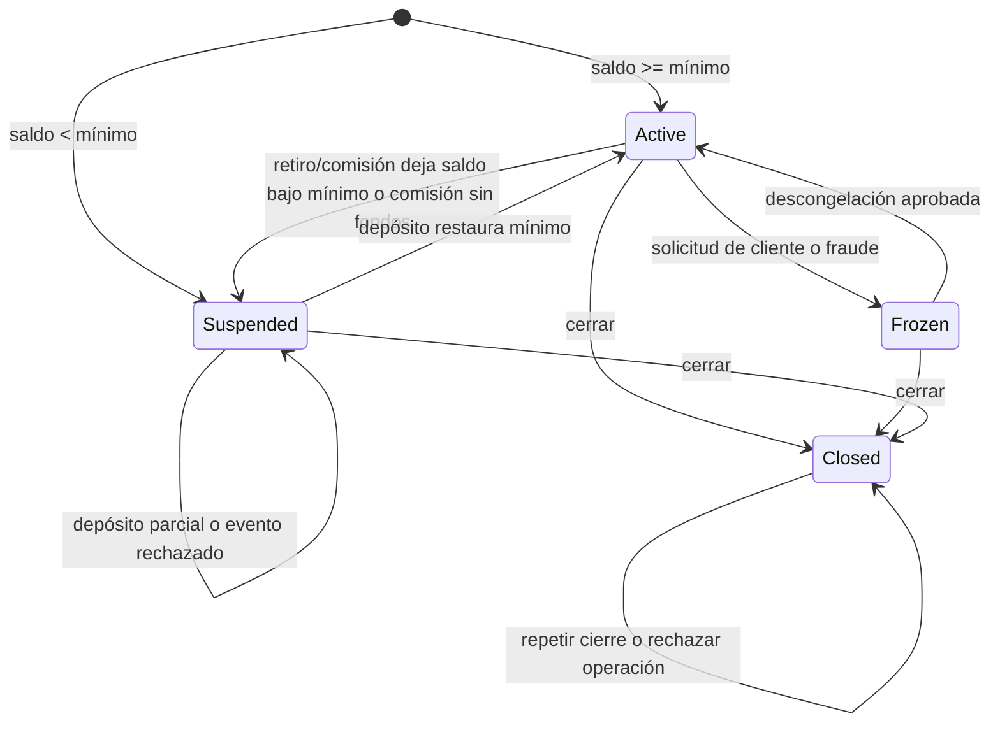

# Diseño de pruebas de caja negra: SecureBank

Autor: David Valdez (`davidvaldezm`). Módulo 4. Fecha: 23 de septiembre de 2026.

## Alcance y oráculo

Se prueban creación y actualización de cuentas, consulta de saldo, transferencias propias y externas, pagos inmediatos y futuros, historial, CSV, comisiones y ciclo de vida. El sistema de referencia está implementado en memoria porque el enunciado proporciona un esqueleto, no un servidor ejecutable. Las expectativas proceden de la especificación y los acuerdos siguientes. Ningún test lee código privado, escribe atributos internos ni usa mocks de las decisiones del banco. El reloj es una dependencia pública controlable. Las observaciones son retornos, excepciones, saldo, contador diario, advertencia, estado e historial.

Fuente: [Homework 4](https://github.com/jp-garduno/software-testing-fall-2026/blob/main/04-black-box-testing/homework/homework-4.md). La organización y entrega siguen la [guía del curso](https://github.com/jp-garduno/software-testing-fall-2026/blob/main/docs/student/STUDENT_SUBMISSION_GUIDE.md).

## Contrato y supuestos ante ambigüedades

| Regla                 | Decisión del contrato                                                                                                       |
| --------------------- | --------------------------------------------------------------------------------------------------------------------------- |
| Cuenta Savings        | Mínimo 100; comisión 5; exención con saldo estrictamente >1000; límite diario 2000                                          |
| Cuenta Checking       | Mínimo 0; comisión 10; exención con saldo estrictamente >5000; límite diario 5000                                           |
| Cuenta Premium        | Mínimo 10000; comisión 0; límite diario 50000                                                                               |
| Igualdad del mínimo   | Se activa con saldo >= mínimo, coherente con «below minimum»; se documenta la ambigüedad de «above minimum»                 |
| Precisión             | Dólares con centavos exactos; se rechazan fracciones de centavo, booleanos, NaN e infinito; no se redondea silenciosamente  |
| Entrada inválida      | ValueError; una operación rechazada conserva saldo, estado y movimientos financieros                                        |
| Precedencia           | Estado, formato/signo, fondos, límite o beneficiario, fecha/destinatario; no se exigen errores simultáneos                  |
| Suspended             | Bloquea retiros y pagos; admite depósitos y consulta. Un depósito que llega al mínimo reactiva                              |
| Frozen                | Solo consulta; no depósitos, retiros, cambios de perfil ni comisiones. Unfreeze representa una autorización ya aprobada     |
| Closed                | Terminal; cierre repetido idempotente; consulta del estado final permitida; cancela pagos futuros                           |
| Cierre                | Devuelve estado de cuenta con saldo e historial. Liquidación externa del saldo queda fuera del modelo                       |
| Comisión              | Solo día 1, una evaluación por mes incluso si se exenta o faltan fondos; sin sobregiro; insuficiencia suspende              |
| Calendario            | UTC; reinicio del acumulado en el primer acceso tras medianoche; reloj de pruebas monotónico                                |
| Beneficiarios         | Catálogo de referencia: water, electricity, credit_card; no se afirma validación bancaria externa                           |
| Pago futuro           | Valida saldo al programar sin reservarlo; al procesar revalida, se ejecuta una sola vez o informa fallo definitivo          |
| Transferencia propia  | Dos objetos BankAccount; valida receptor antes de debitar; receptor Frozen/Closed o idéntico se rechaza                     |
| Transferencia externa | recipient=None registra el débito; no simula la liquidación con otra institución                                            |
| Historial             | Intervalo inclusivo, extremos opcionales, fechas date; orden invertido o texto inválido se rechaza; CSV usa el mismo filtro |
| Perfil                | Nombre no vacío y correo con @; una validación mínima, no validación completa de correo                                     |

## 1. Particiones de equivalencia

Cada valor se ejecuta con las demás condiciones válidas, salvo las combinaciones deliberadas en tablas de decisión.

| Entrada       | Particiones válidas                                                 | Particiones inválidas                                                            | IDs       |
| ------------- | ------------------------------------------------------------------- | -------------------------------------------------------------------------------- | --------- |
| Importe       | 500, positivo con fondos y dentro del límite                        | 0, -100, 6000 fuera de límite, 11000 sin fondos, abc, NaN, Infinity, 0.001, True | EP-A1..10 |
| Tipo          | Savings, Checking, Premium                                          | Unknown                                                                          | EP-T1..4  |
| Saldo inicial | 50 aceptado como Suspended; 500 como Active                         | -1 y bad                                                                         | EP-B1..4  |
| Beneficiario  | water, electricity, credit_card                                     | vacío, unknown, None                                                             | EP-P1..6  |
| Intervalo     | sin extremos, inclusivo de un día, sin movimientos, extremo abierto | invertido y texto bad                                                            | EP-D1..7  |
| Perfil        | David / d@example.test                                              | nombre vacío; correo sin @                                                       | EP-I1..3  |
| Destino       | Cuenta propia receptora activa o suspendida                         | Frozen, Closed, misma cuenta                                                     | EP-R1..4  |

Oráculos: transferencia válida reduce saldo y aumenta acumulado; inválida no genera movimiento. Crear cuenta inválida arroja ValueError. Pago válido descuenta 25; inválido conserva 10000. Historial devuelve el número indicado y CSV equivalente; las copias devueltas no permiten editar el historial almacenado. EP-R1 comprueba conservación de 10050 y reactivación del receptor.

## 2. Análisis de valores límite

| Frontera                       | Valores en dólares salvo indicación    | Oráculo                                           | IDs       |
| ------------------------------ | -------------------------------------- | ------------------------------------------------- | --------- |
| Transferencia Checking         | 0, 0.01, 4999.99, 5000, 5000.01, 10000 | rechaza, acepta, acepta, acepta, rechaza, rechaza | BV-A1..6  |
| Transferencia Savings          | 0, 0.01, 1999.99, 2000, 2000.01, 4000  | rechaza, acepta, acepta, acepta, rechaza, rechaza | BV-A7..12 |
| Saldo mínimo Savings           | 0, 99.99, 100, 100.01, 200             | Suspended, Suspended, Active, Active, Active      | BV-M1..5  |
| Exención Savings               | 999.99, 1000, 1000.01, 1001            | comisión 5, 5, 0, 0                               | BV-F1..4  |
| Acumulado diario tras 4900     | 99.99, 100, 100.01, 101                | acepta, acepta, rechaza, rechaza                  | BV-C1..4  |
| Fondos disponibles de 100      | 99.99, 100, 100.01, 101                | acepta, acepta, rechaza, rechaza                  | BV-B1..4  |
| Medianoche, segundos relativos | -2, -1, 0, +1                          | bloquea, bloquea, reinicia, reinicia              | BV-N1..4  |
| Fecha de pago, días relativos  | -1, 0, +1, +30                         | rechaza, inmediato, programado, programado        | BV-P1..4  |

Cada caso recibe una cuenta nueva. El límite acumulado y la medianoche se preparan con transferencias públicas exitosas, nunca escribiendo el contador.

## 3. Tablas de decisión

### Transferencias: tabla completa de ocho reglas

| Regla | Fondos | Dentro de límite | Active | Acción                      |
| ----- | ------ | ---------------- | ------ | --------------------------- |
| DT-T1 | Sí     | Sí               | Sí     | Debitar 100; acumulado 5000 |
| DT-T2 | Sí     | Sí               | No     | Error de estado             |
| DT-T3 | Sí     | No               | Sí     | Error de límite             |
| DT-T4 | Sí     | No               | No     | Error de estado             |
| DT-T5 | No     | Sí               | Sí     | Error de fondos             |
| DT-T6 | No     | Sí               | No     | Error de estado             |
| DT-T7 | No     | No               | Sí     | Error de fondos             |
| DT-T8 | No     | No               | No     | Error de estado             |

Preparación: transferencia inicial 4900. Saldo inicial 20000 cuando hay fondos; 5050 seguido de pago 100 cuando faltan. Importe 100 dentro del límite restante, 200 fuera. La congelación determina Active=False. Todo rechazo conserva saldo, historial y acumulado.

### Comisiones: reglas representativas exhaustivas del árbol de decisión

| Regla  | Tipo            | Saldo | Día | Comisión | Estado final |
| ------ | --------------- | ----- | --- | -------- | ------------ |
| DT-F1  | Savings         | 1001  | 1   | 0        | Active       |
| DT-F2  | Savings         | 1000  | 1   | 5        | Active       |
| DT-F3  | Savings         | 4     | 1   | 0        | Suspended    |
| DT-F4  | Checking        | 5001  | 1   | 0        | Active       |
| DT-F5  | Checking        | 5000  | 1   | 10       | Active       |
| DT-F6  | Checking        | 9.99  | 1   | 0        | Suspended    |
| DT-F7  | Premium         | 10000 | 1   | 0        | Active       |
| DT-F8  | Checking        | 100   | 2   | 0        | Active       |
| DT-F9  | Savings         | 100   | 1   | 5        | Suspended    |
| DT-F10 | Checking        | 10    | 1   | 10       | Active       |
| ST7    | Checking Frozen | 100   | 1   | 0        | Frozen       |

Todas las DT-F repiten la evaluación y exigen comisión adicional cero. Closed se conserva terminal; la comprobación de la comisión en ese estado queda como ampliación semántica, aunque comparte la rama de guarda ya cubierta por Frozen. No se confunde cobertura de ramas con todas las combinaciones posibles.

### Pagos: tabla completa de 16 combinaciones

F indica saldo preparado suficiente para el importe positivo 10. Para importe cero, F es irrelevante: ambas filas se conservan para mostrar el producto cartesiano y la precedencia.

| Regla  | Active | Beneficiario válido | Positivo | F   | Acción                |
| ------ | ------ | ------------------- | -------- | --- | --------------------- |
| DT-P1  | Sí     | Sí                  | Sí       | Sí  | Debitar 10            |
| DT-P2  | Sí     | Sí                  | Sí       | No  | Error de fondos       |
| DT-P3  | Sí     | Sí                  | No       | Sí  | Error de signo        |
| DT-P4  | Sí     | Sí                  | No       | No  | Error de signo        |
| DT-P5  | Sí     | No                  | Sí       | Sí  | Error de beneficiario |
| DT-P6  | Sí     | No                  | Sí       | No  | Error de fondos       |
| DT-P7  | Sí     | No                  | No       | Sí  | Error de signo        |
| DT-P8  | Sí     | No                  | No       | No  | Error de signo        |
| DT-P9  | No     | Sí                  | Sí       | Sí  | Error de estado       |
| DT-P10 | No     | Sí                  | Sí       | No  | Error de estado       |
| DT-P11 | No     | Sí                  | No       | Sí  | Error de estado       |
| DT-P12 | No     | Sí                  | No       | No  | Error de estado       |
| DT-P13 | No     | No                  | Sí       | Sí  | Error de estado       |
| DT-P14 | No     | No                  | Sí       | No  | Error de estado       |
| DT-P15 | No     | No                  | No       | Sí  | Error de estado       |
| DT-P16 | No     | No                  | No       | No  | Error de estado       |

DT-S1 programa, consulta antes de fecha, ejecuta al vencimiento y repite sin duplicar. DT-S2 reduce fondos antes del vencimiento y espera fallo; DT-S3 congela y espera fallo; DT-S4 cierra y espera cancelación. Ningún fallo produce débito.

## 4. Transiciones de estado

| ID   | Inicio               | Evento                                                | Resultado y observaciones                                  |
| ---- | -------------------- | ----------------------------------------------------- | ---------------------------------------------------------- |
| ST1  | Active Savings 100   | Transferir 0.01; intentar otro retiro; depositar 0.01 | Suspended con advertencia; rechazo; Active con saldo 100   |
| ST2  | Active               | Congelar; descongelar; transferir 1                   | Frozen; Active; saldo 9999                                 |
| ST3  | Active               | Cerrar y probar seis operaciones mutadoras            | Closed terminal, estado de cuenta final, saldo sin cambios |
| ST4  | Frozen               | Cerrar y probar seis operaciones mutadoras            | Closed terminal                                            |
| ST5  | Suspended            | Cerrar y probar seis operaciones mutadoras            | Closed terminal                                            |
| ST6  | Closed               | Repetir cierre y probar seis operaciones mutadoras    | Closed terminal e idempotente                              |
| ST7  | Frozen               | Retiro, depósito, pago, perfil, comisión              | Rechazos o comisión cero; saldo e historial intactos       |
| ST8  | Active Checking 5    | Comisión sin fondos; depositar 10                     | Suspended sin sobregiro; Active                            |
| ST9  | Suspended Savings 50 | Depositar 49.99; congelar; descongelar                | Sigue Suspended; transiciones no autorizadas rechazadas    |
| ST10 | Active               | Depositar 0                                           | Rechazo y permanencia                                      |
| ST11 | Active               | Depositar -1                                          | Rechazo y permanencia                                      |
| ST12 | Active               | Depositar bad                                         | Rechazo y permanencia                                      |

Consulta mantiene todos los estados; depósito válido en Active permanece Active; un retiro que conserva mínimo permanece Active. Frozen solo sale por descongelación aprobada o cierre. No existe evento de reapertura. Los diagramas y tablas describen tanto cambios válidos como eventos rechazados.

## Trazabilidad y criterio de salida

Los IDs anteriores aparecen en docstrings y en IDs de parametrización de pytest. Los métodos no parametrizados conservan su ID en el docstring. Cada fila de las matrices siguientes es un caso ejecutado por separado. Salida: todos los casos pasan, cero omitidos y evidencia registrada; cobertura objetivo >=80%, sin tratarla como prueba de ausencia de defectos.

## Anexo: entradas exactas de cada caso parametrizado

Los nombres `error`, `valid`, `state`, `fee`, `count`, `allowed` y `scheduled` representan resultados esperados. True/False significan sí/no; None en `error` significa éxito y en `state`/`count` significa rechazo. El resto son precondiciones. Las acciones y resultados exactos de las combinaciones DT están en las tablas anteriores.

### test_boundary_values.py

**test_transfer_limit_boundaries**: BV-A1..12: six boundary representatives for each of two account types.

| ID     | kind     | amount  | valid |
| ------ | -------- | ------- | ----- |
| BV-A1  | Checking | 0       | False |
| BV-A2  | Checking | 0.01    | True  |
| BV-A3  | Checking | 4999.99 | True  |
| BV-A4  | Checking | 5000    | True  |
| BV-A5  | Checking | 5000.01 | False |
| BV-A6  | Checking | 10000   | False |
| BV-A7  | Savings  | 0       | False |
| BV-A8  | Savings  | 0.01    | True  |
| BV-A9  | Savings  | 1999.99 | True  |
| BV-A10 | Savings  | 2000    | True  |
| BV-A11 | Savings  | 2000.01 | False |
| BV-A12 | Savings  | 4000    | False |

**test_savings_minimum_boundary**: BV-M1..5: minimum balance is inclusive at exactly 100 dollars.

| ID    | balance | state     |
| ----- | ------- | --------- |
| BV-M1 | 0       | Suspended |
| BV-M2 | 99.99   | Suspended |
| BV-M3 | 100     | Active    |
| BV-M4 | 100.01  | Active    |
| BV-M5 | 200     | Active    |

**test_savings_fee_waiver_boundary**: BV-F1..4: the account-type specification says strictly greater than 1000.

| ID    | balance | fee |
| ----- | ------- | --- |
| BV-F1 | 999.99  | 5   |
| BV-F2 | 1000    | 5   |
| BV-F3 | 1000.01 | 0   |
| BV-F4 | 1001    | 0   |

**test_cumulative_daily_limit**: BV-C1..4: prior transfer of 4900 leaves exactly 100 of daily allowance.

| ID    | amount | valid |
| ----- | ------ | ----- |
| BV-C1 | 99.99  | True  |
| BV-C2 | 100    | True  |
| BV-C3 | 100.01 | False |
| BV-C4 | 101    | False |

**test_available_funds_boundary**: BV-B1..4: sufficient funds means balance >= amount, without overdraft.

| ID    | amount | valid |
| ----- | ------ | ----- |
| BV-B1 | 99.99  | True  |
| BV-B2 | 100    | True  |
| BV-B3 | 100.01 | False |
| BV-B4 | 101    | False |

**test_midnight_reset_boundary**: BV-N1..4: two seconds before, one before, exactly at and after midnight.

| ID    | seconds | allowed |
| ----- | ------- | ------- |
| BV-N1 | -2      | False   |
| BV-N2 | -1      | False   |
| BV-N3 | 0       | True    |
| BV-N4 | 1       | True    |

**test_payment_date_boundary**: BV-P1..4: yesterday, today, tomorrow and a later scheduled date.

| ID    | offset | valid | scheduled |
| ----- | ------ | ----- | --------- |
| BV-P1 | -1     | False | False     |
| BV-P2 | 0      | True  | False     |
| BV-P3 | 1      | True  | True      |
| BV-P4 | 30     | True  | True      |

### test_decision_tables.py

**test_transfer_decision_rules**: DT-T1..8: all eight combinations; state > funds > limit error precedence.

| ID    | funds | limit | active |
| ----- | ----- | ----- | ------ |
| DT-T1 | True  | True  | True   |
| DT-T2 | True  | True  | False  |
| DT-T3 | True  | False | True   |
| DT-T4 | True  | False | False  |
| DT-T5 | False | True  | True   |
| DT-T6 | False | True  | False  |
| DT-T7 | False | False | True   |
| DT-T8 | False | False | False  |

**test_monthly_fee_decision_rules**: DT-F1..10: type, waiver, funds, calendar and post-fee minimum decisions.

| ID     | kind     | balance | day | fee | state     |
| ------ | -------- | ------- | --- | --- | --------- |
| DT-F1  | Savings  | 1001    | 1   | 0   | Active    |
| DT-F2  | Savings  | 1000    | 1   | 5   | Active    |
| DT-F3  | Savings  | 4       | 1   | 0   | Suspended |
| DT-F4  | Checking | 5001    | 1   | 0   | Active    |
| DT-F5  | Checking | 5000    | 1   | 10  | Active    |
| DT-F6  | Checking | 9.99    | 1   | 0   | Suspended |
| DT-F7  | Premium  | 10000   | 1   | 0   | Active    |
| DT-F8  | Checking | 100     | 2   | 0   | Active    |
| DT-F9  | Savings  | 100     | 1   | 5   | Suspended |
| DT-F10 | Checking | 10      | 1   | 10  | Active    |

**test_bill_payment_decision_rules**: DT-P1..16: all 16 combinations; insufficient-funds condition is irrelevant for zero.

| ID     | active | payee_valid | positive | funds |
| ------ | ------ | ----------- | -------- | ----- |
| DT-P1  | True   | True        | True     | True  |
| DT-P2  | True   | True        | True     | False |
| DT-P3  | True   | True        | False    | True  |
| DT-P4  | True   | True        | False    | False |
| DT-P5  | True   | False       | True     | True  |
| DT-P6  | True   | False       | True     | False |
| DT-P7  | True   | False       | False    | True  |
| DT-P8  | True   | False       | False    | False |
| DT-P9  | False  | True        | True     | True  |
| DT-P10 | False  | True        | True     | False |
| DT-P11 | False  | True        | False    | True  |
| DT-P12 | False  | True        | False    | False |
| DT-P13 | False  | False       | True     | True  |
| DT-P14 | False  | False       | True     | False |
| DT-P15 | False  | False       | False    | True  |
| DT-P16 | False  | False       | False    | False |

**test_future_payment_processed_once**: DT-S1: schedule, wait, execute on due date and prevent duplicate execution.

**test_scheduled_payment_revalidation**: DT-S2..4: changed funds/state prevent a scheduled debit; closure cancels.

| ID    | reason |
| ----- | ------ |
| DT-S2 | funds  |
| DT-S3 | frozen |
| DT-S4 | closed |

### test_equivalence_partitioning.py

**test_transfer_amount_partition**: EP-A1..10: valid, nonpositive, excessive, malformed and fractional amounts.

| ID     | amount   | error          |
| ------ | -------- | -------------- |
| EP-A1  | 500      | None           |
| EP-A2  | 0        | positive       |
| EP-A3  | -100     | positive       |
| EP-A4  | 6000     | daily limit    |
| EP-A5  | 11000    | funds          |
| EP-A6  | abc      | Invalid amount |
| EP-A7  | NaN      | Invalid amount |
| EP-A8  | Infinity | Invalid amount |
| EP-A9  | 0.001    | Invalid amount |
| EP-A10 | True     | Invalid amount |

**test_account_type_partition**: EP-T1..4: every supported type and an unsupported type.

| ID    | kind     | limit |
| ----- | -------- | ----- |
| EP-T1 | Savings  | 2000  |
| EP-T2 | Checking | 5000  |
| EP-T3 | Premium  | 50000 |
| EP-T4 | Unknown  | None  |

**test_initial_balance_partition**: EP-B1..4: invalid, below-minimum and valid initial balances.

| ID    | balance | state     |
| ----- | ------- | --------- |
| EP-B1 | -1      | None      |
| EP-B2 | 50      | Suspended |
| EP-B3 | 500     | Active    |
| EP-B4 | bad     | None      |

**test_payee_partition**: EP-P1..6: registered, empty, unknown and absent payees.

| ID    | payee       | valid |
| ----- | ----------- | ----- |
| EP-P1 | water       | True  |
| EP-P2 | electricity | True  |
| EP-P3 | credit_card | True  |
| EP-P4 | (vacío)     | False |
| EP-P5 | unknown     | False |
| EP-P6 | None        | False |

**test_history_date_partition**: EP-D1..7: unbounded, inclusive, empty, inverted, malformed and open ranges.

| ID    | start      | end        | count |
| ----- | ---------- | ---------- | ----- |
| EP-D1 | None       | None       | 2     |
| EP-D2 | 2026-09-01 | 2026-09-01 | 1     |
| EP-D3 | 2026-09-03 | 2026-09-04 | 0     |
| EP-D4 | 2026-09-02 | 2026-09-01 | None  |
| EP-D5 | bad        | None       | None  |
| EP-D6 | None       | 2026-09-01 | 1     |
| EP-D7 | 2026-09-02 | None       | 1     |

**test_update_information_partition**: EP-I1..3: valid and incomplete profile updates.

| ID    | name    | email          | valid |
| ----- | ------- | -------------- | ----- |
| EP-I1 | David   | d@example.test | True  |
| EP-I2 | (vacío) | d@example.test | False |
| EP-I3 | David   | bad            | False |

**test_transfer_between_own_accounts**: EP-R1: an own-account transfer conserves total funds and records both sides.

**test_invalid_recipient_is_atomic**: EP-R2..4: reject unavailable and identical recipients before any debit.

| ID    | recipient_state |
| ----- | --------------- |
| EP-R2 | Frozen          |
| EP-R3 | Closed          |
| EP-R4 | self            |

### test_state_transitions.py

**test_active_to_suspended_and_recovered**: ST1: spending below minimum suspends; deposit at minimum restores access.

**test_frozen_to_active**: ST2: approved unfreeze restores transfers without changing the balance.

**test_close_from_every_state_is_permanent**: ST3..6: closure is terminal from every state and provides a final statement.

| ID  | initial   |
| --- | --------- |
| ST3 | Active    |
| ST4 | Frozen    |
| ST5 | Suspended |
| ST6 | Closed    |

**test_frozen_blocks_all_financial_operations**: ST7: frozen is read-only, including deposits and monthly fees.

**test_insufficient_fee_suspends_then_deposit_recovers**: ST8: a failed fee suspends without overdraft; replenishment restores access.

**test_partial_deposit_keeps_suspended**: ST9: a deposit that does not reach minimum cannot restore outgoing access.

**test_invalid_deposit_preserves_state**: ST10..12: rejected deposits keep the observable state and ledger unchanged.

| ID   | amount |
| ---- | ------ |
| ST10 | 0      |
| ST11 | -1     |
| ST12 | bad    |
