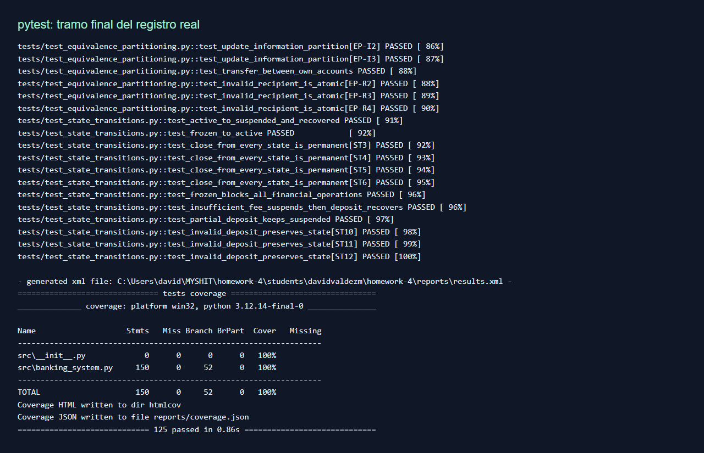
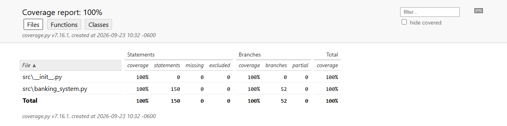
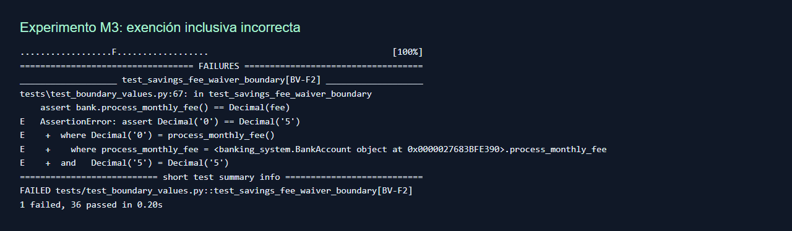

# Reporte de ejecución - SecureBank

Fecha de ejecución: 2026-09-23T10:32:09.406169-06:00. Plataforma: Windows, Python 3.12.14, pytest 9.1.1, pytest-cov 7.1.0. Reloj del sistema bajo prueba: 2026-09-01 UTC, controlado por fixture.

## Resumen

| Métrica                       | Resultado                                                                                |
| ----------------------------- | ---------------------------------------------------------------------------------------- |
| Total                         | 125                                                                                      |
| Aprobados                     | 125                                                                                      |
| Fallidos / errores / omitidos | 0 / 0 / 0                                                                                |
| Duración JUnit                | 0.716 s                                                                                  |
| Líneas                        | 150/150 (100.00%)                                                                        |
| Ramas                         | 52/52 (100.00%)                                                                          |
| Funciones                     | No se reporta como porcentaje: pytest-cov no genera esta métrica en el resumen utilizado |

Comando reproducible:

```sh
python -m pytest -v --cov=src --cov-branch --cov-report=term-missing --cov-report=json:reports/coverage.json --cov-report=html --junitxml=reports/results.xml
```

El reporte de terminal y JUnit pueden diferir ligeramente en duración porque miden intervalos distintos. Pylint: ver [salida íntegra](lint.txt). Evidencia primaria: [pytest](test-output.txt), [JUnit](results.xml), [coverage JSON](coverage.json).

## Cobertura por técnica, ejecutada aisladamente

| Técnica                  | Casos | Líneas          | Ramas         | Combinada |
| ------------------------ | ----- | --------------- | ------------- | --------- |
| equivalence_partitioning | 38    | 113/150 (75.3%) | 33/52 (63.5%) | 72.3%     |
| boundary_values          | 37    | 94/150 (62.7%)  | 23/52 (44.2%) | 57.9%     |
| decision_tables          | 38    | 120/150 (80.0%) | 32/52 (61.5%) | 75.2%     |
| state_transitions        | 12    | 103/150 (68.7%) | 24/52 (46.2%) | 62.9%     |

Las mediciones individuales se obtuvieron con `python -m pytest tests/test_<técnica>.py --cov=src --cov-branch --cov-report=json`. Los cuatro JSON individuales están junto al reporte. No se suman porcentajes: existe solapamiento.

## Experimento de detección de defectos

La implementación inicial pasó los 125 casos. No se inventan defectos encontrados durante desarrollo. Para comparar sensibilidad se introdujeron cinco mutaciones deliberadas, una a la vez en copias temporales de `src/` y `tests/`, ejecutando cada técnica de forma aislada. Exit code 1 significa que al menos una aserción detectó el cambio; errores de colección no se contabilizan como detección. Se restauró siempre el código original y se repitió la suite final. Este experimento pequeño no constituye una tasa general de detección.

| Mutación | Cambio                                      | EP           | BVA          | DT        | ST           |
| -------- | ------------------------------------------- | ------------ | ------------ | --------- | ------------ |
| M1       | Accept zero transfers                       | Detectado    | Detectado    | Detectado | No detectado |
| M2       | Reject an exact daily limit                 | No detectado | Detectado    | Detectado | No detectado |
| M3       | Waive fees at the exact threshold           | No detectado | Detectado    | Detectado | No detectado |
| M4       | Allow frozen outgoing transactions          | No detectado | No detectado | Detectado | Detectado    |
| M5       | Force Suspended after every ledger movement | Detectado    | Detectado    | Detectado | Detectado    |

Las sustituciones exactas están en [mutations.json](mutations.json); M5 se aplica exclusivamente a la recalculación de estado en `_record`, no al constructor. Los veinte registros `mutation-M*-<técnica>.txt` incluyen fallos y aserciones. Para reproducir, copiar el proyecto a un directorio temporal, aplicar una sola sustitución y ejecutar los cuatro archivos por separado. No aplicar mutaciones al archivo de entrega.

## Capturas y validación



La captura anterior muestra una vista HTML del texto exacto del registro de terminal, no una sesión interactiva simulada. El archivo de texto enlazado contiene los 125 resultados. La siguiente captura corresponde al reporte HTML real producido por coverage.py.





La tercera imagen es evidencia del experimento, no un defecto pendiente. La solución consiste en mantener la condición original estricta `balance > threshold`; la ejecución final confirma el resultado correcto.

## Interpretación y límites

EP cubre validaciones de entrada y resultados de consulta; BVA concentra su aporte en igualdades, centavos y calendario. DT añade combinaciones de restricciones, cobros y pagos futuros; ST prueba secuencias, estados terminales y operaciones prohibidas. La unión cubre todas las líneas y ramas instrumentadas. No hay líneas ni ramas marcadas como faltantes en la ejecución final.

Persisten huecos semánticos: no se enumeran todas las secuencias de eventos ni todos los pares de condiciones; faltan límites dedicados de Premium, cambio de año, tamaños extremos, zonas horarias y calendarios complejos. Los requisitos de autenticación, red, persistencia, atomicidad concurrente y liquidación externa están fuera del modelo. La cobertura no convierte esos huecos en casos probados. El clock real por defecto tampoco se valida temporalmente con esta suite determinista.

## Resultado individual por técnica

### equivalence_partitioning

- PASS `test_transfer_amount_partition[EP-A1]`
- PASS `test_transfer_amount_partition[EP-A2]`
- PASS `test_transfer_amount_partition[EP-A3]`
- PASS `test_transfer_amount_partition[EP-A4]`
- PASS `test_transfer_amount_partition[EP-A5]`
- PASS `test_transfer_amount_partition[EP-A6]`
- PASS `test_transfer_amount_partition[EP-A7]`
- PASS `test_transfer_amount_partition[EP-A8]`
- PASS `test_transfer_amount_partition[EP-A9]`
- PASS `test_transfer_amount_partition[EP-A10]`
- PASS `test_account_type_partition[EP-T1]`
- PASS `test_account_type_partition[EP-T2]`
- PASS `test_account_type_partition[EP-T3]`
- PASS `test_account_type_partition[EP-T4]`
- PASS `test_initial_balance_partition[EP-B1]`
- PASS `test_initial_balance_partition[EP-B2]`
- PASS `test_initial_balance_partition[EP-B3]`
- PASS `test_initial_balance_partition[EP-B4]`
- PASS `test_payee_partition[EP-P1]`
- PASS `test_payee_partition[EP-P2]`
- PASS `test_payee_partition[EP-P3]`
- PASS `test_payee_partition[EP-P4]`
- PASS `test_payee_partition[EP-P5]`
- PASS `test_payee_partition[EP-P6]`
- PASS `test_history_date_partition[EP-D1]`
- PASS `test_history_date_partition[EP-D2]`
- PASS `test_history_date_partition[EP-D3]`
- PASS `test_history_date_partition[EP-D4]`
- PASS `test_history_date_partition[EP-D5]`
- PASS `test_history_date_partition[EP-D6]`
- PASS `test_history_date_partition[EP-D7]`
- PASS `test_update_information_partition[EP-I1]`
- PASS `test_update_information_partition[EP-I2]`
- PASS `test_update_information_partition[EP-I3]`
- PASS `test_transfer_between_own_accounts`
- PASS `test_invalid_recipient_is_atomic[EP-R2]`
- PASS `test_invalid_recipient_is_atomic[EP-R3]`
- PASS `test_invalid_recipient_is_atomic[EP-R4]`

### boundary_values

- PASS `test_transfer_limit_boundaries[BV-A1]`
- PASS `test_transfer_limit_boundaries[BV-A2]`
- PASS `test_transfer_limit_boundaries[BV-A3]`
- PASS `test_transfer_limit_boundaries[BV-A4]`
- PASS `test_transfer_limit_boundaries[BV-A5]`
- PASS `test_transfer_limit_boundaries[BV-A6]`
- PASS `test_transfer_limit_boundaries[BV-A7]`
- PASS `test_transfer_limit_boundaries[BV-A8]`
- PASS `test_transfer_limit_boundaries[BV-A9]`
- PASS `test_transfer_limit_boundaries[BV-A10]`
- PASS `test_transfer_limit_boundaries[BV-A11]`
- PASS `test_transfer_limit_boundaries[BV-A12]`
- PASS `test_savings_minimum_boundary[BV-M1]`
- PASS `test_savings_minimum_boundary[BV-M2]`
- PASS `test_savings_minimum_boundary[BV-M3]`
- PASS `test_savings_minimum_boundary[BV-M4]`
- PASS `test_savings_minimum_boundary[BV-M5]`
- PASS `test_savings_fee_waiver_boundary[BV-F1]`
- PASS `test_savings_fee_waiver_boundary[BV-F2]`
- PASS `test_savings_fee_waiver_boundary[BV-F3]`
- PASS `test_savings_fee_waiver_boundary[BV-F4]`
- PASS `test_cumulative_daily_limit[BV-C1]`
- PASS `test_cumulative_daily_limit[BV-C2]`
- PASS `test_cumulative_daily_limit[BV-C3]`
- PASS `test_cumulative_daily_limit[BV-C4]`
- PASS `test_available_funds_boundary[BV-B1]`
- PASS `test_available_funds_boundary[BV-B2]`
- PASS `test_available_funds_boundary[BV-B3]`
- PASS `test_available_funds_boundary[BV-B4]`
- PASS `test_midnight_reset_boundary[BV-N1]`
- PASS `test_midnight_reset_boundary[BV-N2]`
- PASS `test_midnight_reset_boundary[BV-N3]`
- PASS `test_midnight_reset_boundary[BV-N4]`
- PASS `test_payment_date_boundary[BV-P1]`
- PASS `test_payment_date_boundary[BV-P2]`
- PASS `test_payment_date_boundary[BV-P3]`
- PASS `test_payment_date_boundary[BV-P4]`

### decision_tables

- PASS `test_transfer_decision_rules[DT-T1]`
- PASS `test_transfer_decision_rules[DT-T2]`
- PASS `test_transfer_decision_rules[DT-T3]`
- PASS `test_transfer_decision_rules[DT-T4]`
- PASS `test_transfer_decision_rules[DT-T5]`
- PASS `test_transfer_decision_rules[DT-T6]`
- PASS `test_transfer_decision_rules[DT-T7]`
- PASS `test_transfer_decision_rules[DT-T8]`
- PASS `test_monthly_fee_decision_rules[DT-F1]`
- PASS `test_monthly_fee_decision_rules[DT-F2]`
- PASS `test_monthly_fee_decision_rules[DT-F3]`
- PASS `test_monthly_fee_decision_rules[DT-F4]`
- PASS `test_monthly_fee_decision_rules[DT-F5]`
- PASS `test_monthly_fee_decision_rules[DT-F6]`
- PASS `test_monthly_fee_decision_rules[DT-F7]`
- PASS `test_monthly_fee_decision_rules[DT-F8]`
- PASS `test_monthly_fee_decision_rules[DT-F9]`
- PASS `test_monthly_fee_decision_rules[DT-F10]`
- PASS `test_bill_payment_decision_rules[DT-P1]`
- PASS `test_bill_payment_decision_rules[DT-P2]`
- PASS `test_bill_payment_decision_rules[DT-P3]`
- PASS `test_bill_payment_decision_rules[DT-P4]`
- PASS `test_bill_payment_decision_rules[DT-P5]`
- PASS `test_bill_payment_decision_rules[DT-P6]`
- PASS `test_bill_payment_decision_rules[DT-P7]`
- PASS `test_bill_payment_decision_rules[DT-P8]`
- PASS `test_bill_payment_decision_rules[DT-P9]`
- PASS `test_bill_payment_decision_rules[DT-P10]`
- PASS `test_bill_payment_decision_rules[DT-P11]`
- PASS `test_bill_payment_decision_rules[DT-P12]`
- PASS `test_bill_payment_decision_rules[DT-P13]`
- PASS `test_bill_payment_decision_rules[DT-P14]`
- PASS `test_bill_payment_decision_rules[DT-P15]`
- PASS `test_bill_payment_decision_rules[DT-P16]`
- PASS `test_future_payment_processed_once`
- PASS `test_scheduled_payment_revalidation[DT-S2]`
- PASS `test_scheduled_payment_revalidation[DT-S3]`
- PASS `test_scheduled_payment_revalidation[DT-S4]`

### state_transitions

- PASS `test_active_to_suspended_and_recovered`
- PASS `test_frozen_to_active`
- PASS `test_close_from_every_state_is_permanent[ST3]`
- PASS `test_close_from_every_state_is_permanent[ST4]`
- PASS `test_close_from_every_state_is_permanent[ST5]`
- PASS `test_close_from_every_state_is_permanent[ST6]`
- PASS `test_frozen_blocks_all_financial_operations`
- PASS `test_insufficient_fee_suspends_then_deposit_recovers`
- PASS `test_partial_deposit_keeps_suspended`
- PASS `test_invalid_deposit_preserves_state[ST10]`
- PASS `test_invalid_deposit_preserves_state[ST11]`
- PASS `test_invalid_deposit_preserves_state[ST12]`
