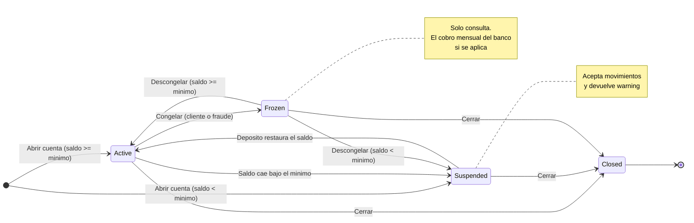

# Test Design Document — SecureBank Online Banking

**Student**: Gilberto Anaya (`gilbertoanayam17`)
**Module**: 4 — Black Box Testing
**System Under Test**: SecureBank (`src/bankingSystem.js` y `src/banking_system.py`)

Este documento es la fase de diseño. Los IDs que defino aquí (EP-, BV-, DT-, ST-)
aparecen en los nombres de las pruebas de `tests/`, para poder ver de qué fila del
diseño viene cada prueba.

---

## 0. Assumptions

Mientras diseñaba las pruebas me encontré con tres cosas que la especificación no
dice. Las decidí yo y las anoto aquí para que se entienda de dónde salen los
resultados esperados de las tablas.

| #   | Lo que no dice la especificación                             | Lo que decidí                                                                              |
| --- | ------------------------------------------------------------ | ------------------------------------------------------------------------------------------ |
| A1  | Qué error devolver cuando fallan varias condiciones a la vez | Reviso en este orden: estado, monto, límite diario y fondos. Devuelvo el primero que falle |
| A2  | Si una cuenta _Suspended_ puede operar o no                  | Sí puede, pero devuelve un `warning`. _Frozen_ y _Closed_ no pueden                        |
| A3  | Qué pasa al descongelar una cuenta con saldo bajo el mínimo  | Se vuelve a revisar el saldo, así que queda _Suspended_ en vez de _Active_                 |

También asumí que el cobro mensual lo hace el banco y no el cliente, así que se
aplica aunque la cuenta esté congelada; solo las cerradas lo rechazan.

**Sobre el manejo del dinero**: los montos son números en dólares y redondeo a dos
decimales con `round2()` antes de comparar o guardar. Lo agregué porque el caso
BV4-1 fallaba: `4999.99 + 0.01` da `5000.000000000001` y se pasaba del límite. Las
comparaciones de saldo en las pruebas usan `toBeCloseTo(x, 2)` y `pytest.approx(x)`.

**Alcance de la implementación**: este documento diseña las tablas completas. La
suite de `tests/` implementa un subconjunto representativo (28 casos por lenguaje),
eligiendo una prueba por cada resultado distinto en vez de cada fila.

---

## 1.1 Equivalence Partitioning

### Input: Transfer Amount

Cuenta de referencia: Checking con saldo $3,000 (límite diario $5,000).

| Partition ID | Description                           | Type    | Representative Value | Expected Result                      |
| ------------ | ------------------------------------- | ------- | -------------------- | ------------------------------------ |
| EP-TA1       | Monto válido dentro de límite y saldo | Valid   | $500                 | Transferencia exitosa                |
| EP-TA2       | Monto cero                            | Invalid | $0                   | Error: Amount must be positive       |
| EP-TA3       | Monto negativo                        | Invalid | -$100                | Error: Amount must be positive       |
| EP-TA4       | Monto sobre el límite diario          | Invalid | $100,000             | Error: Exceeds daily limit           |
| EP-TA5       | Monto sobre el saldo disponible       | Invalid | $4,000               | Error: Insufficient funds            |
| EP-TA6       | Monto no numérico                     | Invalid | `"500"`              | Error: Amount must be a valid number |

### Input: Deposit Amount

El depósito comparte las particiones del monto de transferencia (mismo validador),
así que solo se verifica una representante de cada clase relevante.

| Partition ID | Description                   | Type    | Representative Value | Expected Result                          |
| ------------ | ----------------------------- | ------- | -------------------- | ---------------------------------------- |
| EP-TA7       | Monto cero                    | Invalid | $0                   | Error: Amount must be positive           |
| EP-TA8       | Monto bajo el mínimo de $0.01 | Invalid | $0.001               | Error: Amount is below the $0.01 minimum |
| EP-TA9       | Monto válido                  | Valid   | $250.50              | Saldo aumenta a $1,250.50                |

### Input: Account Type

| Partition ID | Description             | Type    | Representative Value | Expected Result                 |
| ------------ | ----------------------- | ------- | -------------------- | ------------------------------- |
| EP-AT1       | Cuenta de ahorro        | Valid   | `Savings`            | Límite $2,000 / mínimo $100     |
| EP-AT2       | Cuenta corriente        | Valid   | `Checking`           | Límite $5,000 / mínimo $0       |
| EP-AT3       | Cuenta premium          | Valid   | `Premium`            | Límite $50,000 / mínimo $10,000 |
| EP-AT4       | Tipo fuera del catálogo | Invalid | `Crypto`             | Error: Invalid account type     |

### Input: Account Balance (saldo inicial)

| Partition ID | Description                        | Type    | Representative Value | Expected Result                      |
| ------------ | ---------------------------------- | ------- | -------------------- | ------------------------------------ |
| EP-AB1       | Sobre el mínimo del tipo de cuenta | Valid   | Savings $500         | Cuenta abre en estado Active         |
| EP-AB2       | Bajo el mínimo del tipo de cuenta  | Valid   | Savings $50          | Cuenta abre en estado Suspended      |
| EP-AB3       | Saldo negativo                     | Invalid | -$50                 | Error: Amount must be positive       |
| EP-AB4       | Saldo no numérico                  | Invalid | `"mil"`              | Error: Amount must be a valid number |
| EP-AB5       | Más de dos decimales               | Valid   | $100.001             | Se redondea a $100.00                |

### Input: Payee (bill payment)

| Partition ID | Description                | Type    | Representative Value | Expected Result      |
| ------------ | -------------------------- | ------- | -------------------- | -------------------- |
| EP-PY1       | Beneficiario registrado    | Valid   | `ELECTRIC_CO`        | Pago aceptado        |
| EP-PY2       | Beneficiario no registrado | Invalid | `UNKNOWN_CO`         | Error: Invalid payee |
| EP-PY3       | Cadena vacía               | Invalid | `""`                 | Error: Invalid payee |
| EP-PY4       | Valor no textual           | Invalid | `42`                 | Error: Invalid payee |

### Input: Date Range (transaction history)

Cuenta de referencia: un movimiento el 2026-01-15 y otro el 2026-02-10.

| Partition ID | Description                    | Type    | Representative Value    | Expected Result              |
| ------------ | ------------------------------ | ------- | ----------------------- | ---------------------------- |
| EP-DR1       | Rango que contiene movimientos | Valid   | 2026-01-01 → 2026-01-31 | Devuelve 1 movimiento        |
| EP-DR2       | Rango sin movimientos          | Valid   | 2026-03-01 → 2026-03-31 | Devuelve lista vacía         |
| EP-DR3       | Rango invertido                | Invalid | 2026-02-01 → 2026-01-01 | Error: Invalid date range    |
| EP-DR4       | Sin rango, exportando a CSV    | Valid   | (ninguno)               | CSV con encabezado + 2 filas |
| EP-DR5       | Rango invertido al exportar    | Invalid | 2026-02-01 → 2026-01-01 | El error se propaga al CSV   |
| EP-DR6       | Rango abierto por la derecha   | Valid   | desde 2026-02-01        | Devuelve solo el depósito    |
| EP-DR7       | Sin argumentos                 | Valid   | (ninguno)               | Devuelve los 2 movimientos   |

---

## 1.2 Boundary Value Analysis

### BV1 — Transfer Amount vs Daily Limit (Checking, $5,000)

| Test ID | Boundary              | Test Value | Expected Result                |
| ------- | --------------------- | ---------- | ------------------------------ |
| BV1-1   | Bajo el mínimo        | $0.00      | Error: Amount must be positive |
| BV1-2   | Mínimo válido         | $0.01      | Transferencia exitosa          |
| BV1-3   | Justo bajo el límite  | $4,999.99  | Transferencia exitosa          |
| BV1-4   | En el límite          | $5,000.00  | Transferencia exitosa          |
| BV1-5   | Justo sobre el límite | $5,000.01  | Error: Exceeds daily limit     |
| BV1-6   | Muy sobre el límite   | $10,000.00 | Error: Exceeds daily limit     |

### BV2 — Transfer Amount vs Daily Limit (Savings, $2,000)

| Test ID | Boundary              | Test Value | Expected Result                |
| ------- | --------------------- | ---------- | ------------------------------ |
| BV2-1   | Bajo el mínimo        | $0.00      | Error: Amount must be positive |
| BV2-2   | Mínimo válido         | $0.01      | Transferencia exitosa          |
| BV2-3   | Justo bajo el límite  | $1,999.99  | Transferencia exitosa          |
| BV2-4   | En el límite          | $2,000.00  | Transferencia exitosa          |
| BV2-5   | Justo sobre el límite | $2,000.01  | Error: Exceeds daily limit     |

### BV3 — Balance vs Minimum Balance (Savings, $100)

Saldo inicial $500; se observa el saldo y el estado resultantes.

| Test ID | Boundary                       | Test Value         | Expected Result                |
| ------- | ------------------------------ | ------------------ | ------------------------------ |
| BV3-1   | Queda justo sobre el mínimo    | Transfiere $399.99 | Saldo $100.01, estado Active   |
| BV3-2   | Queda exactamente en el mínimo | Transfiere $400.00 | Saldo $100.00, estado Active   |
| BV3-3   | Queda justo bajo el mínimo     | Transfiere $400.01 | Saldo $99.99, estado Suspended |
| BV3-4   | Vacía la cuenta                | Transfiere $500.00 | Saldo $0.00, estado Suspended  |
| BV3-5   | Un centavo sobre el saldo      | Transfiere $500.01 | Error: Insufficient funds      |

### BV4 — Cumulative Daily Limit (Checking, $5,000)

El límite es acumulado, no por transacción: la frontera se cruza con la suma.

| Test ID | Boundary                            | Test Value                 | Expected Result                     |
| ------- | ----------------------------------- | -------------------------- | ----------------------------------- |
| BV4-1   | La suma llega exactamente al límite | $4,999.99 + $0.01          | Ambas exitosas, acumulado $5,000.00 |
| BV4-2   | La suma excede por un centavo       | $4,999.99 + $0.02          | Segunda: Error: Exceeds daily limit |
| BV4-3   | Límite ya agotado                   | $5,000.00 + $0.01          | Segunda: Error: Exceeds daily limit |
| BV4-4   | Corte de medianoche                 | $5,000.00, reinicio, $0.01 | Segunda exitosa, acumulado $0.01    |

### BV5 — Monthly Fee Waiver Threshold

| Test ID | Boundary                       | Test Value | Expected Result                                       |
| ------- | ------------------------------ | ---------- | ----------------------------------------------------- |
| BV5-1   | Checking justo bajo el umbral  | $4,999.99  | Cobra $10 → $4,989.99                                 |
| BV5-2   | Checking en el umbral          | $5,000.00  | Cobra $10 → $4,990.00 (la exención exige _mayor que_) |
| BV5-3   | Checking justo sobre el umbral | $5,000.01  | Exenta, saldo intacto                                 |
| BV5-4   | Savings en el umbral           | $1,000.00  | Cobra $5 → $995.00                                    |
| BV5-5   | Savings justo sobre el umbral  | $1,000.01  | Exenta, saldo intacto                                 |

### BV6 — Transfer Amount vs Daily Limit (Premium, $50,000)

| Test ID | Boundary              | Test Value | Expected Result            |
| ------- | --------------------- | ---------- | -------------------------- |
| BV6-1   | Mínimo válido         | $0.01      | Transferencia exitosa      |
| BV6-2   | Justo bajo el límite  | $49,999.99 | Transferencia exitosa      |
| BV6-3   | En el límite          | $50,000.00 | Transferencia exitosa      |
| BV6-4   | Justo sobre el límite | $50,000.01 | Error: Exceeds daily limit |

### BV7 — Minimum Transaction Amount ($0.01)

La especificación fija "Minimum transfer: $0.01". Esta frontera separa _cero o
negativo_ (no positivo) de _positivo pero demasiado pequeño_.

| Test ID | Boundary                | Test Value  | Expected Result                          |
| ------- | ----------------------- | ----------- | ---------------------------------------- |
| BV7-1   | Cero                    | $0.00       | Error: Amount must be positive           |
| BV7-2   | Positivo bajo el mínimo | $0.005      | Error: Amount is below the $0.01 minimum |
| BV7-3   | Justo bajo el mínimo    | $0.009      | Error: Amount is below the $0.01 minimum |
| BV7-4   | En el mínimo            | $0.01       | Transferencia exitosa                    |
| BV7-5   | Justo sobre el mínimo   | $0.02       | Transferencia exitosa                    |
| BV7-6   | Acumulación de redondeo | 100 × $0.01 | Saldo final exactamente $999.00          |

---

## 1.3 Decision Tables

### Decision Table 1: Transfer Validation

Condiciones (en orden de precedencia, decisión A1):

- **C1** ¿La cuenta acepta movimientos? (Active o Suspended)
- **C2** ¿Está dentro del límite diario acumulado?
- **C3** ¿Hay fondos suficientes?

| Condition                   | R1  | R2  | R3  | R4  | R5  | R6  | R7  | R8  |
| --------------------------- | --- | --- | --- | --- | --- | --- | --- | --- |
| C1 Acepta movimientos       | Y   | Y   | Y   | Y   | N   | N   | N   | N   |
| C2 Dentro del límite diario | Y   | Y   | N   | N   | Y   | Y   | N   | N   |
| C3 Fondos suficientes       | Y   | N   | Y   | N   | Y   | N   | Y   | N   |
| **Action**                  |     |     |     |     |     |     |     |     |
| Transferencia exitosa       | X   |     |     |     |     |     |     |     |
| Error: Insufficient funds   |     | X   |     |     |     |     |     |     |
| Error: Exceeds daily limit  |     |     | X   | X   |     |     |     |     |
| Error: Account frozen       |     |     |     |     | X   | X   | X   | X   |

Cada regla tiene una sola acción, siguiendo el orden que decidí en A1. Si no, no
sabría qué error esperar en la prueba.

**Reducción de reglas.** Cuando C1 = N el resultado ya no depende de C2 ni C3, así
que R5–R8 se pueden juntar en una sola regla usando _don't care_:

| Condition                   | R1    | R2                 | R3            | R4            | R5'            |
| --------------------------- | ----- | ------------------ | ------------- | ------------- | -------------- |
| C1 Acepta movimientos       | Y     | Y                  | Y             | Y             | N              |
| C2 Dentro del límite diario | Y     | Y                  | N             | N             | –              |
| C3 Fondos suficientes       | Y     | N                  | Y             | N             | –              |
| **Acción**                  | Éxito | Insufficient funds | Exceeds limit | Exceeds limit | Account frozen |

En `tests/` implemento R1, R2, R3 y R5, que son las cuatro acciones distintas de
la tabla.

### Decision Table 2: Monthly Fee Processing

| Condition                  | R1      | R2      | R3      | R4       | R5       | R6       | R7      |
| -------------------------- | ------- | ------- | ------- | -------- | -------- | -------- | ------- |
| Tipo de cuenta             | Savings | Savings | Savings | Checking | Checking | Checking | Premium |
| Saldo > umbral de exención | Y       | N       | N       | Y        | N        | N        | –       |
| Fondos para la comisión    | –       | Y       | N       | –        | Y        | N        | –       |
| **Action**                 |         |         |         |          |          |          |         |
| Exenta (no cobra)          | X       |         |         | X        |          |          | X       |
| Cobra la comisión          |         | X       |         |          | X        |          |         |
| Suspende la cuenta         |         |         | X       |          |          | X        |         |

| Rule | Caso de prueba              | Valor            | Resultado esperado                          |
| ---- | --------------------------- | ---------------- | ------------------------------------------- |
| R1   | Savings exenta              | $1,500           | Saldo intacto, `waived = true`              |
| R2   | Savings cobra               | $800             | $795.00, estado Active                      |
| R3   | Savings sin fondos          | $3               | Error: Insufficient funds, estado Suspended |
| R4   | Checking exenta             | $6,000           | Saldo intacto                               |
| R5   | Checking cobra              | $3,000           | $2,990.00                                   |
| R6   | Checking sin fondos         | $5               | Error: Insufficient funds, estado Suspended |
| R7   | Premium siempre exenta      | $20,000          | Comisión $0                                 |
| R8   | La comisión cruza el mínimo | Savings $102     | $97.00, estado Suspended + warning          |
| R9   | Cuenta cerrada              | Checking cerrada | Error: Account closed                       |

R8 y R9 no son combinaciones nuevas de condiciones, sino casos donde esta tabla se
cruza con la máquina de estados de la sección 1.4.

### Decision Table 3: Bill Payment Validation

Tabla reducida con _don't care_: la primera condición que falla determina la acción.

| Condition                         | R1  | R2  | R3  | R4  | R5  | R6  |
| --------------------------------- | --- | --- | --- | --- | --- | --- |
| C1 La cuenta acepta movimientos   | N   | Y   | Y   | Y   | Y   | Y   |
| C2 Beneficiario registrado        | –   | N   | Y   | Y   | Y   | Y   |
| C3 Monto válido                   | –   | –   | N   | Y   | Y   | Y   |
| C4 Fondos suficientes             | –   | –   | –   | N   | Y   | Y   |
| C5 Fecha de pago futura           | –   | –   | –   | –   | N   | Y   |
| **Action**                        |     |     |     |     |     |     |
| Error: Account frozen             | X   |     |     |     |     |     |
| Error: Invalid payee              |     | X   |     |     |     |     |
| Error: Amount must be positive    |     |     | X   |     |     |     |
| Error: Insufficient funds         |     |     |     | X   |     |     |
| Ejecuta el pago (descuenta saldo) |     |     |     |     | X   |     |
| Agenda el pago (no descuenta)     |     |     |     |     |     | X   |

---

## 1.4 State Transition Testing

### State Transition Diagram



Diagrama equivalente en ASCII, por si el visor no renderiza Mermaid:

```
                 saldo < minimo
   [Active] ──────────────────────> [Suspended]
      │  ^                                │
      │  └──────────────────────────────┘
      │            deposito restaura
      │
      │ congelar            descongelar
      └──────> [Frozen] ──────────────> [Active] o [Suspended]
                  │                        (segun el saldo)
      cerrar      │ cerrar      cerrar
   ───────────────┴────────────────────> [Closed]  (terminal)
```

### State Transition Table

| Current State | Event                             | Next State | Action/Output                       |
| ------------- | --------------------------------- | ---------- | ----------------------------------- |
| Active        | Transferencia deja saldo < mínimo | Suspended  | Devuelve `warning`                  |
| Active        | Congelar                          | Frozen     | Bloquea todos los movimientos       |
| Active        | Cerrar                            | Closed     | Genera estado de cuenta final       |
| Active        | Descongelar                       | Active     | Error: Invalid state transition     |
| Suspended     | Depósito restaura el saldo        | Active     | Se retiran las restricciones        |
| Suspended     | Transferencia válida              | Suspended  | Se acepta, con `warning`            |
| Suspended     | Congelar                          | Suspended  | Error: Invalid state transition     |
| Suspended     | Cerrar                            | Closed     | Genera estado de cuenta final       |
| Frozen        | Transferencia / depósito / pago   | Frozen     | Error: Account frozen               |
| Frozen        | Cobro mensual                     | Frozen     | Se aplica, sin reevaluar suspensión |
| Frozen        | Descongelar con saldo ≥ mínimo    | Active     | Acceso restaurado                   |
| Frozen        | Descongelar con saldo < mínimo    | Suspended  | Acceso restaurado, con `warning`    |
| Frozen        | Cerrar                            | Closed     | Genera estado de cuenta final       |
| Closed        | Cualquier evento                  | Closed     | Error: Account closed               |

### State Transition Test Cases

| Test ID | Start State | Event                                   | Expected End State | Validation                            |
| ------- | ----------- | --------------------------------------- | ------------------ | ------------------------------------- |
| ST1     | Active      | Savings $500, transfiere $450           | Suspended          | Saldo $50 y `warning` presente        |
| ST2     | Suspended   | Savings $50, deposita $100              | Active             | Saldo $150, sin `warning`             |
| ST3     | Active      | Congelar                                | Frozen             | `success = true`                      |
| ST4     | Frozen      | Descongelar                             | Active             | `success = true`                      |
| ST5     | Active      | Cerrar                                  | Closed             | `finalStatement = 1000`               |
| ST6     | Frozen      | Cerrar                                  | Closed             | `success = true`                      |
| ST7     | Suspended   | Cerrar                                  | Closed             | `success = true`                      |
| ST8     | Frozen      | Cobro mensual y luego descongelar       | Suspended          | Saldo $97; sigue Frozen tras el cobro |
| ST9     | Frozen      | Transferir $100                         | Frozen             | Error: Account frozen, saldo intacto  |
| ST10    | Suspended   | Congelar                                | Suspended          | Error: Invalid state transition       |
| ST11    | Active      | Descongelar                             | Active             | Error: Invalid state transition       |
| ST12    | Closed      | Transferir / depositar / pagar / cerrar | Closed             | Error: Account closed en los cuatro   |
| ST13    | Suspended   | Transferir $10                          | Suspended          | `success = true` con `warning`        |

**Cobertura de transiciones**: ST1–ST8 son las ocho transiciones válidas entre
estados y ST9–ST13 son transiciones inválidas y el estado terminal. En `tests/`
implemento ST1, ST2, ST3, ST5 y ST12, que tocan los cuatro estados y el caso
terminal.
