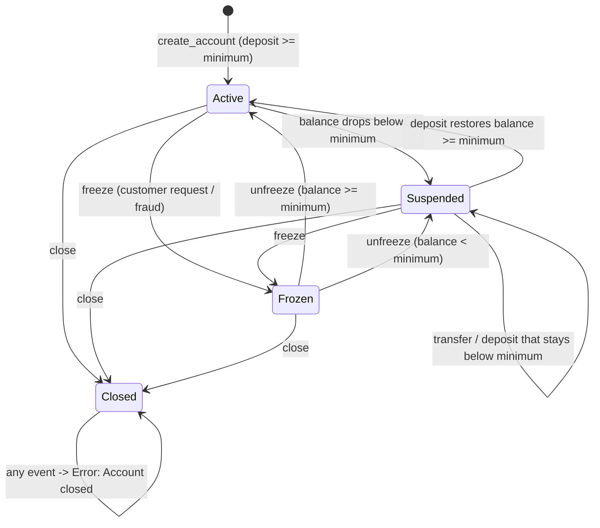

# Test Design Document — SecureBank Online Banking

**Student**: Pablo Portillo
**Module**: 4 — Black Box Testing
**System under test**: `src/banking_system.py` (Python) and `js/src/bankingSystem.js` (JavaScript)
**Techniques**: Equivalence Partitioning (EP), Boundary Value Analysis (BVA), Decision Tables (DT),
State Transition Testing (ST)

---

## 0. System Summary and Design Assumptions

| Account type | Minimum balance | Monthly fee | Fee waived when | Daily transfer limit |
| ------------ | --------------- | ----------- | --------------- | -------------------- |
| Savings      | $100            | $5          | balance > $1,000 | $2,000              |
| Checking     | $0              | $10         | balance > $5,000 | $5,000              |
| Premium      | $10,000         | $0          | always           | $50,000             |

States: **Active**, **Frozen**, **Suspended**, **Closed**.

The brief leaves some behaviour open. The following assumptions were fixed **before** writing any
test, and every test below is designed against them. They are the contract the black box is tested
through.

| # | Assumption | Rationale |
| - | ---------- | --------- |
| A1 | The daily limit applies to the **cumulative** total transferred that day, not to a single transfer. | "Daily transfer limit" and "Daily limit resets at midnight" only make sense cumulatively. |
| A2 | Validation precedence is **state → amount validity → daily limit → funds**, and an operation reports exactly **one** error. | A real API returns one error code; a fixed precedence makes the decision table deterministic. This is a deliberate deviation from the example table in the brief, which marks two actions for the same rule. |
| A3 | **Suspended** accounts can still transfer and pay bills; only **Frozen** and **Closed** block money movement. | The brief says Frozen is "view only" and Suspended only "shows warnings", and the transfer rules name Frozen/Closed as the blockers. |
| A4 | A transfer or fee that drops the balance under the minimum is **allowed** and moves the account to Suspended with a warning. | Required by the brief's own ST1 example. |
| A5 | Amounts carry at most **two decimals**; $0.001 is rejected rather than silently rounded. | Sub-cent input is an input-domain error, not a value to round. Money is stored internally in integer cents. |
| A6 | Opening an account requires an initial deposit **≥ the account-type minimum**. | An account born below its own minimum would have to be Suspended at creation. |
| A7 | A bill payment with a **future** date is accepted and scheduled; the balance is not debited yet. A past date is rejected. | "Schedule payments (immediate or future date)". |
| A8 | `unfreeze` returns the account to Active, or to Suspended when the balance is below the minimum. | The minimum-balance rule cannot be escaped by freezing the account. |
| A9 | The fee waiver is **strictly greater than** the threshold ("waived if balance > $1,000"). | Literal reading of the brief. |
| A10 | Transaction history date ranges are **inclusive** on both ends. | Standard banking statement behaviour. |

---

## 1. Equivalence Partitioning

Six inputs are partitioned. Each partition carries one representative value, which becomes one
automated test.

### 1.1 Input: Transfer amount (Checking account, $1,000 balance, $5,000 daily limit)

| ID   | Description                        | Type    | Representative value | Expected result                |
| ---- | ---------------------------------- | ------- | -------------------- | ------------------------------ |
| EP1  | Valid amount within funds and limit | Valid   | $500.00              | Transfer succeeds, balance $500 |
| EP2  | Zero amount                        | Invalid | $0.00                | Error: Amount must be positive |
| EP3  | Negative amount                    | Invalid | -$100.00             | Error: Amount must be positive |
| EP4  | Amount above the daily limit        | Invalid | $100,000.00          | Error: Exceeds daily limit     |
| EP5  | Amount above the balance but under the limit | Invalid | $1,500.00   | Error: Insufficient funds      |
| EP6  | Non-numeric amount                 | Invalid | `"five hundred"`     | Error: Amount must be numeric  |
| EP7  | Sub-cent precision                 | Invalid | $0.001               | Error: Amount must be specified in whole cents |

### 1.2 Input: Account type (at account creation)

| ID   | Description               | Type    | Representative value | Expected result                       |
| ---- | ------------------------- | ------- | -------------------- | ------------------------------------- |
| EP8  | Savings                   | Valid   | `"Savings"`          | Created, limit $2,000, minimum $100   |
| EP9  | Checking                  | Valid   | `"Checking"`         | Created, limit $5,000, minimum $0     |
| EP10 | Premium                   | Valid   | `"Premium"`          | Created, limit $50,000, minimum $10,000 |
| EP11 | Unsupported type name     | Invalid | `"Crypto"`           | Error: Unknown account type           |
| EP12 | Wrong case / empty string | Invalid | `""`                 | Error: Unknown account type           |

### 1.3 Input: Opening balance (Savings, $100 minimum)

| ID   | Description                        | Type    | Representative value | Expected result                            |
| ---- | ---------------------------------- | ------- | -------------------- | ------------------------------------------ |
| EP13 | Deposit at or above the minimum    | Valid   | $500.00              | Account created Active                      |
| EP14 | Deposit below the minimum          | Invalid | $50.00               | Error: Initial deposit below minimum balance |
| EP15 | Negative deposit                   | Invalid | -$10.00              | Error: Amount must be positive              |
| EP16 | Premium opened below its minimum   | Invalid | $9,000.00            | Error: Initial deposit below minimum balance |

### 1.4 Input: Payee (bill payment)

| ID   | Description                 | Type    | Representative value       | Expected result              |
| ---- | --------------------------- | ------- | -------------------------- | ---------------------------- |
| EP17 | Registered and active payee | Valid   | `"CFE"` (registered)       | Payment succeeds             |
| EP18 | Payee that was never registered | Invalid | `"UNKNOWN-99"`         | Error: Unknown payee         |
| EP19 | Registered but deactivated payee | Invalid | `"OLD-GYM"` (inactive) | Error: Payee is not active  |

### 1.5 Input: Scheduled payment date

| ID   | Description        | Type    | Representative value | Expected result                              |
| ---- | ------------------ | ------- | -------------------- | -------------------------------------------- |
| EP20 | Immediate payment  | Valid   | `None` / today       | Paid now, balance debited                     |
| EP21 | Future date        | Valid   | today + 15 days      | Scheduled, balance **not** debited            |
| EP22 | Past date          | Invalid | today − 1 day        | Error: Scheduled date cannot be in the past   |

### 1.6 Input: Date range for transaction history

| ID   | Description                   | Type    | Representative value                | Expected result                          |
| ---- | ----------------------------- | ------- | ----------------------------------- | ---------------------------------------- |
| EP23 | Range covering some entries   | Valid   | 2026-03-01 → 2026-03-31             | Only entries inside the range returned    |
| EP24 | No range given                | Valid   | `None` → `None`                     | Full history returned                     |
| EP25 | Range with no entries         | Valid   | 2030-01-01 → 2030-01-31             | Empty list, `count == 0`                  |
| EP26 | Inverted range                | Invalid | 2026-03-31 → 2026-03-01             | Error: Start date must not be after end date |
| EP27 | Wrong type for a bound        | Invalid | `"2026-03-01"` (string)             | Error: Date range must use date objects   |

### 1.7 Amount partitions applied to the other money operations

The transfer amount partitions are input-domain classes for *any* amount, so they are re-applied to
deposit, bill payment and account creation. These rows exist because a partition that only holds in
one entry point is not really a partition of the system.

| ID   | Operation        | Description                | Type    | Representative value | Expected result                 |
| ---- | ---------------- | -------------------------- | ------- | -------------------- | ------------------------------- |
| EP28 | `deposit`        | Sub-cent precision         | Invalid | $0.001               | Error: Amount must be specified in whole cents |
| EP29 | `deposit`        | Zero amount                | Invalid | $0.00                | Error: Amount must be positive  |
| EP30 | `pay_bill`       | Non-numeric amount         | Invalid | `"one hundred"`      | Error: Amount must be numeric   |
| EP31 | `create_account` | Non-numeric opening deposit | Invalid | `"one thousand"`    | Error: Amount must be numeric   |
| EP32 | `transfer`       | Non-finite amount          | Invalid | `inf`                | Error: Amount must be numeric   |
| EP33 | `BankAccount()`  | Unsupported type at the constructor | Invalid | `"Crypto"` | Raises `ValueError`             |
| EP34 | `transfer`       | Structured value           | Invalid | `{"amount": 100}`    | Error: Amount must be numeric   |
| EP35 | `transfer`       | Scientific notation below a cent | Invalid | `1e-07`        | Error: Amount must be specified in whole cents |

---

## 2. Boundary Value Analysis

Six boundaries, each with 4–6 values, using the 3-value pattern (below / on / above) around each
edge.

### 2.1 Boundary: Transfer amount vs daily limit — Checking ($5,000)

Balance $20,000 so that only the limit can fail the transfer.

| ID  | Boundary          | Test value  | Expected result                |
| --- | ----------------- | ----------- | ------------------------------ |
| BV1 | Below the minimum transfer | $0.00      | Error: Amount must be positive |
| BV2 | Minimum valid     | $0.01       | Succeeds                       |
| BV3 | Just below limit  | $4,999.99   | Succeeds                       |
| BV4 | At the limit      | $5,000.00   | Succeeds, daily total $5,000   |
| BV5 | Just above limit  | $5,000.01   | Error: Exceeds daily limit     |
| BV6 | Far above limit   | $10,000.00  | Error: Exceeds daily limit     |

### 2.2 Boundary: Transfer amount vs daily limit — Savings ($2,000)

| ID   | Boundary         | Test value | Expected result                |
| ---- | ---------------- | ---------- | ------------------------------ |
| BV7  | Minimum valid    | $0.01      | Succeeds                       |
| BV8  | Just below limit | $1,999.99  | Succeeds                       |
| BV9  | At the limit     | $2,000.00  | Succeeds                       |
| BV10 | Just above limit | $2,000.01  | Error: Exceeds daily limit     |

### 2.3 Boundary: Cumulative daily limit — Premium ($50,000)

Each row is applied after a first transfer of $49,999.00 on the same day.

| ID   | Boundary                      | Second transfer | Expected result             |
| ---- | ----------------------------- | --------------- | --------------------------- |
| BV11 | Cumulative just below limit   | $0.99           | Succeeds, total $49,999.99  |
| BV12 | Cumulative exactly at limit   | $1.00           | Succeeds, total $50,000.00  |
| BV13 | Cumulative one cent over      | $1.01           | Error: Exceeds daily limit  |
| BV14 | Same amount after midnight reset | $1.01 after `reset_daily_limit()` | Succeeds |

### 2.4 Boundary: Balance vs minimum balance — Savings ($100)

Starting balance $200.00; the transfer amount drives the resulting balance.

| ID   | Boundary                    | Resulting balance | Expected state |
| ---- | --------------------------- | ----------------- | -------------- |
| BV15 | Comfortably above minimum   | $150.00           | Active         |
| BV16 | One cent above the minimum  | $100.01           | Active         |
| BV17 | Exactly at the minimum      | $100.00           | Active         |
| BV18 | One cent below the minimum  | $99.99            | Suspended + warning |
| BV19 | Far below the minimum       | $0.00             | Suspended + warning |

### 2.5 Boundary: Balance vs monthly fee waiver — Savings ($1,000 threshold, $5 fee)

| ID   | Boundary                   | Balance     | Expected result        |
| ---- | -------------------------- | ----------- | ---------------------- |
| BV20 | Just below the threshold   | $999.99     | Fee of $5 charged      |
| BV21 | Exactly at the threshold   | $1,000.00   | Fee of $5 charged (waiver is strictly `>`) |
| BV22 | One cent above the threshold | $1,000.01 | Fee waived, balance unchanged |
| BV23 | Far above the threshold    | $5,000.00   | Fee waived             |

### 2.6 Boundary: Balance vs fee affordability — Checking ($10 fee, $0 minimum)

| ID   | Boundary                 | Balance | Expected result                              |
| ---- | ------------------------ | ------- | -------------------------------------------- |
| BV24 | Fee affordable by a cent | $10.01  | Charged, balance $0.01, Active               |
| BV25 | Fee exactly affordable   | $10.00  | Charged, balance $0.00, Active               |
| BV26 | One cent short           | $9.99   | Error: Insufficient funds, account Suspended |
| BV27 | Empty account            | $0.00   | Error: Insufficient funds, account Suspended |

### 2.7 Boundary: Transaction history date range (inclusive ends)

History contains entries on 2026-03-01, 2026-03-15 and 2026-03-31.

| ID   | Boundary                    | Range                   | Expected result |
| ---- | --------------------------- | ----------------------- | --------------- |
| BV28 | Range ends on the first entry | 2026-02-01 → 2026-03-01 | 1 entry         |
| BV29 | Range starts one day late   | 2026-03-02 → 2026-03-31 | 2 entries       |
| BV30 | Full inclusive range        | 2026-03-01 → 2026-03-31 | 3 entries       |
| BV31 | Single-day range            | 2026-03-15 → 2026-03-15 | 1 entry         |

---

## 3. Decision Tables

### 3.1 Decision Table 1 — Transfer validation

Conditions are evaluated in the precedence order of assumption A2, so every rule has exactly one
action. "Amount valid?" means numeric, positive and at most two decimals.

| Condition              | R1 | R2 | R3 | R4 | R5 | R6 | R7 | R8 | R9 | R10 |
| ---------------------- | -- | -- | -- | -- | -- | -- | -- | -- | -- | --- |
| Account state          | Active | Suspended | Frozen | Closed | Active | Active | Active | Active | Frozen | Suspended |
| Amount valid?          | Y  | Y  | –  | –  | N  | N  | Y  | Y  | N  | Y |
| Within daily limit?    | Y  | Y  | –  | –  | –  | –  | N  | Y  | –  | Y |
| Sufficient funds?      | Y  | Y  | –  | –  | –  | –  | –  | N  | –  | N |
| **Actions**            |    |    |    |    |    |    |    |    |    |   |
| Transfer succeeds      | X  | X  |    |    |    |    |    |    |    |   |
| Error: Account frozen  |    |    | X  |    |    |    |    |    | X  |   |
| Error: Account closed  |    |    |    | X  |    |    |    |    |    |   |
| Error: Amount must be positive |   |   |   |   | X |   |   |   |   |   |
| Error: Amount must be numeric  |   |   |   |   |   | X |   |   |   |   |
| Error: Exceeds daily limit     |   |   |   |   |   |   | X |   |   |   |
| Error: Insufficient funds      |   |   |   |   |   |   |   | X |   | X |

R9 and R10 are the interesting collapsed rules: R9 proves the state check wins over an invalid
amount, and R10 proves a Suspended account behaves exactly like an Active one for the funds check.

### 3.2 Decision Table 2 — Monthly fee processing

| Condition                    | R1 | R2 | R3 | R4 | R5 | R6 |
| ---------------------------- | -- | -- | -- | -- | -- | -- |
| Account type                 | Premium | Savings | Savings | Checking | Checking | Savings |
| Balance > waiver threshold?  | –  | Y  | N  | Y  | N  | N  |
| Balance ≥ fee?               | –  | –  | Y  | –  | Y  | N  |
| **Actions**                  |    |    |    |    |    |    |
| Fee waived, balance unchanged | X | X  |    | X  |    |    |
| Fee charged                  |    |    | X  |    | X  |    |
| Error: Insufficient funds    |    |    |    |    |    | X  |
| Account moved to Suspended   |    |    |    |    |    | X  |

Note on R3: charging the fee may itself push a Savings account below its $100 minimum, in which
case the account is also suspended by the rule in A4 — this is where DT and ST overlap.

### 3.3 Decision Table 3 — Bill payment validation

| Condition           | R1 | R2 | R3 | R4 | R5 | R6 | R7 |
| ------------------- | -- | -- | -- | -- | -- | -- | -- |
| Account operable?   | Y  | Y  | Y  | Y  | Y  | Y  | N  |
| Payee registered?   | Y  | Y  | N  | Y  | Y  | Y  | –  |
| Payee active?       | Y  | Y  | –  | N  | Y  | Y  | –  |
| Amount > $0?        | Y  | Y  | –  | –  | N  | Y  | –  |
| Date not in past?   | Y  | Y  | –  | –  | –  | Y  | –  |
| Sufficient funds?   | Y  | N  | –  | –  | –  | –  | –  |
| Date is future?     | N  | –  | –  | –  | –  | N(past) | – |
| **Actions**         |    |    |    |    |    |    |    |
| Paid immediately    | X  |    |    |    |    |    |    |
| Error: Insufficient funds |  | X |   |    |    |    |    |
| Error: Unknown payee |   |    | X  |    |    |    |    |
| Error: Payee is not active | | |    | X  |    |    |    |
| Error: Amount must be positive | | | |  | X  |    |    |
| Error: Scheduled date cannot be in the past | | | | | | X |  |
| Error: Account frozen |  |    |    |    |    |    | X  |

A separate rule R8 covers the scheduled path: operable account, active payee, positive amount,
future date, sufficient funds → **payment scheduled, balance unchanged**.

### 3.4 Decision Table 4 — Account creation

| Condition                     | R1 | R2 | R3 | R4 |
| ----------------------------- | -- | -- | -- | -- |
| Account type supported?       | Y  | Y  | Y  | N  |
| Opening deposit ≥ 0?          | Y  | Y  | N  | –  |
| Opening deposit ≥ type minimum? | Y | N  | –  | –  |
| **Actions**                   |    |    |    |    |
| Account created Active        | X  |    |    |    |
| Error: Initial deposit below minimum balance | | X |  |  |
| Error: Amount must be positive |   |    | X  |    |
| Error: Unknown account type   |    |    |    | X  |

---

## 4. State Transition Testing

### 4.1 State diagram



ASCII fallback:

```
                 balance < minimum
   [Active] ---------------------------> [Suspended]
      |   <---------------------------       |
      |        deposit restores              |
      |                                      |
      |-- freeze -----> [Frozen] <-- freeze --|
      |                  |  |
      |                  |  +-- unfreeze (balance >= min) --> [Active]
      |                  +----- unfreeze (balance <  min) --> [Suspended]
      |
      +-- close --> [Closed] <-- close -- (Frozen, Suspended)
                       |
                       +-- any event --> Error: Account closed (stays Closed)
```

### 4.2 State transition table

| Current state | Event                                  | Next state | Action / output                        |
| ------------- | -------------------------------------- | ---------- | -------------------------------------- |
| Active        | Transfer leaves balance below minimum  | Suspended  | Warning notification, transfer applied  |
| Active        | Transfer leaves balance at/above minimum | Active   | Transfer applied                        |
| Active        | Monthly fee cannot be paid             | Suspended  | Error: Insufficient funds               |
| Active        | Freeze request                         | Frozen     | All money movement blocked              |
| Active        | Close request                          | Closed     | Final statement (CSV) generated         |
| Suspended     | Deposit restores balance ≥ minimum     | Active     | Restrictions removed                    |
| Suspended     | Deposit that stays below minimum       | Suspended  | Warning repeated                        |
| Suspended     | Transfer with funds available          | Suspended  | Transfer applied, warning repeated      |
| Suspended     | Freeze request                         | Frozen     | Money movement blocked                  |
| Suspended     | Close request                          | Closed     | Final statement generated               |
| Frozen        | Transfer / bill payment / deposit      | Frozen     | Error: Account frozen                   |
| Frozen        | Unfreeze, balance ≥ minimum            | Active     | Full access restored                    |
| Frozen        | Unfreeze, balance < minimum            | Suspended  | Access restored with warning            |
| Frozen        | Close request                          | Closed     | Final statement generated               |
| Closed        | Transfer / deposit / bill payment / close | Closed  | Error: Account closed                   |

Invalid transitions that must **not** happen: Closed → any other state, and Active → Active for a
transfer that should have been rejected.

### 4.3 State transition test cases

| ID   | Start state | Event                                            | Expected end state | Validation                                |
| ---- | ----------- | ------------------------------------------------ | ------------------ | ----------------------------------------- |
| ST1  | Active      | Savings transfer takes balance to $99.99          | Suspended          | Warning raised, transfer applied           |
| ST2  | Suspended   | Deposit $500                                      | Active             | Warnings cleared, full access              |
| ST3  | Suspended   | Deposit $10 (still below minimum)                 | Suspended          | Warning repeated                           |
| ST4  | Active      | Freeze request                                    | Frozen             | Transfer now returns "Account frozen"      |
| ST5  | Frozen      | Unfreeze with balance above minimum               | Active             | Transfer succeeds afterwards               |
| ST6  | Frozen      | Unfreeze with balance below minimum               | Suspended          | Warning raised, not Active                 |
| ST7  | Frozen      | Close request                                     | Closed             | Final statement returned                   |
| ST8  | Closed      | Any transfer / deposit                            | Closed             | Error: Account closed, no reopening        |
| ST9  | Active      | Monthly fee larger than balance                   | Suspended          | Error: Insufficient funds, balance intact  |
| ST10 | Suspended   | Transfer with sufficient funds                    | Suspended          | Transfer applied (Suspended ≠ blocked)     |
| ST11 | Active      | Close request                                     | Closed             | CSV statement generated                    |
| ST12 | Active      | Transfer leaving balance exactly at the minimum   | Active             | No suspension at the boundary              |
| ST13 | Active      | Unfreeze (event not valid in this state)          | Active             | Error: Account is not frozen, state unchanged |

---

## 5. Traceability

| Technique | Design IDs | Test file | Automated tests |
| --------- | ---------- | --------- | --------------- |
| Equivalence Partitioning | EP1–EP35 | `tests/test_equivalence_partitioning.py` | 36 |
| Boundary Value Analysis  | BV1–BV31 | `tests/test_boundary_values.py`          | 33 |
| Decision Tables          | DT1 R1–R10, DT2 R1–R6, DT3 R1–R8, DT4 R1–R4 | `tests/test_decision_tables.py` | 31 |
| State Transitions        | ST1–ST13 | `tests/test_state_transitions.py`        | 16 |
| **Total**                |          |                                          | **116** |

The automated count is higher than the number of design IDs because several IDs are executed as
parametrized cases and a few checks (for example "no invalid partition moves money") assert a
property shared by a whole group of partitions. The same 116 cases are mirrored in Jest under
`js/tests/`.

Every automated test names its design ID in the docstring, so a failing test points straight at the
row of the table that it came from.
