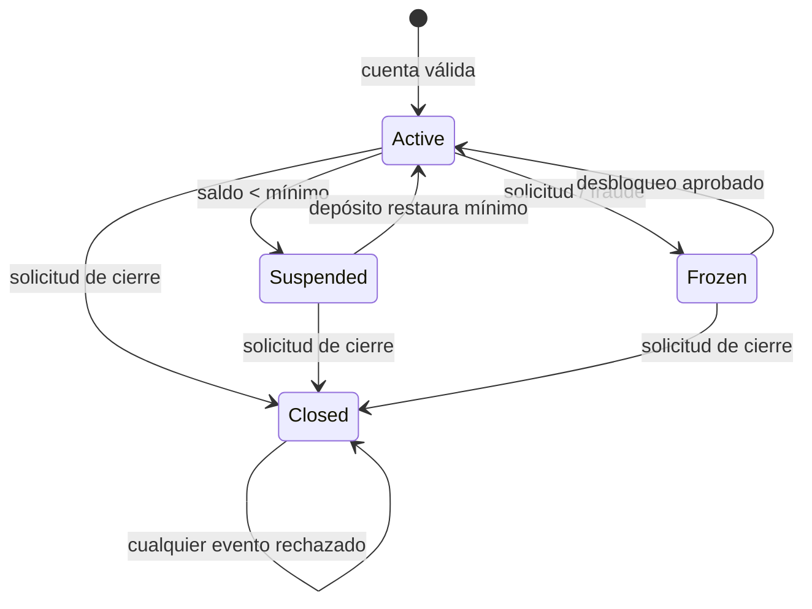

# Documento de diseño de pruebas — SecureBank

## Alcance y supuestos

Este diseño deriva exclusivamente de las reglas observables proporcionadas para
SecureBank. Se adoptan los siguientes supuestos para resolver ambigüedades:

1. Un beneficiario válido es una cadena no vacía después de eliminar espacios.
2. Los montos monetarios se normalizan a dos decimales con redondeo `ROUND_HALF_UP`.
3. Para transferencias con monto positivo, la prioridad de validación es: estado
   activo, límite diario y fondos suficientes. Así se obtiene un único error.
4. Un saldo exactamente igual al mínimo no está por debajo del mínimo; por ello,
   una cuenta suspendida se reactiva al restaurar `saldo >= mínimo`.
5. La exención usa la comparación estricta indicada: Savings requiere saldo
   `> $1,000` y Checking requiere saldo `> $5,000`.
6. Premium no cobra cuota. Closed es un estado terminal y no puede reabrirse.
7. Un rango de historial es válido cuando ambos valores son fechas y
   `fecha_inicio <= fecha_fin`.

## 1. Particiones de equivalencia

### Entrada 1: monto de transferencia

| ID | Partición | Tipo | Valor representativo | Resultado esperado |
|---|---|---|---:|---|
| EP1 | Monto positivo, dentro del límite y del saldo | Válida | $500.00 | Transferencia exitosa |
| EP2 | Monto igual a cero | Inválida | $0.00 | `amount_must_be_positive` |
| EP3 | Monto negativo | Inválida | -$100.00 | `amount_must_be_positive` |
| EP4 | Monto superior al límite diario | Inválida | $5,000.01 en Checking | `exceeds_daily_limit` |
| EP5 | Monto dentro del límite pero mayor al saldo | Inválida | Saldo $100; monto $100.01 | `insufficient_funds` |

### Entrada 2: tipo de cuenta

| ID | Partición | Tipo | Valor representativo | Resultado esperado |
|---|---|---|---|---|
| EP6 | Cuenta de ahorro reconocida | Válida | `Savings` | Límite diario $2,000 |
| EP7 | Cuenta de cheques reconocida | Válida | `Checking` | Límite diario $5,000 |
| EP8 | Cuenta premium reconocida | Válida | `Premium` | Límite diario $50,000 |
| EP9 | Tipo no contemplado | Inválida | `Business` | Rechazo: tipo no soportado |

### Entrada 3: saldo de la cuenta

| ID | Partición | Tipo | Valor representativo | Resultado esperado |
|---|---|---|---:|---|
| EP16 | Saldo negativo | Inválida | -$1.00 | Rechazo de apertura |
| EP17 | Saldo menor al mínimo del tipo | Inválida | Savings con $99.99 | Rechazo: saldo inicial insuficiente |
| EP18 | Saldo igual o mayor al mínimo | Válida | Savings con $100.00 | Cuenta creada Active |
| EP19 | Saldo menor que una operación solicitada | Inválida para la operación | Saldo $100; pago $101 | `insufficient_funds` |

### Entrada 4: información del beneficiario

| ID | Partición | Tipo | Valor representativo | Resultado esperado |
|---|---|---|---|---|
| EP10 | Texto vacío | Inválida | `""` | `invalid_payee` |
| EP10b | Sólo espacios | Inválida | `"   "` | `invalid_payee` |
| EP10c | Valor no textual | Inválida | `None` | `invalid_payee` |
| EP11 | Nombre no vacío | Válida | `CFE` | Pago procesado y nombre normalizado |

### Entrada 5: rango de fechas del historial

| ID | Partición | Tipo | Valor representativo | Resultado esperado |
|---|---|---|---|---|
| EP12 | Inicio anterior o igual al fin | Válida | 01/09/2026–30/09/2026 | Rango aceptado, 30 días |
| EP12b | Inicio y fin iguales | Válida | 15/09/2026–15/09/2026 | Rango aceptado, 1 día |
| EP13 | Inicio posterior al fin | Inválida | 30/09/2026–01/09/2026 | `invalid_date_range` |
| EP14 | Uno o ambos valores no son fechas | Inválida | `"2026-09-01"` | `invalid_date` |

## 2. Análisis de valores frontera

### Frontera 1: monto de transferencia Checking ($0.01–$5,000)

| ID | Posición | Valor | Resultado esperado |
|---|---|---:|---|
| BV1 | Debajo del mínimo | $0.00 | `amount_must_be_positive` |
| BV2 | Mínimo válido | $0.01 | Éxito |
| BV3 | Justo debajo del máximo | $4,999.99 | Éxito |
| BV4 | En el máximo | $5,000.00 | Éxito |
| BV5 | Justo arriba del máximo | $5,000.01 | `exceeds_daily_limit` |
| BV6 | Muy arriba del máximo | $10,000.00 | `exceeds_daily_limit` |

### Frontera 2: saldo inicial mínimo Savings ($100)

| ID | Posición | Valor | Resultado esperado |
|---|---|---:|---|
| BV7a | Muy debajo | $0.00 | Rechazo de apertura |
| BV7 | Justo debajo | $99.99 | Rechazo de apertura |
| BV8 | En el mínimo | $100.00 | Cuenta Active |
| BV9 | Justo arriba | $100.01 | Cuenta Active |

### Frontera 3: exención de cuota Savings (> $1,000)

| ID | Posición | Valor | Resultado esperado |
|---|---|---:|---|
| BV10 | Justo debajo | $999.99 | Cobra $5 |
| BV11 | En el umbral | $1,000.00 | Cobra $5 |
| BV12 | Justo arriba | $1,000.01 | Exenta |
| BV13 | Muy arriba | $1,500.00 | Exenta |

### Frontera 4: exención de cuota Checking (> $5,000)

| ID | Posición | Valor | Resultado esperado |
|---|---|---:|---|
| BV14 | Justo debajo | $4,999.99 | Cobra $10 |
| BV15 | En el umbral | $5,000.00 | Cobra $10 |
| BV16 | Justo arriba | $5,000.01 | Exenta |
| BV17 | Muy arriba | $6,000.00 | Exenta |

### Frontera 5: límite diario Premium ($50,000)

| ID | Posición | Valor | Resultado esperado |
|---|---|---:|---|
| BV18 | Justo debajo | $49,999.99 | Éxito |
| BV19 | En el límite | $50,000.00 | Éxito |
| BV20 | Justo arriba | $50,000.01 | `exceeds_daily_limit` |
| BV21 | Muy arriba | $100,000.00 | `exceeds_daily_limit` |

## 3. Tablas de decisión

### DT1: validación de transferencia

Se presupone un monto positivo. La prioridad es estado → límite → fondos.

| Condición / acción | R1 | R2 | R3 | R4 | R5 | R6 | R7 | R8 |
|---|---|---|---|---|---|---|---|---|
| Cuenta Active | Y | N | Y | N | Y | N | Y | N |
| Dentro del límite diario | Y | Y | N | N | Y | Y | N | N |
| Fondos suficientes | Y | Y | Y | Y | N | N | N | N |
| **Transferencia exitosa** | X |  |  |  |  |  |  |  |
| **Error: cuenta no activa** |  | X |  | X |  | X |  | X |
| **Error: excede límite** |  |  | X |  |  |  | X |  |
| **Error: fondos insuficientes** |  |  |  |  | X |  |  |  |

### DT2: procesamiento de cuota mensual

| Condición / acción | R1 | R2 | R3 | R4 | R5 |
|---|---|---|---|---|---|
| Tipo de cuenta | Savings | Savings | Checking | Checking | Premium |
| Saldo supera umbral | Y | N | Y | N | — |
| **Exentar cuota** | X |  | X |  | X |
| **Cobrar $5** |  | X |  |  |  |
| **Cobrar $10** |  |  |  | X |  |
| **Cuota $0 por tipo Premium** |  |  |  |  | X |

Si el cobro deja el saldo por debajo del mínimo, el estado resultante es
Suspended.

### DT3: validación de pago de servicios

Se presupone una cuenta Active. La prioridad es beneficiario → monto → fondos.

| Condición / acción | R1 | R2 | R3 | R4 | R5 | R6 | R7 | R8 |
|---|---|---|---|---|---|---|---|---|
| Beneficiario válido | Y | N | Y | N | Y | N | Y | N |
| Monto positivo | Y | Y | N | N | Y | Y | N | N |
| Fondos suficientes | Y | Y | Y | Y | N | N | N | N |
| **Pago exitoso** | X |  |  |  |  |  |  |  |
| **Error: beneficiario inválido** |  | X |  | X |  | X |  | X |
| **Error: monto no positivo** |  |  | X |  |  |  | X |  |
| **Error: fondos insuficientes** |  |  |  |  | X |  |  |  |

## 4. Pruebas de transición de estado

### Diagrama Mermaid

### Tabla de transiciones

| Estado actual | Evento | Estado siguiente | Acción / salida |
|---|---|---|---|
| Active | Operación deja saldo bajo el mínimo | Suspended | Mostrar advertencia y restringir operaciones |
| Active | Solicitud de congelamiento/fraude | Frozen | Bloquear transacciones |
| Active | Solicitud de cierre | Closed | Cerrar permanentemente |
| Suspended | Depósito restaura saldo mínimo | Active | Retirar restricciones |
| Suspended | Solicitud de cierre | Closed | Cerrar permanentemente |
| Frozen | Descongelamiento aprobado | Active | Restaurar acceso |
| Frozen | Solicitud de cierre | Closed | Cerrar permanentemente |
| Closed | Cualquier evento | Closed | Error; no reabrir |

### Casos de transición

| ID | Estado inicial | Evento | Estado esperado | Validación |
|---|---|---|---|---|
| ST1 | Active | Transferencia deja Savings en $90 | Suspended | Operación termina y muestra estado suspendido |
| ST2 | Suspended | Depósito restaura $100 | Active | Acceso restaurado |
| ST3 | Active | Solicitud de congelamiento | Frozen | Transacciones bloqueadas |
| ST4 | Frozen | Descongelamiento aprobado | Active | Acceso restaurado |
| ST5 | Active | Solicitud de cierre | Closed | Cierre exitoso |
| ST6 | Suspended | Solicitud de cierre | Closed | Cierre exitoso |
| ST7 | Frozen | Solicitud de cierre | Closed | Cierre exitoso |
| ST8 | Closed | Intento de descongelar | Closed | `invalid_transition` |
| ST9 | Closed | Depósito, transferencia, pago o cuota | Closed | Operaciones rechazadas |
| ST10 | Frozen | Nueva solicitud de congelamiento | Frozen | `invalid_transition` |
| ST11 | Closed | Nueva solicitud de cierre | Closed | `account_closed` |
| ST12 | Active | Medianoche | Active | Acumulado diario vuelve a $0 |
| ST13 | Active | Depósito válido | Active | Estado sin cambio |
| ST14 | Active | Depósito de $0 | Active | Rechazo sin cambio de estado |

## Trazabilidad

Los archivos `test_equivalence_partitioning.py`, `test_boundary_values.py`,
`test_decision_tables.py` y `test_state_transitions.py` conservan estos IDs en
los nombres, docstrings e identificadores de parametrización. Cada caso es
independiente mediante cuentas nuevas o fixtures con alcance de función.
