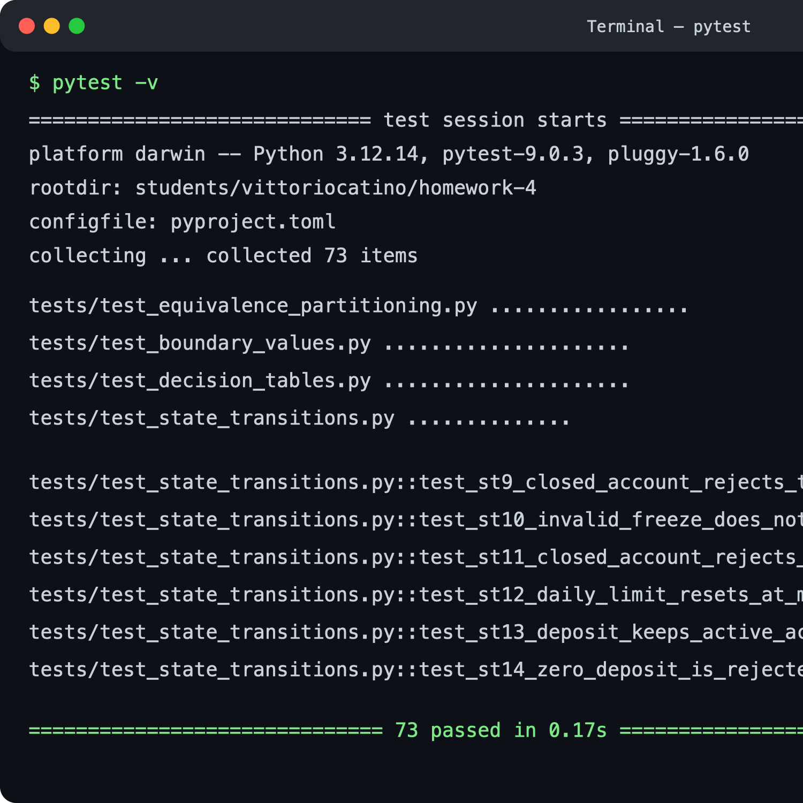
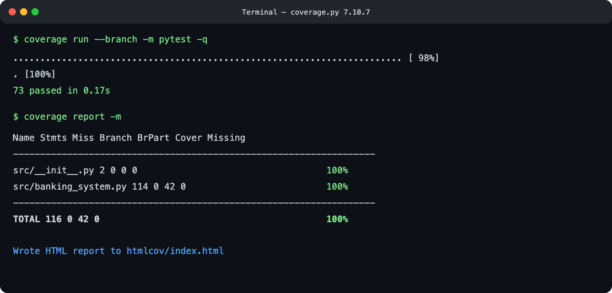

# Reporte de ejecución de pruebas

## Resumen de ejecución

- **Fecha:** 28 de septiembre de 2026
- **Sistema:** SecureBank Online Banking
- **Framework:** pytest 9.0.3
- **Python:** 3.12.14
- **Total de pruebas:** 73
- **Aprobadas:** 73
- **Fallidas:** 0
- **Omitidas:** 0
- **Duración con cobertura:** 0.17 s
- **Resultado:** ✅ Suite completa aprobada

Comando equivalente de reproducción:

```bash
pytest -v --cov=src --cov-branch --cov-report=term-missing --cov-report=html
```

## Resumen de cobertura

- **Cobertura de líneas:** 100%
- **Cobertura de ramas:** 100%
- **Cobertura de funciones/métodos:** 100% (15 de 15)

| Archivo | Sentencias | Sin cubrir | Ramas | Ramas parciales | Cobertura |
|---|---:|---:|---:|---:|---:|
| `src/__init__.py` | 2 | 0 | 0 | 0 | 100% |
| `src/banking_system.py` | 114 | 0 | 42 | 0 | 100% |
| **Total** | **116** | **0** | **42** | **0** | **100%** |

La medición incluye líneas y ramas del código productivo en `src/`; no infla el
porcentaje contabilizando las pruebas.

## Resultados por técnica

### Particiones de equivalencia — 17 pruebas

- ✅ EP1–EP5: montos válidos, cero, negativos, límite y fondos.
- ✅ EP6–EP9: tipos Savings, Checking, Premium y tipo desconocido.
- ✅ EP10–EP11: beneficiario vacío, espacios, nulo y válido.
- ✅ EP12–EP14: rangos cronológicos, invertidos y tipos inválidos.
- ✅ EP15: monto no numérico.

**Defectos potenciales prevenidos:** aceptación de entradas no numéricas,
beneficiarios vacíos y tipos de cuenta fuera del catálogo.

### Análisis de valores frontera — 21 pruebas

- ✅ BV1–BV6: mínimo de un centavo y máximo diario de Checking.
- ✅ BV7–BV9: mínimo de apertura de Savings.
- ✅ BV10–BV13: umbral estricto de exención Savings.
- ✅ BV14–BV17: umbral estricto de exención Checking.
- ✅ BV18–BV21: máximo diario de Premium.

**Defecto potencial más relevante:** interpretar `> $1,000` o `> $5,000` como
`>=` habría exentado incorrectamente la cuota justo en el umbral.

### Tablas de decisión — 21 pruebas

- ✅ DT1-R1–R8: todas las combinaciones de estado, límite y fondos.
- ✅ DT2-R1–R5: tipo de cuenta, exención y cuota.
- ✅ DT3-R1–R8: beneficiario, monto y fondos para pagos.

**Defectos potenciales prevenidos:** mensajes inconsistentes cuando varias
condiciones fallan y cobros equivocados según el tipo de cuenta.

### Transiciones de estado — 14 pruebas

- ✅ ST1–ST4: suspensión, reactivación, congelamiento y descongelamiento.
- ✅ ST5–ST11: cierres desde estados válidos y rechazo en Closed.
- ✅ ST12–ST14: reinicio diario y eventos que no cambian Active.

**Defecto potencial más relevante:** reabrir una cuenta Closed o modificar su
saldo mediante operaciones posteriores.

## Evidencias visuales

### Resultado de pytest



### Cobertura



No hubo fallos en la corrida final. Durante el desarrollo se detectaron dos
ramas inicialmente no ejercitadas en depósitos; se agregaron ST13 y ST14 para
verificar explícitamente tanto el depósito normal como el monto cero.

## Análisis de cobertura

La suite recorre todas las decisiones implementadas: conversión monetaria,
apertura por tipo y saldo, transferencias, pagos, depósitos, cuotas, límites,
rangos de fechas y cambios de estado. EP cubre categorías amplias de entrada;
BVA concentra casos alrededor de umbrales; las tablas de decisión recorren
combinaciones de reglas; y las transiciones validan el comportamiento a lo
largo del tiempo. El solapamiento intencional entre técnicas confirma reglas
críticas desde perspectivas distintas.

No quedan líneas o ramas sin ejecutar en el modelo entregado. Permanecen fuera
del alcance funciones no definidas suficientemente por la especificación, como
autenticación, persistencia, concurrencia, comunicación bancaria real, zona
horaria y exportación física a CSV. Estas áreas requerirían requisitos e
integraciones adicionales, no más casos unitarios sobre el modelo actual.
