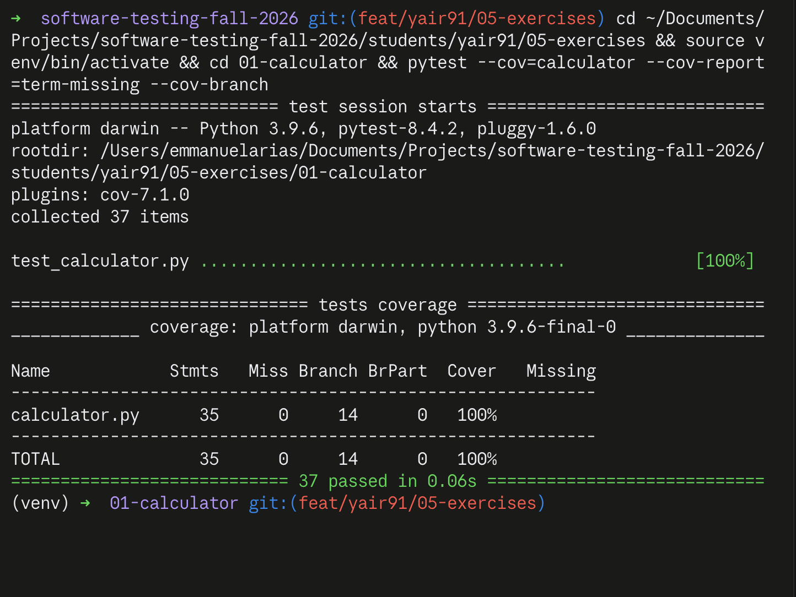
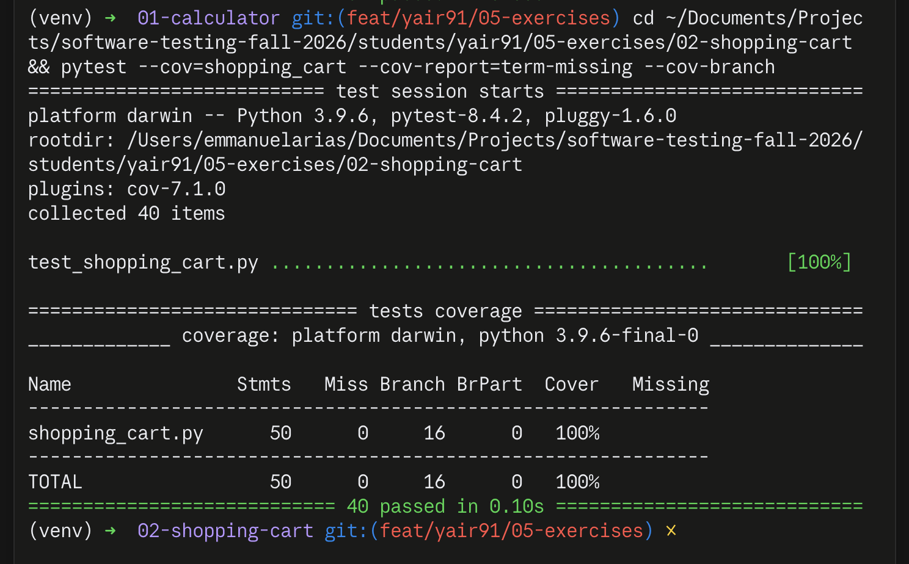

# Module 5 — White Box Testing Exercises

Exercises 1 and 2 of the white box testing module, in Python.

| Exercise | Folder | Tests | Statement coverage | Branch coverage |
| --- | --- | --- | --- | --- |
| 1. Calculator | `01-calculator/` | 37 | 100% | 100% |
| 2. Shopping Cart | `02-shopping-cart/` | 40 | 100% | 100% |

## Coverage reports





## Setup

```bash
python -m venv venv
source venv/bin/activate        # Windows: venv\Scripts\activate
pip install pytest pytest-cov
```

## Running

Each exercise is self-contained and runs from its own folder.

```bash
cd 01-calculator
pytest --cov=calculator --cov-report=term-missing --cov-branch

cd ../02-shopping-cart
pytest --cov=shopping_cart --cov-report=term-missing --cov-branch
```

An HTML report, if you want to see the annotated source:

```bash
pytest --cov=calculator --cov-report=html --cov-branch
open htmlcov/index.html
```

## Notes on the test design

**Exercise 1** covers the six methods from the starter code plus the three from
the Part 4 challenge (`modulo`, `absolute`, `factorial`). Error paths use
`pytest.raises` with `match=` so the test checks *which* error was raised, not
just that something failed. Floating point comparisons use `pytest.approx`.

**Exercise 2** targets branch coverage rather than statement coverage, so every
decision is exercised on both sides:

- `add_item` with a name that matches and one that does not, plus a match found
  on a later pass of the loop rather than the first.
- `remove_item` on a present name, an absent name, and an empty cart.
- `apply_discount` below 0, above 100, and at both ends of the valid range.
- `Item.__eq__` against another `Item` and against a value of a different type,
  which is the `isinstance` guard.
- Both aggregate methods on an empty cart, which is the case where the
  comprehension never iterates.
