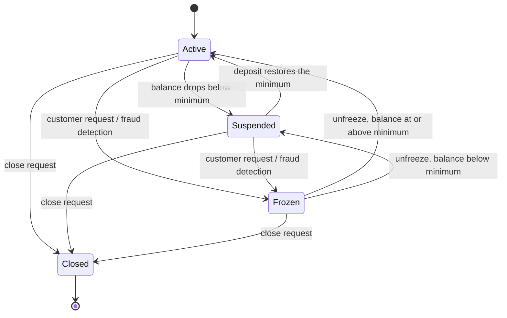

# Test Design Document — SecureBank Online Banking

**Homework 4 · Module 4 — Black Box Testing**
**Author**: Emmanuel Arias (`yair91`)
**System under test**: `src/banking_system.py`

---

## 1. Scope

SecureBank has three account types, four account states, transfers, bill payments and a filterable transaction history. This document designs the test suite with four black box techniques applied in this order: equivalence partitioning to split the input space, boundary value analysis to probe the edges of each partition, decision tables for the rules that combine several conditions at once, and state transition testing for the account lifecycle.

Each technique answers a different question, and the order is not arbitrary: partitions tell you _what kinds_ of input exist, boundaries tell you _where_ they end, decision tables tell you what happens when several conditions disagree, and state testing tells you what the system remembers between operations.

## 2. Design decisions

The brief leaves three things open. They are resolved here because every expected result downstream depends on them.

**2.1 Suspended accounts keep transacting.** The brief says transfers are blocked "from Frozen or Closed accounts" and describes Suspended as "below minimum balance, warnings shown". Blocking Suspended would make the warning pointless, so a suspended account transacts normally and every result carries `warning: "Balance below minimum"`. The decision tables use the condition _account allows transactions_ (Active or Suspended) rather than _account is Active_.

**2.2 Validation has a fixed precedence.** When more than one condition fails, only one error can be reported. The order is **state → amount → daily limit → funds**. State first because a frozen account should not leak whether the customer had the money; the limit before the funds because the limit is a policy the bank sets and the balance is a fact about the customer. This precedence is what rules DT1-R4, DT1-R6, DT1-R7 and DT1-R8 exist to pin down.

**2.3 The minimum balance is inclusive.** "Below minimum" means strictly below, so a Savings account holding exactly $100.00 stays Active. The same reading applies to the daily limit: "exceeds" means strictly greater, so a transfer of exactly $5,000.00 on a Checking account is allowed. Boundaries BV4, BV10, BV13 and BV17 are the tests that would catch a `<=` written where `<` belongs.

---

## 3. Equivalence Partitioning

Seven inputs are partitioned. One representative value per partition: if the partition is drawn correctly, every other value in it behaves the same way.

### 3.1 Input: transfer amount

| ID  | Description                                  | Type    | Representative value | Expected result                |
| --- | -------------------------------------------- | ------- | -------------------- | ------------------------------ |
| EP1 | Valid amount, within balance and daily limit | Valid   | $500.00              | Transfer succeeds              |
| EP2 | Zero                                         | Invalid | $0.00                | Error: Amount must be positive |
| EP3 | Negative                                     | Invalid | -$100.00             | Error: Amount must be positive |
| EP4 | Above the daily limit                        | Invalid | $100,000.00          | Error: Exceeds daily limit     |
| EP5 | Within the limit, above the balance          | Invalid | balance + $1.00      | Error: Insufficient funds      |
| EP6 | Not a number                                 | Invalid | `"five hundred"`     | Error: Amount must be a number |

### 3.2 Input: account type

| ID   | Description      | Type    | Representative value | Expected result                      |
| ---- | ---------------- | ------- | -------------------- | ------------------------------------ |
| EP7  | Savings          | Valid   | `"Savings"`          | Daily limit $2,000, minimum $100     |
| EP8  | Checking         | Valid   | `"Checking"`         | Daily limit $5,000, minimum $0       |
| EP9  | Premium          | Valid   | `"Premium"`          | Daily limit $50,000, minimum $10,000 |
| EP10 | Unsupported type | Invalid | `"Platinum"`         | `ValueError` at construction         |

### 3.3 Input: account balance, read against the type minimum

| ID   | Description             | Type               | Representative value | Expected result                         |
| ---- | ----------------------- | ------------------ | -------------------- | --------------------------------------- |
| EP11 | At or above the minimum | Valid              | $150.00 on Savings   | State stays Active                      |
| EP12 | Below the minimum       | Valid but degraded | $50.00 on Savings    | State becomes Suspended, warning issued |

### 3.4 Input: payee for a bill payment

| ID   | Description    | Type    | Representative value | Expected result      |
| ---- | -------------- | ------- | -------------------- | -------------------- |
| EP13 | Named payee    | Valid   | `"City Water"`       | Payment accepted     |
| EP14 | Empty or blank | Invalid | `"   "`              | Error: Invalid payee |

### 3.5 Input: date range for the transaction history

| ID   | Description                         | Type    | Representative value | Expected result                |
| ---- | ----------------------------------- | ------- | -------------------- | ------------------------------ |
| EP15 | Well-formed range covering activity | Valid   | yesterday → tomorrow | Matching transactions returned |
| EP16 | Start after end                     | Invalid | today → 5 days ago   | `ValueError`                   |

### 3.6 Input: account state at construction

| ID   | Description                       | Type    | Representative value | Expected result                   |
| ---- | --------------------------------- | ------- | -------------------- | --------------------------------- |
| EP17 | One of the four documented states | Valid   | `"Frozen"`           | Account constructed in that state |
| EP18 | Anything else                     | Invalid | `"Dormant"`          | `ValueError` at construction      |

### 3.7 Input: deposit amount

| ID   | Description                          | Type    | Representative value | Expected result                       |
| ---- | ------------------------------------ | ------- | -------------------- | ------------------------------------- |
| EP19 | Positive amount into an open account | Valid   | $250.00              | Balance increases, state re-evaluated |
| EP20 | Zero                                 | Invalid | $0.00                | Error: Amount must be positive        |
| EP21 | Any amount into a closed account     | Invalid | $250.00 on Closed    | Error: Account is closed              |

Two further partitions, EP22 and EP23, cover the CSV export with and without transactions in the history.

---

## 4. Boundary Value Analysis

Five boundaries, each probed below, at and above the edge. Partitions say which values are equivalent; boundaries are where that equivalence breaks.

### 4.1 Boundary 1 — transfer amount against the $5,000 Checking daily limit

| ID  | Boundary                   | Test value | Expected result                |
| --- | -------------------------- | ---------- | ------------------------------ |
| BV1 | Below the minimum transfer | $0.00      | Error: Amount must be positive |
| BV2 | At the minimum transfer    | $0.01      | Transfer succeeds              |
| BV3 | Just below the limit       | $4,999.99  | Transfer succeeds              |
| BV4 | At the limit               | $5,000.00  | Transfer succeeds              |
| BV5 | Just above the limit       | $5,000.01  | Error: Exceeds daily limit     |
| BV6 | Far above the limit        | $10,000.00 | Error: Exceeds daily limit     |

### 4.2 Boundary 2 — transfer amount against the $2,000 Savings daily limit

| ID   | Boundary                   | Test value | Expected result                |
| ---- | -------------------------- | ---------- | ------------------------------ |
| BV7  | Below the minimum transfer | $0.00      | Error: Amount must be positive |
| BV8  | At the minimum transfer    | $0.01      | Transfer succeeds              |
| BV9  | Just below the limit       | $1,999.99  | Transfer succeeds              |
| BV10 | At the limit               | $2,000.00  | Transfer succeeds              |
| BV11 | Just above the limit       | $2,000.01  | Error: Exceeds daily limit     |

The same boundary is tested on two account types because the limit is data, not code: a defect could easily apply the Checking limit to every account.

### 4.3 Boundary 3 — resulting balance against the $100 Savings minimum

| ID   | Boundary                   | Resulting balance | Expected result                            |
| ---- | -------------------------- | ----------------- | ------------------------------------------ |
| BV12 | One cent above the minimum | $100.01           | State stays Active                         |
| BV13 | Exactly the minimum        | $100.00           | State stays Active                         |
| BV14 | One cent below the minimum | $99.99            | State becomes Suspended                    |
| BV15 | Account emptied            | $0.00             | Transfer succeeds, state becomes Suspended |

### 4.4 Boundary 4 — resulting balance against the $10,000 Premium minimum

| ID   | Boundary                   | Resulting balance | Expected result                     |
| ---- | -------------------------- | ----------------- | ----------------------------------- |
| BV16 | One cent above the minimum | $10,000.01        | State stays Active                  |
| BV17 | Exactly the minimum        | $10,000.00        | State stays Active                  |
| BV18 | One cent below the minimum | $9,999.99         | State becomes Suspended             |
| BV19 | Far below the minimum      | $1,000.00         | State becomes Suspended, not Closed |

### 4.5 Boundary 5 — cumulative daily total against the limit

The limit applies to the running total for the day, not to one transfer. A suite that only sends single transfers never tests the accumulator.

| ID   | Boundary                       | Sequence                 | Expected result                     |
| ---- | ------------------------------ | ------------------------ | ----------------------------------- |
| BV20 | Total one cent below the limit | $3,000.00 then $1,999.99 | Both succeed, $0.01 remaining       |
| BV21 | Total exactly at the limit     | $3,000.00 then $2,000.00 | Both succeed, $0.00 remaining       |
| BV22 | Total one cent over the limit  | $3,000.00 then $2,000.01 | Second refused: Exceeds daily limit |
| BV23 | After the midnight reset       | $5,000.00, reset, $1.00  | Third succeeds, full limit restored |

---

## 5. Decision Tables

### 5.1 DT1 — transfer validation

Conditions are listed in evaluation order. The action row shows which single error surfaces when several conditions fail at once.

| Condition                    | R1  | R2  | R3  | R4  | R5  | R6  | R7  | R8  |
| ---------------------------- | --- | --- | --- | --- | --- | --- | --- | --- |
| Sufficient funds?            | Y   | Y   | Y   | Y   | N   | N   | N   | N   |
| Within daily limit?          | Y   | Y   | N   | N   | Y   | Y   | N   | N   |
| Account allows transactions? | Y   | N   | Y   | N   | Y   | N   | Y   | N   |
| **Action**                   |     |     |     |     |     |     |     |     |
| Transfer succeeds            | X   |     |     |     |     |     |     |     |
| Error: Account is frozen     |     | X   |     | X   |     | X   |     | X   |
| Error: Exceeds daily limit   |     |     | X   |     |     |     | X   |     |
| Error: Insufficient funds    |     |     |     |     | X   |     |     |     |

Rules R4, R6, R7 and R8 are the ones that only exist because of the precedence decided in section 2.2. Without them the table would not distinguish a correct implementation from one that reports whichever error it happens to check first.

### 5.2 DT2 — monthly fee processing

| Condition                           | R1     | R2     | R3     | R4     | R5     | R6     | R7     | R8     |
| ----------------------------------- | ------ | ------ | ------ | ------ | ------ | ------ | ------ | ------ |
| Account type                        | Sav    | Sav    | Sav    | Chk    | Chk    | Prm    | any    | Sav    |
| Balance above the waiver threshold? | Y      | N      | N      | Y      | N      | –      | –      | N      |
| Balance covers the fee?             | –      | Y      | N      | –      | Y      | –      | –      | Y      |
| Account state                       | Active | Active | Active | Active | Active | Active | Closed | Frozen |
| **Action**                          |        |        |        |        |        |        |        |        |
| Fee waived                          | X      |        |        | X      |        | X      |        |        |
| Fee charged                         |        | X      |        |        | X      |        |        | X      |
| Account suspended                   |        |        | X      |        |        |        |        |        |
| Error: Insufficient funds for fee   |        |        | X      |        |        |        |        |        |
| Error: Account is closed            |        |        |        |        |        |        | X      |        |

R8 records a rule the brief does not state: a frozen account is still charged its fee and stays Frozen. Freezing stops the customer, not the bank's own billing.

### 5.3 DT3 — bill payment validation

| Condition                            | R1   | R2  | R3  | R4   | R5     | R6   | R7  | R8           |
| ------------------------------------ | ---- | --- | --- | ---- | ------ | ---- | --- | ------------ |
| Account allows transactions?         | Y    | Y   | Y   | Y    | Y      | Y    | N   | Y            |
| Valid payee?                         | Y    | N   | Y   | Y    | Y      | Y    | –   | Y            |
| Amount is a positive number?         | Y    | –   | N   | Y    | Y      | Y    | –   | Not a number |
| Scheduled date                       | none | –   | –   | none | future | past | –   | none         |
| Sufficient funds?                    | Y    | –   | –   | N    | Y      | –    | –   | –            |
| **Action**                           |      |     |     |      |        |      |     |              |
| Payment made immediately             | X    |     |     |      |        |      |     |              |
| Payment scheduled, balance untouched |      |     |     |      | X      |      |     |              |
| Error: Invalid payee                 |      | X   |     |      |        |      |     |              |
| Error: Amount must be positive       |      |     | X   |      |        |      |     |              |
| Error: Insufficient funds            |      |     |     | X    |        |      |     |              |
| Error: Scheduled date is in the past |      |     |     |      |        | X    |     |              |
| Error: Account is frozen             |      |     |     |      |        |      | X   |              |
| Error: Amount must be a number       |      |     |     |      |        |      |     | X            |

---

## 6. State Transition Testing

### 6.1 State transition diagram



The same machine in plain text, for readers without a Mermaid renderer:

```
            balance < minimum
   [Active] ------------------> [Suspended]
      |  ^                          |  |
      |  |   deposit restores       |  |
      |  +--------------------------+  |
      |                                |
      |  freeze                 freeze |
      v                                v
   [Frozen] <--------------------------
      |  |
      |  +-- unfreeze --> [Active] or [Suspended] (depends on balance)
      |
      +-- close --> [Closed]

   [Active], [Suspended], [Frozen] --close--> [Closed]
   [Closed] --any event--> [Closed] (rejected, terminal)
```

### 6.2 State transition table

| Current state | Event                                    | Next state | Action / output                   |
| ------------- | ---------------------------------------- | ---------- | --------------------------------- |
| Active        | Transfer drops balance below the minimum | Suspended  | Warning: Balance below minimum    |
| Active        | Monthly fee cannot be paid               | Suspended  | Error: Insufficient funds for fee |
| Active        | Freeze request                           | Frozen     | All money movement blocked        |
| Active        | Close request                            | Closed     | Final statement generated         |
| Suspended     | Deposit restores the minimum             | Active     | Restrictions removed              |
| Suspended     | Transfer                                 | Suspended  | Succeeds, warning repeated        |
| Suspended     | Close request                            | Closed     | Final statement generated         |
| Frozen        | Unfreeze, balance at or above minimum    | Active     | Full access restored              |
| Frozen        | Unfreeze, balance below minimum          | Suspended  | Access restored, warning issued   |
| Frozen        | Close request                            | Closed     | Final statement generated         |
| Frozen        | Transfer or deposit                      | Frozen     | Error: Account is frozen          |
| Closed        | Any event                                | Closed     | Error: Account is closed          |

### 6.3 State transition test cases

| ID   | Start state | Event                                     | Expected end state | Validation                                    |
| ---- | ----------- | ----------------------------------------- | ------------------ | --------------------------------------------- |
| ST1  | Active      | Transfer leaves balance under the minimum | Suspended          | Warning returned, state is Suspended          |
| ST2  | Suspended   | Deposit restores the minimum              | Active             | State is Active, balance correct              |
| ST3  | Active      | Freeze request                            | Frozen             | Call succeeds, state is Frozen                |
| ST4  | Frozen      | Unfreeze with a healthy balance           | Active             | Call succeeds, state is Active                |
| ST5  | Active      | Close request                             | Closed             | Final statement flag returned                 |
| ST6  | Suspended   | Close request                             | Closed             | Call succeeds from a degraded state           |
| ST7  | Frozen      | Close request                             | Closed             | Call succeeds from a blocked state            |
| ST8  | Active      | Monthly fee with insufficient funds       | Suspended          | Balance untouched, state is Suspended         |
| ST9  | Frozen      | Unfreeze with a balance below the minimum | Suspended          | Lands in Suspended, not Active                |
| ST10 | Closed      | Transfer                                  | Closed             | Error: Account is closed                      |
| ST11 | Closed      | Unfreeze                                  | Closed             | Refused, a closed account cannot reopen       |
| ST12 | Closed      | Close again                               | Closed             | Refused, not a silent no-op                   |
| ST13 | Closed      | Freeze                                    | Closed             | Refused, Closed is terminal                   |
| ST14 | Frozen      | Transfer                                  | Frozen             | Error returned, balance untouched             |
| ST15 | Frozen      | Deposit                                   | Frozen             | Refused, money cannot go in either            |
| ST16 | Active      | Unfreeze                                  | Active             | Refused, there is no Active → Active unfreeze |
| ST17 | Suspended   | Transfer                                  | Suspended          | Succeeds with the warning repeated            |

ST9 is the transition most likely to be missed: it is easy to write `unfreeze` so that it always returns the account to Active, which silently clears a suspension the balance has not earned.

---

## 7. Traceability

| Technique                | Design ids      | Test file                                | Tests  |
| ------------------------ | --------------- | ---------------------------------------- | ------ |
| Equivalence partitioning | EP1–EP23        | `tests/test_equivalence_partitioning.py` | 23     |
| Boundary value analysis  | BV1–BV23        | `tests/test_boundary_values.py`          | 23     |
| Decision tables          | DT1-R1 – DT3-R8 | `tests/test_decision_tables.py`          | 24     |
| State transitions        | ST1–ST17        | `tests/test_state_transitions.py`        | 17     |
|                          |                 | **Total**                                | **87** |

Every test carries its design id in the docstring, so a failure points straight back to the rule it was written from.
