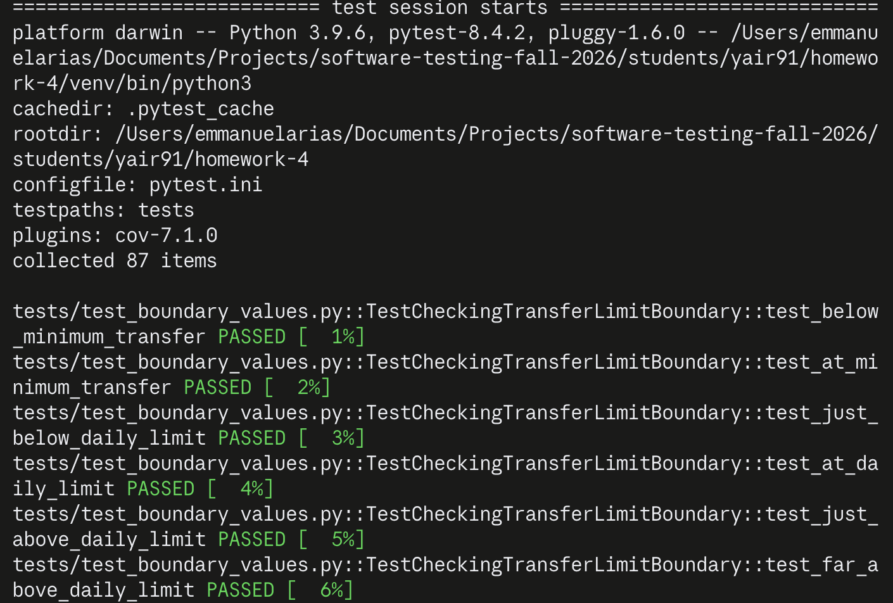
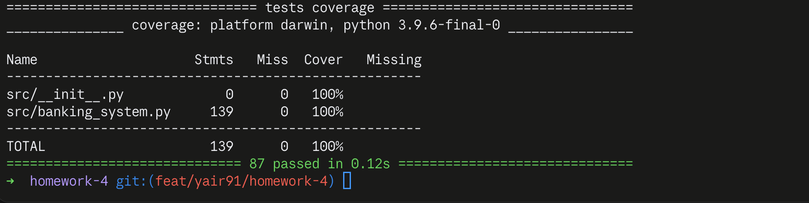

# Test Execution Report — SecureBank Online Banking

**Homework 4 · Module 4 — Black Box Testing**
**Author**: Emmanuel Arias (`yair91`)

---

## Test Execution Summary

- **Date**: 2026-09-24
- **Test framework**: pytest 8.4.2 with pytest-cov
- **Python**: 3.9.6
- **Command**: `pytest -v --cov=src --cov-report=term-missing`
- **Total tests**: 87
- **Passed**: 87
- **Failed**: 0
- **Skipped**: 0
- **Duration**: 0.10s

## Coverage Summary

| Metric                                | Result   |
| ------------------------------------- | -------- |
| Statements in `src/banking_system.py` | 139      |
| Statements missed                     | 0        |
| **Line coverage**                     | **100%** |
| Course threshold                      | 80%      |

## Static Analysis

| Tool         | Configuration                                     | Result                    |
| ------------ | ------------------------------------------------- | ------------------------- |
| pylint 3.3.9 | `.github/grading/pylintrc` (course configuration) | **10.00/10**, no findings |

---

## Results by Technique

### Equivalence Partitioning (23 tests)

File: `tests/test_equivalence_partitioning.py`

**TestTransferAmountPartitions**

- ✅ `test_valid_amount_within_limits`
- ✅ `test_zero_amount_is_rejected`
- ✅ `test_negative_amount_is_rejected`
- ✅ `test_amount_above_daily_limit_is_rejected`
- ✅ `test_amount_above_balance_is_rejected`
- ✅ `test_non_numeric_amount_is_rejected`

**TestAccountTypePartitions**

- ✅ `test_savings_daily_limit`
- ✅ `test_checking_daily_limit`
- ✅ `test_premium_daily_limit`
- ✅ `test_unknown_account_type_is_rejected`

**TestAccountBalancePartitions**

- ✅ `test_balance_at_or_above_minimum_keeps_account_active`
- ✅ `test_balance_below_minimum_suspends_account`

**TestPayeePartitions**

- ✅ `test_valid_payee_is_accepted`
- ✅ `test_empty_payee_is_rejected`

**TestDateRangePartitions**

- ✅ `test_range_containing_transactions_returns_them`
- ✅ `test_inverted_range_is_rejected`

**TestAccountStatePartitions**

- ✅ `test_known_state_is_accepted`
- ✅ `test_unknown_state_is_rejected`

**TestDepositAmountPartitions**

- ✅ `test_valid_deposit`
- ✅ `test_zero_deposit_is_rejected`
- ✅ `test_deposit_into_closed_account_is_rejected`

**TestHistoryExport**

- ✅ `test_export_includes_header_and_rows`
- ✅ `test_export_of_an_empty_history`

**Defects found**: none. Every assertion matched the expected result in the design document.

### Boundary Value Analysis (23 tests)

File: `tests/test_boundary_values.py`

**TestCheckingTransferLimitBoundary**

- ✅ `test_below_minimum_transfer`
- ✅ `test_at_minimum_transfer`
- ✅ `test_just_below_daily_limit`
- ✅ `test_at_daily_limit`
- ✅ `test_just_above_daily_limit`
- ✅ `test_far_above_daily_limit`

**TestSavingsTransferLimitBoundary**

- ✅ `test_below_minimum_transfer`
- ✅ `test_at_minimum_transfer`
- ✅ `test_just_below_daily_limit`
- ✅ `test_at_daily_limit`
- ✅ `test_just_above_daily_limit`

**TestSavingsMinimumBalanceBoundary**

- ✅ `test_leaves_one_cent_above_minimum`
- ✅ `test_leaves_exactly_the_minimum`
- ✅ `test_leaves_one_cent_below_minimum`
- ✅ `test_leaves_the_account_empty`

**TestPremiumMinimumBalanceBoundary**

- ✅ `test_leaves_one_cent_above_minimum`
- ✅ `test_leaves_exactly_the_minimum`
- ✅ `test_leaves_one_cent_below_minimum`
- ✅ `test_leaves_the_balance_far_below_minimum`

**TestCumulativeDailyLimitBoundary**

- ✅ `test_two_transfers_just_below_the_limit`
- ✅ `test_two_transfers_reaching_the_limit_exactly`
- ✅ `test_second_transfer_crossing_the_limit`
- ✅ `test_limit_resets_at_midnight`

**Defects found**: none. Every assertion matched the expected result in the design document.

### Decision Tables (24 tests)

File: `tests/test_decision_tables.py`

**TestTransferValidationTable**

- ✅ `test_rule_1_all_conditions_met`
- ✅ `test_rule_2_frozen_account`
- ✅ `test_rule_3_above_daily_limit`
- ✅ `test_rule_4_above_limit_and_frozen`
- ✅ `test_rule_5_insufficient_funds`
- ✅ `test_rule_6_insufficient_and_frozen`
- ✅ `test_rule_7_insufficient_and_above_limit`
- ✅ `test_rule_8_all_conditions_failed`

**TestMonthlyFeeTable**

- ✅ `test_rule_1_savings_above_waiver`
- ✅ `test_rule_2_savings_below_waiver`
- ✅ `test_rule_3_savings_cannot_cover_the_fee`
- ✅ `test_rule_4_checking_above_waiver`
- ✅ `test_rule_5_checking_below_waiver`
- ✅ `test_rule_6_premium_never_pays`

**TestBillPaymentTable**

- ✅ `test_rule_1_valid_immediate_payment`
- ✅ `test_rule_2_invalid_payee`
- ✅ `test_rule_3_non_positive_amount`
- ✅ `test_rule_4_insufficient_funds`
- ✅ `test_rule_5_future_dated_payment_is_scheduled`
- ✅ `test_rule_6_past_dated_payment_is_rejected`

**TestBillPaymentGuardRules**

- ✅ `test_rule_7_frozen_account`
- ✅ `test_rule_8_non_numeric_amount`

**TestMonthlyFeeOnNonActiveAccounts**

- ✅ `test_closed_account_is_not_charged`
- ✅ `test_frozen_account_is_still_charged_and_stays_frozen`

**Defects found**: none. Every assertion matched the expected result in the design document.

### State Transitions (17 tests)

File: `tests/test_state_transitions.py`

**TestValidTransitions**

- ✅ `test_active_to_suspended_on_low_balance`
- ✅ `test_suspended_to_active_on_deposit`
- ✅ `test_active_to_frozen_on_request`
- ✅ `test_frozen_to_active_on_unfreeze`
- ✅ `test_active_to_closed_on_request`
- ✅ `test_suspended_to_closed_on_request`
- ✅ `test_frozen_to_closed_on_request`
- ✅ `test_active_to_suspended_when_the_fee_cannot_be_paid`
- ✅ `test_unfreeze_re_evaluates_the_balance`

**TestInvalidTransitions**

- ✅ `test_closed_account_refuses_transfers`
- ✅ `test_closed_account_cannot_be_reopened`
- ✅ `test_closed_account_cannot_be_closed_twice`
- ✅ `test_closed_account_cannot_be_frozen`
- ✅ `test_frozen_account_refuses_transfers`
- ✅ `test_frozen_account_refuses_deposits`
- ✅ `test_unfreeze_on_an_active_account_is_rejected`

**TestSuspendedBehaviour**

- ✅ `test_suspended_account_still_transfers_with_a_warning`

**Defects found**: none. Every assertion matched the expected result in the design document.

---

## Screenshots

### Test run

### Coverage report

Both images are screenshots of the run on my machine. The raw output behind
them is committed alongside, in `reports/logs/pytest-verbose.txt`,
`reports/logs/coverage-term.txt` and `reports/logs/pylint.txt`, so the numbers
can be checked without trusting the picture.

---

## Coverage Analysis

### What is covered

Every statement in `src/banking_system.py` is executed by the suite: 139 of 139.
That includes the paths that are easy to leave out because they are not part of
any happy flow:

- the `ValueError` raised for an unsupported account type and for an unknown
  state at construction (EP10, EP18);
- the early return in `_apply_balance_state` that protects Frozen and Closed
  accounts from being moved by a balance check (exercised through DT2-R8, the
  frozen account that is still charged its fee);
- the CSV export with and without rows (EP22, EP23);
- every error branch of `transfer`, `deposit` and `pay_bill`.

### How each technique contributed

Coverage was measured per test file, each run on its own against `src/`, to
see what every technique reaches by itself. The raw output is in
`reports/logs/coverage-by-technique.txt`.

| Technique                | Tests  | Statement coverage alone |
| ------------------------ | ------ | ------------------------ |
| Equivalence partitioning | 23     | 76%                      |
| Boundary value analysis  | 23     | 47%                      |
| Decision tables          | 24     | 70%                      |
| State transitions        | 17     | 65%                      |
| **All four together**    | **87** | **100%**                 |

No single technique reaches 100%, and the ranking is informative. Equivalence
partitioning scores highest because it deliberately visits one value from every
kind of input, including the invalid ones, so it sweeps most error branches.
Boundary value analysis scores lowest of the four while being the most precise:
it hammers three or four lines from six angles each, which finds off-by-one
defects but barely moves a coverage number.

That gap is the point worth keeping. Coverage rewards breadth and is blind to
depth. BV13 and BV17 — the balances that land exactly on the minimum — execute
the same line as BV12 and BV16 and add nothing to the percentage, yet they are
the two tests that would catch a `<=` written where `<` belongs. A suite tuned
to maximise coverage would delete them.

### What is not covered, and why

Nothing in `src/` is uncovered. What the suite does _not_ reach is outside the
system under test:

- **The midnight reset.** `reset_daily_limit()` is called directly (BV23); the
  scheduler that would call it at 00:00 in production does not exist here.
- **The fee run.** `apply_monthly_fee()` is called directly; the job that would
  run it on the 1st of the month is not part of the system under test.
- **Scheduled payments actually executing.** DT3-R5 proves a future-dated
  payment is recorded without moving money, but nothing settles it when the day
  arrives, because the system has no clock of its own.

All three are integration concerns, and black box design at the unit level
cannot reach them. They are listed as recommendations in the analysis report.

### Float precision

Money is held as a float and rounded to cents on every write. This is not what
a real bank would do — `Decimal` or integer cents is the correct choice — but
the rounding is what makes assertions such as `balance == 100.01` in BV12 hold
exactly rather than approximately. The test suite would pass either way; the
note is here because the design decision is visible in the code and a reader
should know it was deliberate.
